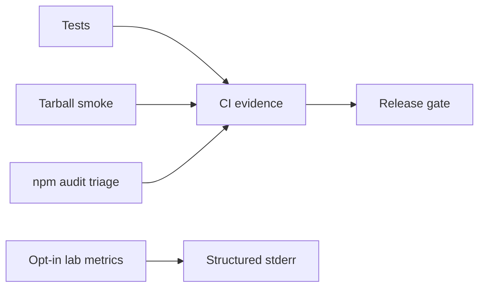

# Monitoring — Database Engines Workbench

## Operability Model

This is a local library/CLI, not an always-on database service; uptime SLOs would be misleading. Release health is measured through CI, tarball smoke tests, issue trends, and opt-in lab diagnostics.

| Signal | Target | Evidence |
| --- | --- | --- |
| Supported-platform verification | 100% required jobs pass | CI checks |
| Tarball smoke success | 100% before publish | install/import run |
| Deterministic CLI errors | 100% contract tests | exit-code suite |
| Critical dependency exposure | 0 unmitigated releasable findings | audit record |
| Recovery regression | no >10% redo time on bench fixtures | optional bench job |

## Lab Diagnostics (Opt-In)

With explicit `DEB_DEBUG=1`, report command, duration bucket, data-dir size bucket, module, and stable error code—never raw secrets, connection strings, or tuple payloads on stdout.

Module-level counters (cache hit ratio, WAL bytes, AOF rewrite duration) demonstrate [[08-Databases/12-Production-Database-Ops/Monitoring Checkpoints Lag Bloat Cache Hit|Monitoring Checkpoints Lag Bloat Cache Hit]] concepts; the workbench itself does not phone home.

## Triage

Reproducible wrong recovery or import failure blocks release. Performance observations become regressions only against versioned benchmark fixtures. Link confirmed defects to [[08-Databases/projects/Database Engines Workbench/Debug Diary|Debug Diary]] and [[08-Databases/projects/Database Engines Workbench/Known Issues|Known Issues]].

## Related Documents

- [[08-Databases/12-Production-Database-Ops/Monitoring Checkpoints Lag Bloat Cache Hit|Monitoring Checkpoints Lag Bloat Cache Hit]]
- [[08-Databases/projects/Database Engines Workbench/Deployment|Deployment]]
