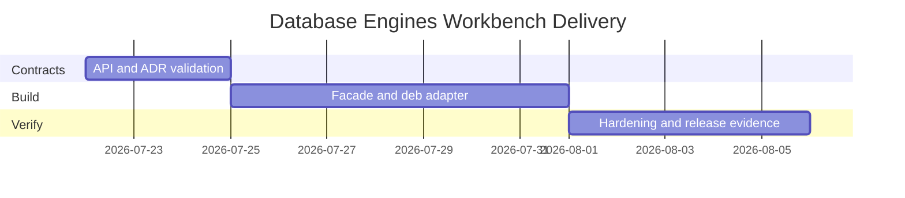

# Planning — Database Engines Workbench

## Problem Statement

Databases track wiki notes explain engine internals, but learners lack a discoverable package surface, CLI workflow, compatibility contract, and release evidence—especially across WAL recovery, isolation anomalies, AOF persistence, and EXPLAIN literacy.

## Success Definition

Every documented capability is importable and demonstrable through stable contracts; a clean checkout installs and passes tests; documentation states production engine gaps without implying Postgres/Mongo/Redis replacement or ORM/product-stack scope.

## Scope

**In scope:** package facade, CLI adapter (`deb`), page/WAL/index modules, isolation/MVCC lab, Redis AOF subset, SQL fixture runner, EXPLAIN harness, engine-selection advisor, typed contracts, tests, release artifact, security checks, backup/PITR drill documentation.

**Out of scope:** Express/repos/ORM patterns, full SQL engines, wire protocols, replication clusters, multi-region system design, replacing production databases.

## Milestones

| Milestone | Outcome | Exit criteria |
| --- | --- | --- |
| M1 Contracts | Public exports and CLI schemas fixed | ADRs accepted; contract tests define gaps |
| M2 Integration | Library + CLI vertical slice | Ten commands pass positive/negative tests |
| M3 Hardening | Release-ready evidence | clean install, vitest, package smoke, docs match behavior |

## Risks

| Risk | Impact | Mitigation |
| --- | --- | --- |
| Docs exceed implementation | Misleading portfolio | Label target vs implemented; test every claimed command |
| Production parity implied | Incorrect learning | Explicit limitations; link engine docs |
| CLI accepts unsafe paths | Data loss outside lab | Root jail + size caps |
| Isolation tests flaky | CI noise | Deterministic schedule DSL only |
| Live Postgres tests in CI | Flaky/unavailable | Fixture-first default; optional integration job |

## Dependencies

Node.js 20 LTS+, TypeScript, Vitest. Optional local Postgres for EXPLAIN adapter only. See [[08-Databases/projects/Database Engines Workbench/Roadmap|Roadmap]].

## Related Documents

- [[08-Databases/projects/Database Engines Workbench/Requirements|Requirements]]
- [[08-Databases/projects/Database Engines Workbench/Roadmap|Roadmap]]
