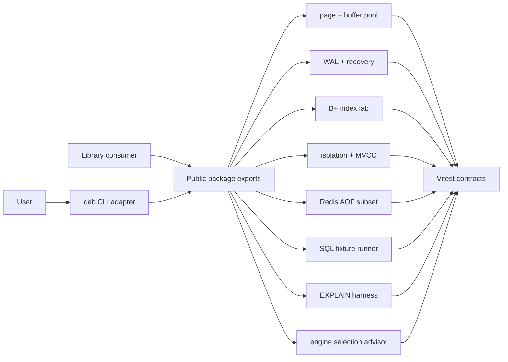

# Database Engines Workbench

## One-Line Purpose

A tested TypeScript library and thin CLI learning surface that exposes selected database engine mechanics: page/WAL storage, B+ index pages, MVCC/isolation demos, Redis AOF subset, SQL fixture runner, EXPLAIN literacy harness, engine-selection advisor, typed contracts, and bounded resource limits.

## Status

**Active.** Core modules and tests target [[08-Databases/code/src|08-Databases/code/src]] and [[08-Databases/code/tests/labs.test.ts|labs.test.ts]]. Package facade, public re-exports, and CLI integration (`deb`) are the active portfolio scope.

This workbench is **not an Express/Fastify product stack, ORM, repository layer, Mongo/Postgres/Redis replacement, or multi-region system design course**. It is an inspectable educational model with explicit behavioral limits.

## Goals

- Present integrated engine mechanics through one versioned package boundary and a deterministic CLI.
- Preserve small modules that can be tested and reasoned about independently.
- Make durability, isolation, access-path, and persistence trade-offs visible.
- Demonstrate production disciplines: contracts, security, tests, releases, and observability for database literacy.

## Non-Goals

- Express, Nest, or other application HTTP frameworks.
- ORMs, query builders, repository patterns, or migration products.
- Claiming to replace PostgreSQL, MongoDB, or Redis in production.
- Multi-region CAP product design (handoff to [[09-System-Design/README|System Design]]).
- Full SQL compatibility, wire protocols, or replication clusters.

## Architecture Snapshot



## Document Map

| Document | Purpose |
| --- | --- |
| [[08-Databases/projects/Database Engines Workbench/Planning\|Planning]] | Scope, milestones, risks |
| [[08-Databases/projects/Database Engines Workbench/Requirements\|Requirements]] | Functional and non-functional requirements |
| [[08-Databases/projects/Database Engines Workbench/Architecture\|Architecture]] | System shape and major components |
| [[08-Databases/projects/Database Engines Workbench/Database\|Database]] | Educational engines stance (not product DB) |
| [[08-Databases/projects/Database Engines Workbench/API\|API]] | Interfaces and contracts |
| [[08-Databases/projects/Database Engines Workbench/Deployment\|Deployment]] | Environments and release path |
| [[08-Databases/projects/Database Engines Workbench/Security\|Security]] | Threats, controls, secrets |
| [[08-Databases/projects/Database Engines Workbench/Testing\|Testing]] | Verification strategy |
| [[08-Databases/projects/Database Engines Workbench/Monitoring\|Monitoring]] | Release health and lab diagnostics |
| [[08-Databases/projects/Database Engines Workbench/Engineering Journal\|Engineering Journal]] | Session logs |
| [[08-Databases/projects/Database Engines Workbench/Debug Diary\|Debug Diary]] | Bug investigations |
| [[08-Databases/projects/Database Engines Workbench/Known Issues\|Known Issues]] | Open defects and debt |
| [[08-Databases/projects/Database Engines Workbench/Lessons Learned\|Lessons Learned]] | Durable takeaways |
| [[08-Databases/projects/Database Engines Workbench/Postmortem\|Postmortem]] | Retrospectives |
| [[08-Databases/projects/Database Engines Workbench/Ideas\|Ideas]] | Backlog |
| [[08-Databases/projects/Database Engines Workbench/Roadmap\|Roadmap]] | Phased delivery |
| [[08-Databases/projects/Database Engines Workbench/ADR/ADR-001 Educational Engine Scope\|ADR-001]] · [[08-Databases/projects/Database Engines Workbench/ADR/ADR-002 Postgres-First Relational Default\|ADR-002]] · [[08-Databases/projects/Database Engines Workbench/ADR/ADR-003 Redis Persistence Teaching Model\|ADR-003]] · [[08-Databases/projects/Database Engines Workbench/ADR/ADR-004 Isolation Lab Defaults\|ADR-004]] · [[08-Databases/projects/Database Engines Workbench/ADR/ADR-005 Backup and PITR Drill Policy\|ADR-005]] |

## Mini Projects

| Mini project | Module focus |
| --- | --- |
| [[08-Databases/projects/Toy Page and WAL Store/README\|Toy Page and WAL Store]] | page store, buffer pool, WAL |
| [[08-Databases/projects/Mini B-Plus Index Lab/README\|Mini B-Plus Index Lab]] | on-disk B+ index |
| [[08-Databases/projects/Isolation Anomaly Clinic/README\|Isolation Anomaly Clinic]] | locks, MVCC, anomalies |
| [[08-Databases/projects/Mini Redis Persistence Lab/README\|Mini Redis Persistence Lab]] | dict + AOF |
| [[08-Databases/projects/EXPLAIN Literacy Workbench/README\|EXPLAIN Literacy Workbench]] | cost model + plan harness |

## Run and Test

```bash
cd 08-Databases/code
npm install
npm test
```

The documented CLI target is `deb <command> --json`; until its adapter lands under [[08-Databases/code|08-Databases/code]], use imported TypeScript APIs described in [[08-Databases/projects/Database Engines Workbench/API|API]].

## Portfolio Acceptance Checklist

- [ ] All documented capabilities export from one package boundary.
- [ ] CLI output is deterministic JSON; errors use stable non-zero exit codes.
- [ ] Unit and integration tests cover WAL ordering, index splits, isolation schedules, AOF replay, and plan scoring.
- [ ] Package ships typed public symbols and excludes test fixtures from artifacts.
- [ ] Security and monitoring checks pass before a tagged release.
- [ ] Engine-selection advisor links to wiki matrix without prescribing product architecture.

## Related Notes

- [[08-Databases/code/README|Databases Code Labs]]
- [[08-Databases/README|Databases Track]]
- [[Projects/README|Projects]]
- [[Career/README|Career]]
