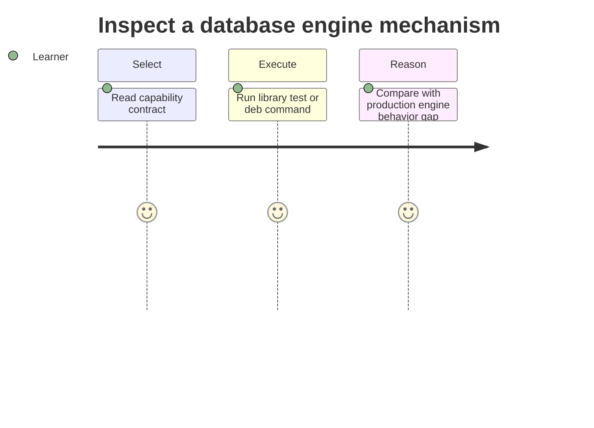

# Requirements — Database Engines Workbench

## Actors

| Actor | Goal |
| --- | --- |
| Learner | Inspect engine mechanics and reproduce anomalies or recovery paths |
| Library consumer | Import typed, documented educational APIs |
| CLI user | Run deterministic labs without writing code |
| Maintainer | Change modules without silently breaking contracts |
| Instructor | Score EXPLAIN literacy and isolation scenarios from fixtures |

## Functional Requirements

| ID | Requirement | Acceptance |
| --- | --- | --- |
| FR-001 | Export page store + buffer pool | Slot CRUD and eviction tests pass |
| FR-002 | Export WAL append + redo recovery | Crash recovery fixtures pass |
| FR-003 | Export B+ index search/range/split | Golden tree and fuzz tests pass |
| FR-004 | Export isolation schedule runner | Anomaly catalog schedules classified correctly |
| FR-005 | Export MVCC visibility helpers | Tuple visibility table tests pass |
| FR-006 | Export Redis dict + AOF replay/rewrite | fsync mode matrix passes |
| FR-007 | Export SQL fixture runner (SELECT subset) | Schema fixtures execute with expected counts |
| FR-008 | Export EXPLAIN harness + cost chooser | Rubric scoring tests pass |
| FR-009 | Export engine-selection advisor | Decision matrix cases match documented rules |
| FR-010 | Offer JSON CLI for each capability | Valid input → documented JSON + exit 0 |

## Non-Functional Requirements

| ID | Category | Requirement | Measurement |
| --- | --- | --- | --- |
| NFR-001 | Correctness | Deterministic schedules and recovery | 100% contract suite pass |
| NFR-002 | Performance | Bounded pages, keys, locks, AOF size | limits enforced before work |
| NFR-003 | Security | No eval of CLI input; jail data paths | negative security tests pass |
| NFR-004 | Portability | Node LTS on Windows/Linux/macOS | CI matrix passes |
| NFR-005 | Observability | JSON stdout; diagnostics stderr | integration tests assert separation |
| NFR-006 | Honesty | Document gaps vs Postgres/Mongo/Redis | each module links limitations |

## Traceability

FR-001/FR-002 → [[08-Databases/projects/Database Engines Workbench/ADR/ADR-001 Educational Engine Scope|ADR-001]]; FR-007/FR-008 → [[08-Databases/projects/Database Engines Workbench/ADR/ADR-002 Postgres-First Relational Default|ADR-002]]; FR-006 → [[08-Databases/projects/Database Engines Workbench/ADR/ADR-003 Redis Persistence Teaching Model|ADR-003]]; FR-004/FR-005 → [[08-Databases/projects/Database Engines Workbench/ADR/ADR-004 Isolation Lab Defaults|ADR-004]]; backup drills → [[08-Databases/projects/Database Engines Workbench/ADR/ADR-005 Backup and PITR Drill Policy|ADR-005]].

## Related Documents

- [[08-Databases/projects/Database Engines Workbench/API|API]]
- [[08-Databases/projects/Database Engines Workbench/Testing|Testing]]
