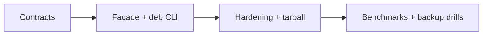

# Roadmap — Database Engines Workbench

## Current Phase

P0 contract and integration design is active. Wiki and project documentation exist; distributable product boundaries in [[08-Databases/code|08-Databases/code]] do not.

| Phase | Outcome | Exit criteria |
| --- | --- | --- |
| P0 | Truthful contracts and decisions | requirements, API, security, tests, ADRs reviewed |
| P1 | Integrated vertical slice | ten exports and ten CLI commands pass contracts |
| P2 | Release-ready artifact | CI matrix, audit triage, tarball smoke, docs match behavior |
| P3 | Evidence-led enhancements | bench fixtures + ADR-005 drill scripts justified by measured need |

## Now

Implement core modules under `08-Databases/code/src`, define facade exports, CLI JSON schemas, resource ceilings, error codes, and Vitest suites per mini project.

## Next

Land `deb` adapter, npm pack smoke test, clean-install CI job, isolation golden schedules, WAL crash injection harness.

## Later

Evaluate doublewrite lab, B+ delete, RESP AOF adapter, optional Postgres EXPLAIN CI job from [[08-Databases/projects/Database Engines Workbench/Ideas|Ideas]]. Do not add Express, ORM, repository, or production-database-replacement scope.

## Related Documents

- [[08-Databases/projects/Database Engines Workbench/Planning|Planning]]
- [[08-Databases/projects/Database Engines Workbench/Known Issues|Known Issues]]
