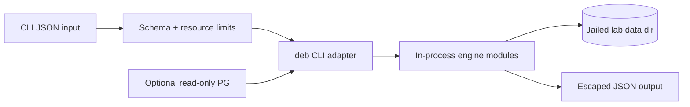

# Security — Database Engines Workbench

## Trust Boundaries

## Threat Model

| Threat | Example | Control |
| --- | --- | --- |
| Code execution | input treated as JS/SQL source | parse JSON only; SQL fixture allowlist |
| Path traversal | `--data-dir ../../` | root jail on all FS ops |
| Resource exhaustion | huge WAL or lock storm | byte, page, lock, schedule step caps |
| Credential leakage | log `DEB_PG_URL` | redact connection strings in stderr |
| Supply-chain compromise | malicious dependency | lockfile, audit, minimal deps |
| Misuse as production DB | Redis AOF fsync no | banners + docs; advisor warns |

## Controls

The package needs no credentials for core labs. Optional Postgres uses read-only role. AOF/WAL paths stay under lab root. SQL runner rejects DDL/DML. Isolation schedules are data-only JSON. Engine advisor outputs educational guidance—not authorization to skip backups.

## Security Acceptance

- Negative tests cover malformed, oversized, deeply nested, cyclic, and hostile path inputs.
- `npm audit` findings triaged by exploitability before release.
- Publish token scope is publish-only; unavailable to pull-request jobs.
- Limitations link to [[08-Databases/projects/Database Engines Workbench/Known Issues|Known Issues]] and [[08-Databases/projects/Database Engines Workbench/Postmortem|Postmortem]].

## Related Documents

- [[08-Databases/projects/Database Engines Workbench/Requirements|Requirements]]
- [[08-Databases/projects/Database Engines Workbench/ADR/ADR-005 Backup and PITR Drill Policy|ADR-005]]
- [[08-Databases/12-Production-Database-Ops/Roles TLS and Least Privilege to the Database|Roles TLS and Least Privilege to the Database]]
