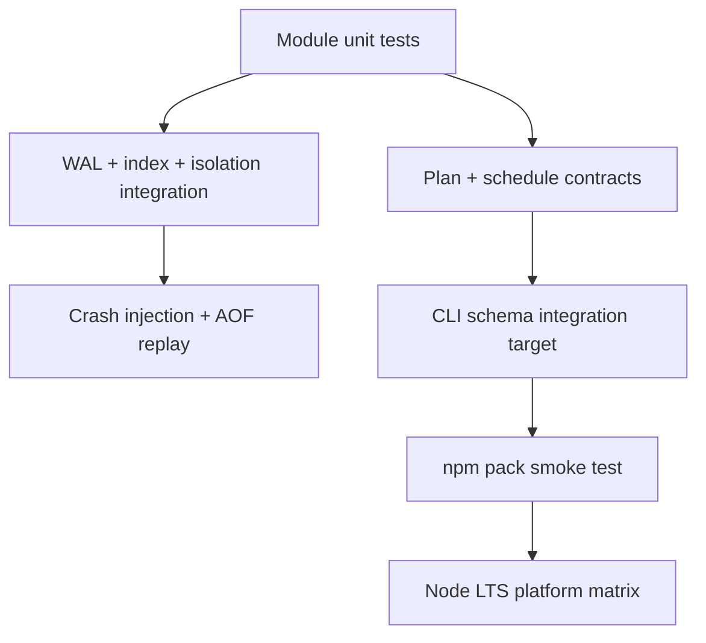

# Testing — Database Engines Workbench

## Strategy



## Test Layers

| Layer | Coverage |
| --- | --- |
| Unit | slot math, WAL records, B+ splits, visibility, cost model |
| Integration | recovery after crash; index+page store; isolation schedules |
| Contract | JSON CLI schemas, stderr/stdout separation, exit codes |
| Package | install tarball, import facade, invoke `deb` entry |
| Platform | Windows/Linux/macOS on Node 20+ LTS |
| Optional | Postgres EXPLAIN adapter when `DEB_PG_URL` set |

## Current Command

```bash
cd 08-Databases/code
npm install
npm test
```

Target executable coverage: [[08-Databases/code/tests/labs.test.ts|labs.test.ts]]. Required additions include facade export smoke tests, CLI schema validation, hostile path fixtures, AOF rewrite failure paths, isolation anomaly golden schedules, and packed-artifact smoke tests.

## Module Test Filters

| Capability | Vitest filter |
| --- | --- |
| Page + WAL | `PageStore\|BufferPool\|Wal` |
| B+ index | `BPlusIndex` |
| Isolation | `IsolationLab\|LockManager\|Mvcc` |
| Redis AOF | `RedisDict\|RedisAof` |
| EXPLAIN | `ExplainHarness\|CostModel\|PlanParser` |
| SQL fixtures | `SqlFixture` |
| Advisor | `EngineAdvisor` |

## Definition of Done

- [ ] Mini project acceptance criteria trace to named tests
- [ ] Crash tests clean temp dirs on success and failure
- [ ] CLI contract tests land with facade (target M2)
- [ ] Optional Postgres job isolated from default CI

## Related Documents

- [[08-Databases/projects/Database Engines Workbench/Deployment|Deployment]]
- [[08-Databases/projects/Database Engines Workbench/API|API]]
