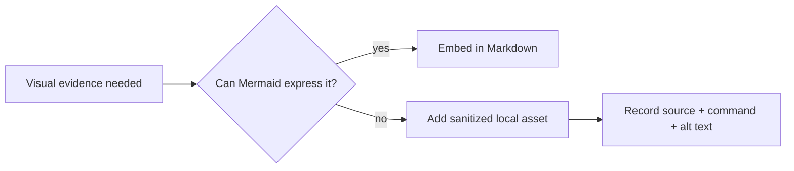

# Assets — Database Engines Workbench

## Purpose

Store project-local exported diagrams, benchmark charts, EXPLAIN plan screenshots, and sanitized CLI output only when Mermaid or text cannot express the evidence.

## Rules

- Prefer Mermaid embedded in [[08-Databases/projects/Database Engines Workbench/Architecture|Architecture]], [[08-Databases/projects/Database Engines Workbench/Security|Security]], and [[08-Databases/projects/Database Engines Workbench/Testing|Testing]].
- Use descriptive lowercase filenames with date or semver when time-dependent.
- Include source, generation command, license, and accessibility description beside every binary asset.
- Never commit credentials, `.env` dumps, production EXPLAIN plans with real data, WAL/AOF files from learner machines, unredacted `DEB_PG_URL`, or `npm pack` tarballs.
- Keep executable fixtures in [[08-Databases/code/tests|code/tests]], not in this documentation directory.

## Related Documents

- [[08-Databases/projects/Database Engines Workbench/README|Project README]]
- [[08-Databases/code/README|Databases Code Labs]]
