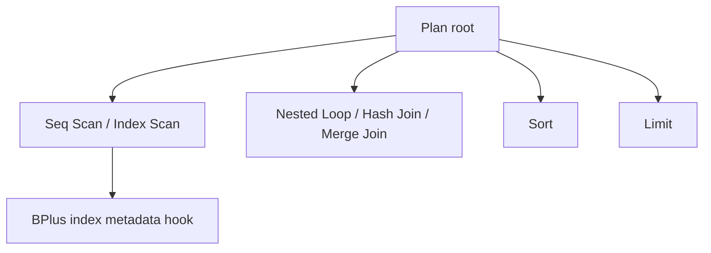

# Architecture — EXPLAIN Literacy Workbench

## Summary

Three layers: fixture SQL + stats catalog, educational cost model producing plan trees, and harness that diffs/scores against golden plans. Source: [[08-Databases/code/src/explain-harness.ts|explain-harness.ts]], [[08-Databases/code/src/cost-model.ts|cost-model.ts]], [[08-Databases/code/src/plan-parser.ts|plan-parser.ts]].

## Plan Node Types

| Node | Cost inputs |
| --- | --- |
| Seq Scan | `pages`, `cpu_per_row` |
| Index Scan | `index_pages`, `selectivity`, `heap_fetch` |
| Nested Loop | outer rows × inner cost |
| Hash Join | build + probe memory budget |
| Sort | `n log n` work mem spill flag |

## SQL Fixture Runner

Subset executor over in-memory tables defined in JSON schema fixtures—not a full SQL engine. Produces row counts for chooser validation. Ties to [[08-Databases/code/src/sql-fixture-runner.ts|sql-fixture-runner.ts]] in Workbench.

## Scoring Rubric

| Check | Points |
| --- | --- |
| Correct access path | 40 |
| Correct join algorithm | 30 |
| Avoids redundant sort | 20 |
| Identifies missing index | 10 |

Harness emits hints referencing wiki sections, not production runbooks.

## Live Postgres Adapter (Optional)

When `DEB_PG_URL` set, `capturePlan(sql)` runs `EXPLAIN (FORMAT JSON)` and normalizes to lab plan shape for diff-only exercises. CI default remains offline fixtures.

## Related Documents

- [[08-Databases/projects/EXPLAIN Literacy Workbench/README|Project README]]
- [[08-Databases/04-Query-Processing-and-Planning/EXPLAIN and EXPLAIN ANALYZE Literacy|EXPLAIN and EXPLAIN ANALYZE Literacy]]
- [[08-Databases/projects/Database Engines Workbench/ADR/ADR-002 Postgres-First Relational Default|ADR-002]]
