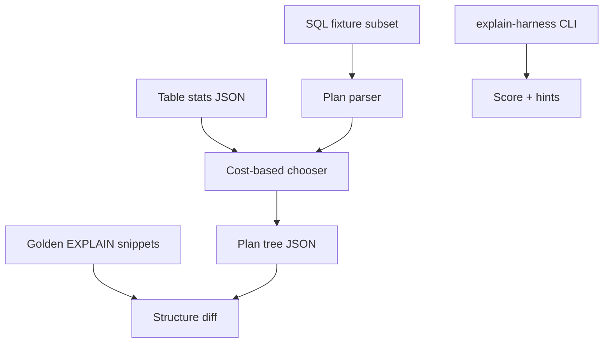

# EXPLAIN Literacy Workbench

## One-Line Purpose

Parse fixture query plans, score access-path choices, and teach EXPLAIN / EXPLAIN ANALYZE literacy with a cost-model harness—bridging wiki planner notes to inspectable JSON without requiring a live Postgres instance for every test.

## Status

**Active.** The learning surface targets [[08-Databases/code/src/plan-parser.ts|plan-parser.ts]], [[08-Databases/code/src/cost-model.ts|cost-model.ts]], and [[08-Databases/code/src/explain-harness.ts|explain-harness.ts]] in [[08-Databases/code/tests/labs.test.ts|labs.test.ts]].

## Prerequisites

- [[08-Databases/04-Query-Processing-and-Planning/Parse Bind Plan Execute Pipeline|Parse Bind Plan Execute Pipeline]]
- [[08-Databases/04-Query-Processing-and-Planning/Cost Models Statistics and Cardinality|Cost Models Statistics and Cardinality]]
- [[08-Databases/04-Query-Processing-and-Planning/Access Paths Seq Scan vs Index|Access Paths Seq Scan vs Index]]
- [[08-Databases/04-Query-Processing-and-Planning/Join Algorithms Nested Loop Hash Merge|Join Algorithms Nested Loop Hash Merge]]
- [[08-Databases/04-Query-Processing-and-Planning/EXPLAIN and EXPLAIN ANALYZE Literacy|EXPLAIN and EXPLAIN ANALYZE Literacy]]
- [[08-Databases/projects/Mini B-Plus Index Lab/README|Mini B+ Index Lab]]

## Architecture



See [[08-Databases/projects/EXPLAIN Literacy Workbench/Architecture|Architecture]] for node types and scoring rubric.

## Acceptance Criteria

- [ ] SQL fixture runner supports `SELECT` with `WHERE`, `JOIN`, `ORDER BY`, `LIMIT` on declared schemas.
- [ ] Chooser picks seq scan vs index scan using row count, selectivity, and index availability fixtures.
- [ ] Join chooser demonstrates nested loop vs hash merge at configured cardinality crossover.
- [ ] Plan JSON includes node type, estimated cost, estimated rows, and actual rows when ANALYZE fixture present.
- [ ] `diffPlan` flags seq scan where index expected and missing index hint text.
- [ ] Harness scores learner answers against rubric (access path, join method, sort avoidance).
- [ ] Optional live Postgres mode documented but not required for CI—fixture-first default.

## Run and Test

```bash
cd 08-Databases/code
npm install
npm test -- tests/labs.test.ts -t "ExplainHarness|CostModel|PlanParser"
```

Workbench session:

```bash
npm run lab -- explain score --fixture fixtures/missing-index-orders.sql
```

## Benchmarks

| Workload | Variants | Primary metrics |
| --- | --- | --- |
| Plan parse | small vs deep nested JSON | parse µs |
| Cost chooser | 10 vs 1000 table stats | chooser ms |
| Diff golden plans | 50 fixtures | diff ms |
| Fixture SQL run | indexed vs seq | planned node count |

Benchmark entry point (when added): `08-Databases/code/bench/explain.bench.ts`.

## Security and Failure Constraints

- Fixture SQL is read-only; runner rejects `INSERT`, `UPDATE`, `DELETE`, DDL, and multiple statements.
- No arbitrary file load—fixtures from allowlisted directory only.
- Live Postgres connection string never logged; env var `DEB_PG_URL` optional and redacted in output.
- Do not expose production database credentials in scored reports.

## Exercises and Reflection

1. Add partial index fixture and verify chooser prefers index when predicate matches.
2. Import one real `EXPLAIN (ANALYZE, BUFFERS)` snippet and map nodes to lab vocabulary.
3. Break cardinality estimate on purpose—observe bad nested loop choice.

**Reflection prompts**

- Why can EXPLAIN without ANALYZE lie?
- When is a seq scan legitimately cheaper?
- What statistic would fix a bad join choice?

## Interview Questions

- Read an EXPLAIN plan top-down: what do you look for first?
- Explain nested loop vs hash join cost crossover.
- How do missing stats manifest in production latency?

## Related Notes

- [[08-Databases/projects/EXPLAIN Literacy Workbench/Architecture|Architecture]]
- [[08-Databases/projects/EXPLAIN Literacy Workbench/Testing|Testing]]
- [[08-Databases/projects/EXPLAIN Literacy Workbench/Security|Security]]
- [[08-Databases/README|Databases MOC]]
- [[08-Databases/code/README|Databases Code Labs]]
- [[08-Databases/projects/Database Engines Workbench/README|Database Engines Workbench]]
- [[Career/README|Career]]
