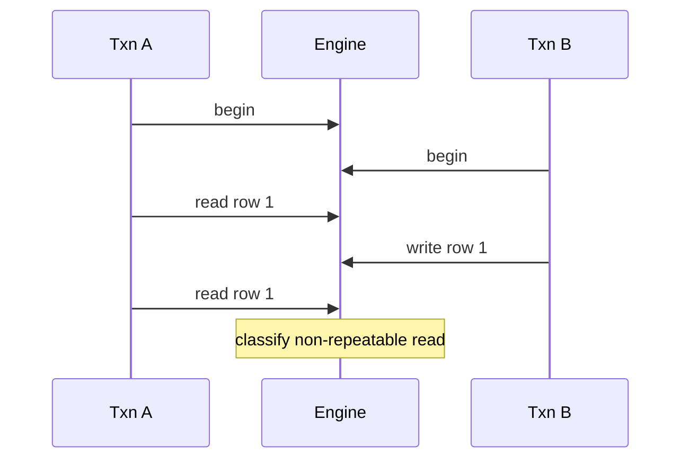

# Architecture — Isolation Anomaly Clinic

## Summary

`IsolationLabEngine` replays declarative schedules against a tuple heap with pluggable concurrency control: row locks, table locks (lab simplification), or MVCC snapshots. Source: [[08-Databases/code/src/isolation-lab.ts|isolation-lab.ts]].

## Schedule DSL

Each step: `{ txn, op: begin|read|write|commit|abort, key, value? }`. Engine yields at every step boundary for deterministic interleaving in tests.

## Subsystems

| Module | Role |
| --- | --- |
| `LockManager` | Shared/exclusive locks, wait-for graph, deadlock victim |
| `MvccSnapshot` | Transaction id, snapshot xmin/xmax, tuple visibility |
| `TupleHeader` | `{ xmin, xmax, deleted }` on lab rows |
| `AnomalyClassifier` | Maps outcomes to anomaly kinds |

## Isolation Presets

| Preset | Reads | Writes | Notes |
| --- | --- | --- | --- |
| `read-uncommitted` | no locks | short write locks | dirty read possible |
| `read-committed` | lock row, release | hold to commit | non-repeatable possible |
| `repeatable-read-snapshot` | snapshot | first-writer-wins row | phantom possible |
| `serializable-locks` | predicate/row locks held | strict 2PL | no anomalies in lab catalog |

Formal defaults: [[08-Databases/projects/Database Engines Workbench/ADR/ADR-004 Isolation Lab Defaults|ADR-004]].

## Write Skew Fixture

Classic two-row eligibility: transactions read disjoint rows, each sees eligible, both update status—snapshot isolation allows both commits; serializable mode aborts one.

## Invariants

- Commit assigns monotonic `commit_id`; abort rolls back version chain for txn.
- Lock manager never holds duplicate incompatible locks on same resource.
- Classifier runs only after full schedule completion or explicit abort.

## Related Documents

- [[08-Databases/projects/Isolation Anomaly Clinic/README|Project README]]
- [[08-Databases/projects/Database Engines Workbench/ADR/ADR-004 Isolation Lab Defaults|ADR-004 Isolation Lab Defaults]]
