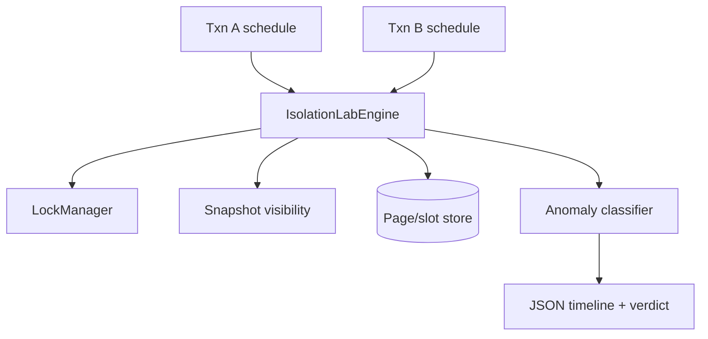

# Isolation Anomaly Clinic

## One-Line Purpose

Reproduce dirty read, non-repeatable read, phantom, write skew, and serialization failures under configurable locking and MVCC snapshot models—making isolation level trade-offs observable in code.

## Status

**Active.** The learning surface targets [[08-Databases/code/src/isolation-lab.ts|isolation-lab.ts]], [[08-Databases/code/src/lock-manager.ts|lock-manager.ts]], and [[08-Databases/code/src/mvcc-snapshot.ts|mvcc-snapshot.ts]] in [[08-Databases/code/tests/labs.test.ts|labs.test.ts]].

## Prerequisites

- [[08-Databases/05-Transactions-and-Isolation/ACID as Engine Contracts|ACID as Engine Contracts]]
- [[08-Databases/05-Transactions-and-Isolation/Anomalies Dirty Nonrepeatable Phantom Serialization|Anomalies Dirty Nonrepeatable Phantom Serialization]]
- [[08-Databases/05-Transactions-and-Isolation/Locking vs MVCC|Locking vs MVCC]]
- [[08-Databases/05-Transactions-and-Isolation/Isolation Levels and Product Defaults|Isolation Levels and Product Defaults]]
- [[08-Databases/05-Transactions-and-Isolation/Snapshot Isolation and SSI Concepts|Snapshot Isolation and SSI Concepts]]
- [[08-Databases/06-Concurrency-Internals/Hot Rows Write Skew and Contention|Hot Rows Write Skew and Contention]]
- [[08-Databases/projects/Toy Page and WAL Store/README|Toy Page and WAL Store]]

## Architecture



See [[08-Databases/projects/Isolation Anomaly Clinic/Architecture|Architecture]] for schedule DSL and isolation presets.

## Acceptance Criteria

- [ ] Schedule runner executes interleaved ops from two+ transactions with deterministic yield points.
- [ ] `READ UNCOMMITTED` allows dirty read demonstration; `READ COMMITTED` blocks it.
- [ ] Non-repeatable read demonstrated under RC; prevented under `REPEATABLE READ` snapshot.
- [ ] Phantom insert demonstrated under snapshot without predicate locking; prevented under serializable locking lab mode.
- [ ] Write-skew scenario (two counters / eligibility row pattern) produces anomaly under SI; prevented under serializable schedule.
- [ ] Deadlock detection returns victim transaction id and ordered wait-for graph.
- [ ] MVCC visibility uses `(xmin, xmax)` tuple headers on lab tuples—vacuum/GC optional exercise.
- [ ] Output includes human timeline + machine `anomalyDetected: kind`.

## Run and Test

```bash
cd 08-Databases/code
npm install
npm test -- tests/labs.test.ts -t "IsolationLab|LockManager|Mvcc"
```

Scenario catalog:

```bash
npm run lab -- isolation run --scenario phantom --mode snapshot
npm run lab -- isolation run --scenario write-skew --mode serializable
```

## Benchmarks

| Workload | Variants | Primary metrics |
| --- | --- | --- |
| Lock acquire/release | 2 vs 8 txns | waits/sec, deadlock count |
| Snapshot read | long vs short horizon | versions scanned |
| Serializable validation | predicate vs row locks | abort rate |
| Schedule replay | 100-step random | determinism hash |

Benchmark entry point (when added): `08-Databases/code/bench/isolation.bench.ts`.

## Security and Failure Constraints

- Schedule files are data-only JSON—no embedded scripts or eval.
- Lock manager caps max transactions and max locks to prevent test hangs.
- Anomaly reports must not include raw tuple payloads from fixtures marked sensitive.
- Lab does not expose network SQL—local in-process only.
- Do not claim full PostgreSQL SSI parity—document simplified predicate model.

## Exercises and Reflection

1. Add `SKIP LOCKED` behavior on contended row read.
2. Implement basic vacuum that reclaims dead tuple versions and measure snapshot horizon.
3. Map each demonstrated anomaly to Postgres default isolation behavior.

**Reflection prompts**

- Why is snapshot isolation not serializable?
- What production symptom suggests write skew?
- When does MVCC beat two-phase locking for read-heavy workloads?

## Interview Questions

- Define dirty, non-repeatable, phantom, and serialization anomalies with timelines.
- Compare locking vs MVCC for long-running readers.
- How would you debug unexpected `40001` serialization failures?

## Related Notes

- [[08-Databases/projects/Isolation Anomaly Clinic/Architecture|Architecture]]
- [[08-Databases/projects/Isolation Anomaly Clinic/Testing|Testing]]
- [[08-Databases/projects/Isolation Anomaly Clinic/Security|Security]]
- [[08-Databases/README|Databases MOC]]
- [[08-Databases/code/README|Databases Code Labs]]
- [[08-Databases/projects/Database Engines Workbench/README|Database Engines Workbench]]
- [[Career/README|Career]]
