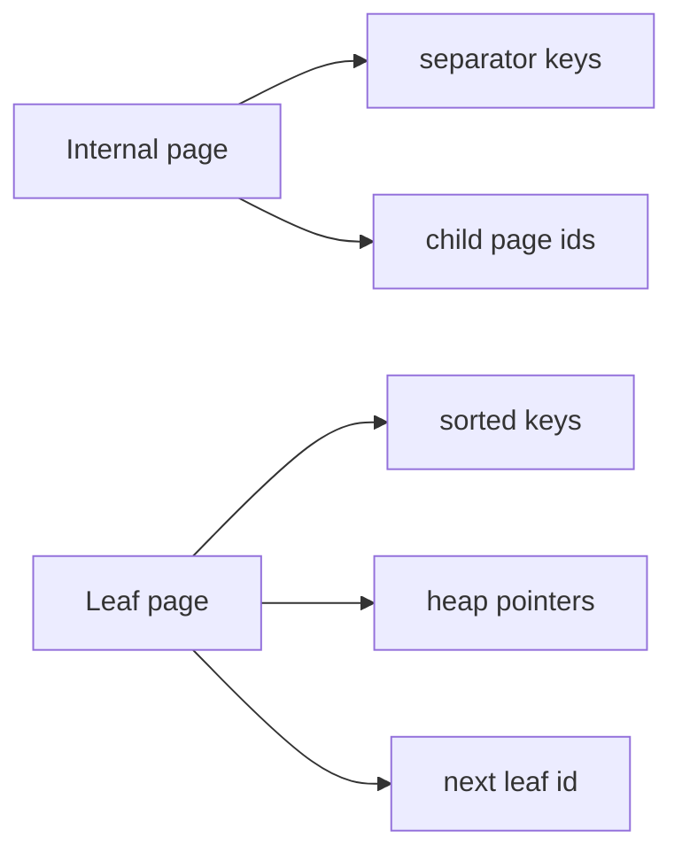

# Architecture — Mini B+ Index Lab

## Summary

`BPlusIndex` stores keys and heap pointers in page-aligned nodes backed by [[08-Databases/code/src/page-store.ts|page-store.ts]]. Internal nodes route; leaves hold data entries and sibling links. Source: [[08-Databases/code/src/bplus-index.ts|bplus-index.ts]].

## Node Layout

| Node kind | Max entries | Overflow policy |
| --- | --- | --- |
| Leaf | `fanout - 1` keys | split half + promote first key of right leaf |
| Internal | `fanout - 1` separators | split + promote middle separator to parent |

Default `fanout` is configurable (lab default 32) to fit page size budget.

## Algorithms

**Search:** root → child while internal; binary search within page; follow `<= key` child pointer.

**Insert:** find leaf; insert in order; on overflow split and insert promoted key into parent recursively.

**Range scan:** locate start leaf; walk `next` until key > end.

## WAL Integration

Index mutations log structural records (`split`, `new_root`, `insert`) so recovery rebuilds tree metadata. Structural WAL is redo-only in v1—rollback of failed multi-page splits is a Workbench follow-up.

## Teaching Hooks

| Symbol | Responsibility |
| --- | --- |
| `BPlusIndex` | Public insert/search/range API |
| `explainIndexLookup` | Returns `{ depth, pagesRead, leafCount }` |
| `dumpTree` | ASCII/Mermaid-friendly shape for tests |

## Invariants

- All keys in left subtree `< separator` (lab uses non-strict `<` on duplicates policy documented in README).
- Leaves at same depth; internal nodes have at least one child.
- Sibling links form a doubly-linked list at leaf level (optional `prev` for exercises).

## Related Documents

- [[08-Databases/projects/Mini B-Plus Index Lab/README|Project README]]
- [[08-Databases/03-Indexing-on-Disk/B-Plus Trees as Page Structures|B+ Trees as Page Structures]]
- [[08-Databases/projects/Database Engines Workbench/ADR/ADR-001 Educational Engine Scope|ADR-001]]
