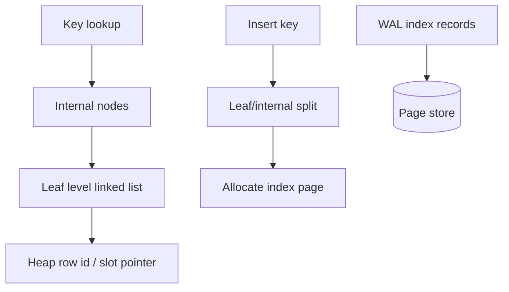

# Mini B-Plus Index Lab

## One-Line Purpose

Build a page-backed B+ tree index with leaf linked lists, root-to-leaf search, splits, and secondary-index semantics—connecting disk page structures to access-path reasoning without implementing a full planner.

## Status

**Active.** The learning surface targets [[08-Databases/code/src/bplus-index.ts|bplus-index.ts]] and page integration via [[08-Databases/code/src/page-store.ts|page-store.ts]] in [[08-Databases/code/tests/labs.test.ts|labs.test.ts]].

## Prerequisites

- [[04-Data-Structures/05-Trees-and-Ordered-Maps/B-Trees and B-Plus Trees Concepts|B-Trees and B-Plus Trees Concepts]]
- [[08-Databases/03-Indexing-on-Disk/B-Plus Trees as Page Structures|B-Plus Trees as Page Structures]]
- [[08-Databases/03-Indexing-on-Disk/Secondary Covering and Partial Indexes|Secondary Covering and Partial Indexes]]
- [[08-Databases/03-Indexing-on-Disk/Hash Indexes and Equality Lookups|Hash Indexes and Equality Lookups]]
- [[08-Databases/04-Query-Processing-and-Planning/Access Paths Seq Scan vs Index|Access Paths Seq Scan vs Index]]
- [[08-Databases/projects/Toy Page and WAL Store/README|Toy Page and WAL Store]]

## Architecture



See [[08-Databases/projects/Mini B-Plus Index Lab/Architecture|Architecture]] for fanout, separator keys, and split propagation.

## Acceptance Criteria

- [ ] Search returns correct RID for present keys and `null` for absent keys.
- [ ] Range scan walks leaf sibling pointers in sorted order without revisiting internal nodes.
- [ ] Leaf split promotes separator; internal split propagates to root; root split increases tree height by one.
- [ ] Duplicate keys supported with stable insert order (lab policy: append at leaf).
- [ ] Index pages persist through [[08-Databases/projects/Toy Page and WAL Store/README|Toy Page and WAL Store]] WAL + recovery path.
- [ ] `explainIndexLookup` returns depth, pages touched, and leaf count for teaching.
- [ ] Secondary index mode stores `(key → heap_page_id, slot)` only—no clustered table rewrite.

## Run and Test

```bash
cd 08-Databases/code
npm install
npm test -- tests/labs.test.ts -t "BPlusIndex"
```

Visualization (when CLI lands):

```bash
npm run lab -- index dump --keys 1000 --fanout 32
```

## Benchmarks

| Workload | Variants | Primary metrics |
| --- | --- | --- |
| Point lookup | tree height 2 vs 4 | comparisons, pages read |
| Range scan | 10 vs 10k keys | leaf pages walked |
| Insert burst | random vs sequential keys | splits/sec, WAL bytes |
| Bulk load | sorted insert vs random | tree balance metric |

Benchmark entry point (when added): `08-Databases/code/bench/bplus.bench.ts`.

## Security and Failure Constraints

- Key and RID payloads are bounded length; reject oversize entries before page allocation.
- Index dump must not follow pointers outside allocated page id space.
- No user-provided comparator functions from CLI (fixed lexicographic / numeric modes only).
- Do not claim index-only scan or visibility-map semantics—Postgres hooks are wiki-only.

## Exercises and Reflection

1. Implement backward leaf scan via `prev` pointers.
2. Compare hash index equality path for UUID PK vs B+ range queries.
3. Add fillfactor knob and measure split rate under updates.

**Reflection prompts**

- Why do B+ trees keep keys out of internal nodes in some texts but not others?
- When does a secondary index stop helping?
- How would a bad cardinality estimate pick seq scan over your index?

## Interview Questions

- Explain leaf vs internal splits during insert.
- What is the difference between clustered and secondary indexes on disk?
- How does index depth relate to fanout and row count?

## Related Notes

- [[08-Databases/projects/Mini B-Plus Index Lab/Architecture|Architecture]]
- [[08-Databases/projects/Mini B-Plus Index Lab/Testing|Testing]]
- [[08-Databases/projects/Mini B-Plus Index Lab/Security|Security]]
- [[08-Databases/README|Databases MOC]]
- [[08-Databases/code/README|Databases Code Labs]]
- [[08-Databases/projects/Database Engines Workbench/README|Database Engines Workbench]]
- [[Career/README|Career]]
