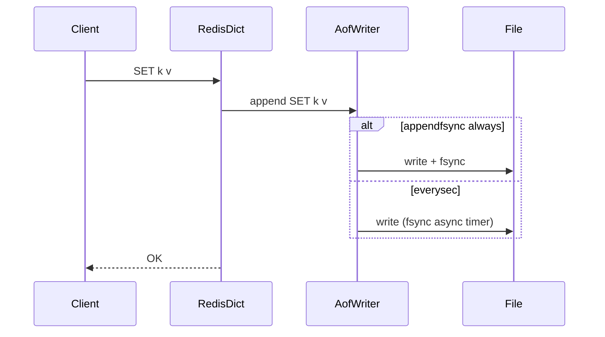

# Architecture — Mini Redis Persistence Lab

## Summary

`RedisDict` holds string keys to typed lab values; `AofWriter` serializes mutating commands; `AofReplayer` applies idempotent command stream on startup. Source: [[08-Databases/code/src/redis-dict.ts|redis-dict.ts]], [[08-Databases/code/src/redis-aof.ts|redis-aof.ts]].

## Command Path

## AOF Record Format (Lab)

JSON lines for testability: `{ "ts", "cmd", "argv"[] }`. Production Redis uses RESP; lab documents mapping in API doc.

## Rewrite Flow

1. Pause incoming writes (lab mutex).
2. Scan dict generating minimal `SET` stream (skip tombstoned keys).
3. Write `appendonly.aof.rewrite` completely.
4. `rename` over active AOF + fsync directory metadata.
5. Resume writes; append subsequent ops to new file.

Teaching model per [[08-Databases/projects/Database Engines Workbench/ADR/ADR-003 Redis Persistence Teaching Model|ADR-003]]—no fork-based COW.

## Eviction

When `used_memory > maxmemory`, sample keys with approximate LRU counter; evict until under limit. Expired keys removed lazily on access + active cycle in exercises.

## Public Surface

| Symbol | Responsibility |
| --- | --- |
| `RedisDict` | Command dispatch + memory accounting |
| `AofWriter` | Durability policy + fsync scheduler |
| `AofReplayer` | Cold start rebuild |
| `rewriteAof` | Compaction job |

## Related Documents

- [[08-Databases/projects/Mini Redis Persistence Lab/README|Project README]]
- [[08-Databases/projects/Database Engines Workbench/ADR/ADR-003 Redis Persistence Teaching Model|ADR-003]]
