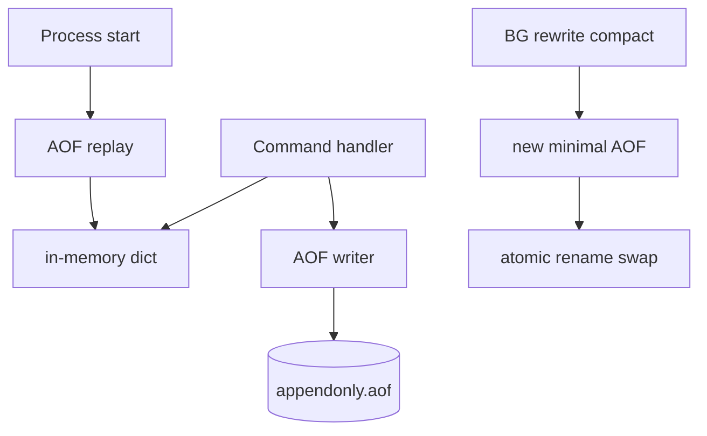

# Mini Redis Persistence Lab

## One-Line Purpose

Implement an in-memory dict with a subset of Redis commands and AOF append/replay—demonstrating durability, fsync policies, and rewrite compaction without claiming Redis or RDB parity.

## Status

**Active.** The learning surface targets [[08-Databases/code/src/redis-dict.ts|redis-dict.ts]] and [[08-Databases/code/src/redis-aof.ts|redis-aof.ts]] in [[08-Databases/code/tests/labs.test.ts|labs.test.ts]].

## Prerequisites

- [[08-Databases/10-Redis-and-In-Memory-Engines/Redis Data Structures as Persistence API|Redis Data Structures as Persistence API]]
- [[08-Databases/10-Redis-and-In-Memory-Engines/RDB Snapshots and AOF|RDB Snapshots and AOF]]
- [[08-Databases/10-Redis-and-In-Memory-Engines/Single-Threaded Execution and Persistence Trade-offs|Single-Threaded Execution and Persistence Trade-offs]]
- [[08-Databases/10-Redis-and-In-Memory-Engines/Eviction Policies and Memory Limits|Eviction Policies and Memory Limits]]
- [[08-Databases/10-Redis-and-In-Memory-Engines/Redis as Cache vs Primary Store|Redis as Cache vs Primary Store]]
- [[08-Databases/02-WAL-Durability-and-Recovery/fsync Group Commit and Durability Levels|fsync Group Commit and Durability Levels]]

## Architecture



See [[08-Databases/projects/Mini Redis Persistence Lab/Architecture|Architecture]] for command subset and fsync modes.

## Acceptance Criteria

- [ ] Commands supported: `SET`, `GET`, `DEL`, `INCR`, `EXPIRE` (lab timer wheel or lazy expiry).
- [ ] Each mutating command appends RESP-like or JSON-line AOF entry before acknowledging (per durability mode).
- [ ] `appendfsync always|everysec|no` changes observable loss window in crash tests.
- [ ] AOF replay rebuilds identical dict state from cold start.
- [ ] AOF rewrite rewrites current keyspace to minimal command sequence; swap is atomic on same volume.
- [ ] Memory limit triggers eviction policy `allkeys-lru` (lab simplified LRU).
- [ ] `INFO persistence` lab struct reports `aof_size`, `rewrite_in_progress`, `last_fsync_ms`.

## Run and Test

```bash
cd 08-Databases/code
npm install
npm test -- tests/labs.test.ts -t "RedisDict|RedisAof"
```

Crash drill:

```bash
npm run lab -- redis crash --commands 1000 --fsync everysec --kill-after-ms 50
```

## Benchmarks

| Workload | Variants | Primary metrics |
| --- | --- | --- |
| SET throughput | fsync always vs no | ops/sec, p99 latency |
| Replay | 1k vs 1M entries | replay seconds |
| Rewrite | 50% stale keys | rewrite time, size reduction |
| Eviction | over maxmemory | evicted keys/sec |

Benchmark entry point (when added): `08-Databases/code/bench/redis-aof.bench.ts`.

## Security and Failure Constraints

- AOF path jailed to lab root; no arbitrary file read in rewrite.
- Command parser rejects nested bulk strings beyond size cap.
- No network listener in v1—CLI and in-process API only.
- Do not position lab as primary store for authoritative data.
- RDB binary snapshot out of scope—AOF teaching only per ADR-003.

## Exercises and Reflection

1. Add `MULTI`/`EXEC` no-op stub and discuss why Redis queues commands.
2. Compare everysec loss window with Postgres synchronous commit.
3. Implement copy-on-write rewrite using fork simulation (child process optional).

**Reflection prompts**

- Why is Redis single-threaded yet still durable?
- When is AOF rewrite worth the spike risk?
- What breaks if you use Redis as source of truth without fsync?

## Interview Questions

- Explain AOF vs RDB trade-offs.
- What happens on partial AOF write during crash?
- How does `maxmemory` interact with persistence?

## Related Notes

- [[08-Databases/projects/Mini Redis Persistence Lab/Architecture|Architecture]]
- [[08-Databases/projects/Mini Redis Persistence Lab/Testing|Testing]]
- [[08-Databases/projects/Mini Redis Persistence Lab/Security|Security]]
- [[08-Databases/README|Databases MOC]]
- [[08-Databases/code/README|Databases Code Labs]]
- [[08-Databases/projects/Database Engines Workbench/README|Database Engines Workbench]]
- [[Career/README|Career]]
