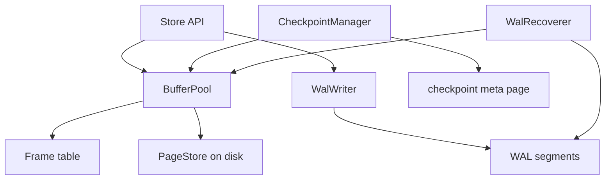

# Architecture — Toy Page and WAL Store

## Summary

Three cooperating modules—`PageStore`, `BufferPool`, and `WalWriter`/`WalRecoverer`—model how engines keep heap pages durable. Source targets: [[08-Databases/code/src/page-store.ts|page-store.ts]], [[08-Databases/code/src/buffer-pool.ts|buffer-pool.ts]], [[08-Databases/code/src/wal.ts|wal.ts]].

## Component Diagram

## Page Layout

| Region | Size | Purpose |
| --- | --- | --- |
| Header | 16 B | page id, LSN, checksum slot, slot count |
| Slot directory | 4 B × N | offset + length per tuple |
| Free space | variable | append-only tuple area |
| Tuple bytes | variable | opaque payload |

Pages are fixed size (default 8 KiB lab constant). Oversized tuples are out of scope—see wiki note on TOAST/overflow.

## WAL Record Shape

| Field | Meaning |
| --- | --- |
| `lsn` | monotonic log sequence number |
| `page_id` | target page |
| `kind` | insert / update / delete |
| `payload` | slot delta bytes |

Write path invariant: **WAL append returns durable (per policy) before dirty page is eligible for checkpoint flush that could expose torn state without redo.**

## Buffer Pool Invariants

- Pin count ≥ 0; pinned frames never evicted.
- At most one frame per `page_id`.
- Dirty frames track `first_dirty_lsn`.
- Unpin does not imply flush—background or checkpoint drives write-back.

## Recovery Model

Redo-only lab scope: on startup, read `checkpoint_lsn`, scan WAL from that offset, reapply page mutations idempotently by `(page_id, lsn)` ordering. Undo log and multi-page transactions are deferred to [[08-Databases/projects/Isolation Anomaly Clinic/README|Isolation Anomaly Clinic]].

## Failure Model

| Failure | Behavior |
| --- | --- |
| Crash after WAL, before page flush | Redo restores page |
| Crash after page flush, before WAL | Data loss—tests document unsafe ordering |
| Partial WAL segment | Recovery stops at last valid record; tail truncation logged |
| Eviction of dirty page without WAL | Forbidden—invariant violation throws in tests |

## Related Documents

- [[08-Databases/projects/Toy Page and WAL Store/README|Project README]]
- [[08-Databases/02-WAL-Durability-and-Recovery/Write-Ahead Logging Protocol|Write-Ahead Logging Protocol]]
- [[08-Databases/projects/Database Engines Workbench/ADR/ADR-001 Educational Engine Scope|ADR-001 Educational Engine Scope]]
