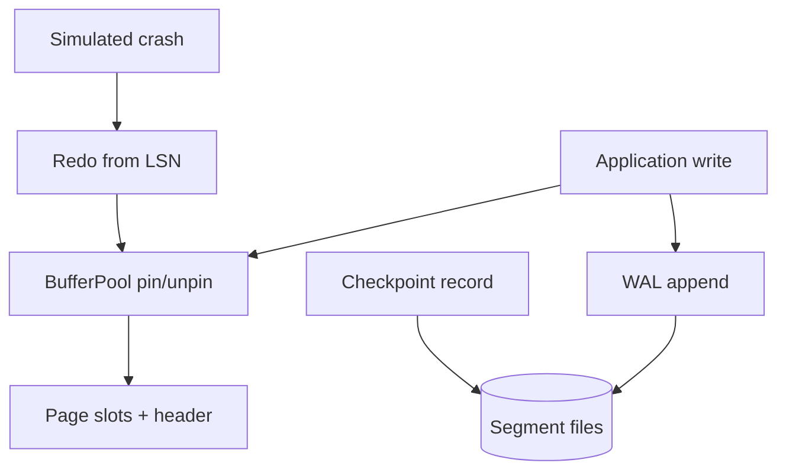

# Toy Page and WAL Store

## One-Line Purpose

Implement a fixed-size page/slot store with a buffer pool, append-only WAL, checkpoint metadata, and crash-recovery redo—making durable storage mechanics inspectable without a full SQL engine.

## Status

**Active.** The learning surface targets [[08-Databases/code/src/page-store.ts|page-store.ts]], [[08-Databases/code/src/buffer-pool.ts|buffer-pool.ts]], and [[08-Databases/code/src/wal.ts|wal.ts]] with recovery checks in [[08-Databases/code/tests/labs.test.ts|labs.test.ts]].

## Prerequisites

- [[08-Databases/01-Storage-and-Buffer-Pool/Pages Blocks and I/O Units|Pages Blocks and I/O Units]]
- [[08-Databases/01-Storage-and-Buffer-Pool/Buffer Pool vs OS Page Cache|Buffer Pool vs OS Page Cache]]
- [[08-Databases/01-Storage-and-Buffer-Pool/Tuple Layout and Oversized Values|Tuple Layout and Oversized Values]]
- [[08-Databases/02-WAL-Durability-and-Recovery/Write-Ahead Logging Protocol|Write-Ahead Logging Protocol]]
- [[08-Databases/02-WAL-Durability-and-Recovery/fsync Group Commit and Durability Levels|fsync Group Commit and Durability Levels]]
- [[08-Databases/02-WAL-Durability-and-Recovery/Crash Recovery Redo and Undo Concepts|Crash Recovery Redo and Undo Concepts]]
- [[04-Data-Structures/00-Orientation-and-Contracts/Memory Layout Locality and Allocation Patterns|Memory Layout Locality and Allocation Patterns]]

## Architecture



See [[08-Databases/projects/Toy Page and WAL Store/Architecture|Architecture]] for page layout, LSN ordering, and dirty-page flush policy.

## Acceptance Criteria

- [ ] Fixed page size with slot directory; insert/update/delete mutate slots within page capacity.
- [ ] Buffer pool pins pages on read/write; eviction respects pin count and dirty flag.
- [ ] Every page mutation appends a WAL record **before** the in-memory page becomes durable-visible to recovery.
- [ ] `fsync` policy configurable: `always`, `group`, `never` (lab-only)—tests prove data loss window under `never`.
- [ ] Checkpoint writes `checkpoint_lsn` and flushes dirty pages up to that LSN.
- [ ] Crash simulator truncates WAL or drops in-memory state; recovery replays from last checkpoint LSN.
- [ ] Recovery is idempotent: double replay does not corrupt page contents.
- [ ] Metrics expose cache hit ratio, dirty page count, and WAL bytes appended.

## Run and Test

```bash
cd 08-Databases/code
npm install
npm test -- tests/labs.test.ts -t "PageStore|BufferPool|Wal"
```

Optional recovery drill:

```bash
npm run lab -- wal recover --data-dir ./tmp/wal-lab --crash-at-lsn 42
```

## Benchmarks

| Workload | Variants | Primary metrics |
| --- | --- | --- |
| Sequential slot inserts | cold vs warm buffer pool | inserts/sec, cache hit % |
| Random page updates | LRU vs clock eviction | evictions/sec, dirty flush count |
| WAL append | fsync always vs group | append latency p50/p99 |
| Recovery | 1k vs 100k records | redo time, pages replayed |

Benchmark entry point (when added): `08-Databases/code/bench/page-wal.bench.ts`.

## Security and Failure Constraints

- Lab data directories must stay under a configured root; reject path traversal in `--data-dir`.
- Simulated crash must not delete files outside the lab root.
- WAL segments are not encrypted in v1—document that production engines use TLS at transport and encryption at rest separately.
- Torn-page simulation is conceptual only unless doublewrite lab is explicitly enabled.
- Never claim this store replaces PostgreSQL durability guarantees.

## Exercises and Reflection

1. Implement clock eviction and compare with LRU on skewed access.
2. Add a torn-page flag and demonstrate why real engines use doublewrite or page checksums.
3. Measure group-commit batch size vs latency trade-off.

**Reflection prompts**

- Why must WAL precede dirty page flush for crash safety?
- What breaks if checkpoint LSN advances past unflushed dirty pages?
- When is `fsync never` acceptable in production (hint: rarely—and never for authoritative data)?

## Interview Questions

- Walk through WAL + buffer pool interaction on a single-row update.
- What is the difference between redo and undo in crash recovery?
- How do torn pages differ from lost WAL records?

## Related Notes

- [[08-Databases/projects/Toy Page and WAL Store/Architecture|Architecture]]
- [[08-Databases/projects/Toy Page and WAL Store/Testing|Testing]]
- [[08-Databases/projects/Toy Page and WAL Store/Security|Security]]
- [[08-Databases/README|Databases MOC]]
- [[08-Databases/code/README|Databases Code Labs]]
- [[08-Databases/projects/Database Engines Workbench/README|Database Engines Workbench]]
- [[Career/README|Career]]
