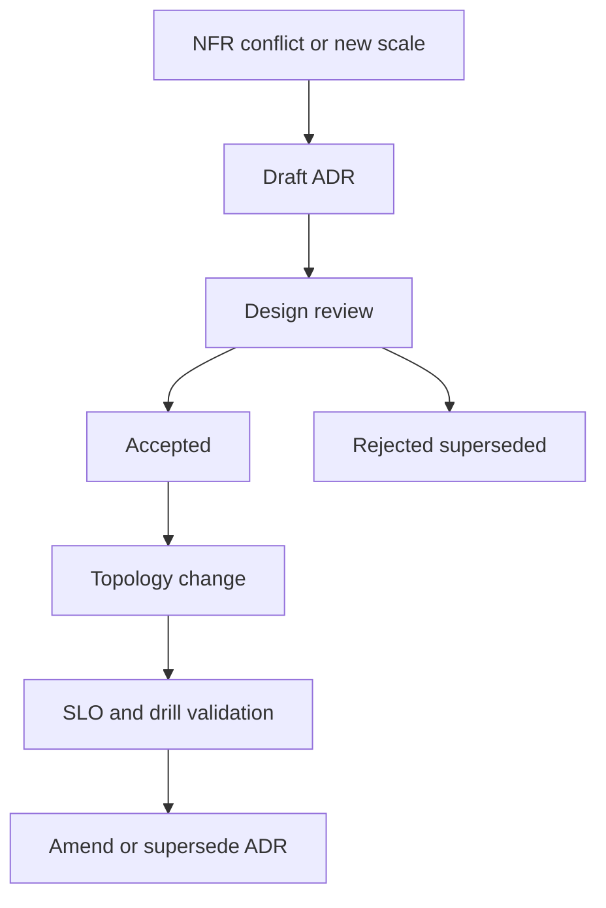
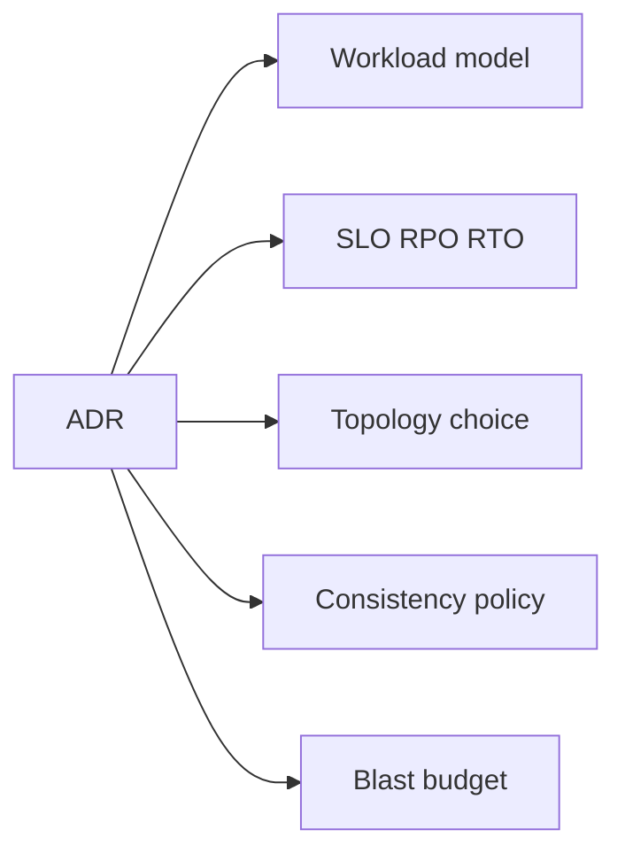
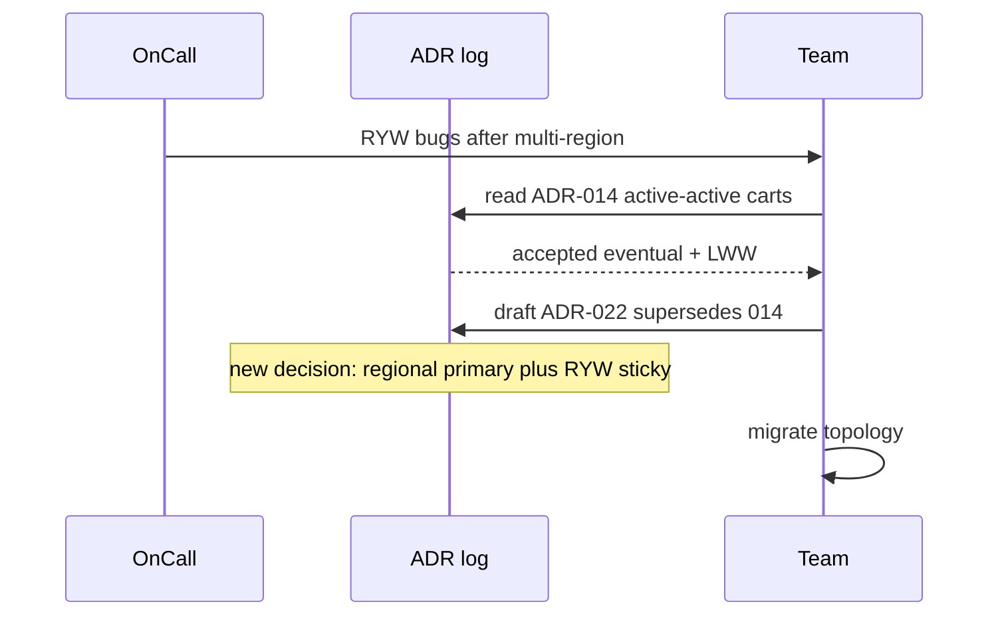

# ADR Discipline for Distributed Decisions

## Overview

An **Architecture Decision Record (ADR)** captures a single significant choice with context, options, consequences, and ownership. In distributed systems, ADRs are not bureaucracy—they are how teams remember *why* the cart is active-passive, *why* R+W > N, and *why* the edge sheds traffic before the database does.

This note defines an ADR discipline tailored to System Design: every topology, consistency, and blast-radius choice gets a record that later modules and interviews can cite.

## Learning Objectives

- Write ADRs that bind NFRs, workload assumptions, and failure budgets to a decision
- Structure options with explicit trade-offs (latency, cost, operability, consistency)
- Assign track owners (SD/Backend/Databases/DevOps) per decision
- Know when *not* to ADR (reversible local choices)
- Use ADRs as living inputs to incident reviews and redesigns

## Prerequisites

- [[09-System-Design/00-Orientation-and-Boundaries/Requirements Non-Functional and Workload Modeling|Requirements Non-Functional and Workload Modeling]]
- [[09-System-Design/00-Orientation-and-Boundaries/Failure Domains and Blast Radius Budgets|Failure Domains and Blast Radius Budgets]]
- [[00-Templates/ADR Template|ADR Template]]

## Difficulty

`intermediate`

## Estimated Time

- Reading: 45 minutes
- Exercises: 1 hour
- Mini project: 2 hours

## History

ADRs (Nygard and successors) spread as microservices multiplied irreversible choices. Cloud vendors made it easy to click "global table" without recording the conflict policy. Mature orgs treat ADRs as the append-only log of product topology—cheaper than tribal memory after staff turnover.

## Problem It Solves

| Failure mode | ADR discipline |
| --- | --- |
| "Why Cassandra?" unanswered two years later | Context + rejected alternatives preserved |
| Silent consistency downgrade in incident | Decision + invariants recorded; change needs new ADR |
| Duplicate conflicting designs across teams | Named owners and links to MOC |
| Interview handwaving | Practice articulating consequences |

## Internal Implementation

### ADR lifecycle for distributed choices



Minimum fields for SD ADRs: **Status, Context (workload+NFR), Decision, Options, Consequences, Blast radius, Owner track, Related notes**.

## Mermaid Diagrams

### Structure



### Sequence / Lifecycle — superseding a decision



## Examples

### Minimal Example — ADR body as data

```typescript
export type SdAdr = {
  id: string;
  title: string;
  status: "proposed" | "accepted" | "superseded" | "rejected";
  context: string;
  decision: string;
  options: Array<{ name: string; pros: string[]; cons: string[] }>;
  consequences: string[];
  blastBudgetRef: string;
  owner: "SystemDesign" | "Backend" | "Databases" | "DevOps";
  related: string[];
};

export const ADR_015: SdAdr = {
  id: "ADR-015",
  title: "Checkout writes use single-region primary",
  status: "accepted",
  context: "RPO=0 payments; p99 write 200ms; EU users tolerate +80ms RTT",
  decision: "Single primary in us-east-1; EU read replicas for non-checkout",
  options: [
    {
      name: "Active-active multi-primary",
      pros: ["Lower EU write latency"],
      cons: ["Conflict policy on inventory", "Split-brain risk"],
    },
    {
      name: "Single primary",
      pros: ["Simple invariants", "Clear RPO"],
      cons: ["Cross-ocean write latency"],
    },
  ],
  consequences: [
    "EU checkout write latency includes transatlantic RTT",
    "Failover runbook required (RTO 15m)",
  ],
  blastBudgetRef: "CHECKOUT_BUDGETS.az",
  owner: "SystemDesign",
  related: [
    "[[09-System-Design/03-Consistency-Models-and-CAP/Choosing Consistency from User-Visible Invariants|Choosing Consistency]]",
  ],
};
```

### Production-Shaped Example — decision gate checklist

```typescript
export function readyForReview(adr: SdAdr): string[] {
  const gaps: string[] = [];
  if (!adr.context.match(/QPS|RPO|p99|SLO/i)) gaps.push("missing quantitative context");
  if (adr.options.length < 2) gaps.push("need at least two options");
  if (!adr.blastBudgetRef) gaps.push("link blast-radius budget");
  if (adr.consequences.length < 2) gaps.push("state operational consequences");
  return gaps;
}
```

## Trade-offs

| Dimension | ADR discipline | Tribal / Slack decisions |
| --- | --- | --- |
| Continuity | Survivable turnover | Knowledge walks out |
| Speed | Review latency | Fast now, slow later |
| Quality | Forces alternatives | First idea ships forever |
| Audit | Compliance-friendly | Reconstruct from git blame |

### When to Use

- Cross-region, consistency, partitioning, shared dependency introduction
- Irreversible or expensive-to-reverse data plane choices
- Anything that changes user-visible invariants

### When Not to Use

- Renaming a private function or bumping a library patch
- Purely local Backend refactors with no topology impact
- Spikes—use a "proposed" ADR or a spike note, then accept/reject

## Exercises

1. Write ADR-style options for Redis vs local cache for session (owners differ!).
2. Convert a past team argument into an ADR with two rejected options.
3. Mark which fields of `SdAdr` map to [[00-Templates/ADR Template|ADR Template]].
4. Draft a supersede ADR when RPO tightens from 60s to 0.
5. List five decisions in a feed system that deserve ADRs vs five that do not.

## Mini Project

Create `ADR/ADR-001` through `ADR-003` for a URL shortener: edge entry, storage primary, redirect consistency. Use the repo ADR template.

## Portfolio Project

[[09-System-Design/projects/Distributed Systems Workbench/README|Distributed Systems Workbench]] — ADR folder with index linking each accepted ADR to workload and blast-budget docs.

## Interview Questions

1. What belongs in an ADR for a multi-region design?
2. How do you handle superseded decisions?
3. Who owns an ADR that mixes Postgres sync commit and global traffic steering? (Split it.)
4. When is "we might need it later" a bad ADR rationale?
5. How do ADRs help during incidents?

### Stretch / Staff-Level

1. Design an ADR review board that does not become a bottleneck (async review SLAs).
2. How do you migrate 200 undocumented historical choices into ADRs without a year of archaeology?

## Common Mistakes

- ADR as essay without a clear Decision line
- No rejected alternatives (hides risk)
- Mixing engine knobs and product topology in one ADR
- Never revisiting accepted ADRs after SLOs change
- Status "accepted" with zero implementation follow-through

## Best Practices

- One decision per ADR; link siblings
- Lead with quantitative context
- Name blast radius and rollback/failover consequences
- Supersede; do not silently edit history without a trail
- Cross-link [[09-System-Design/README|System Design]] MOC topics

## Summary

Distributed systems accumulate irreversible choices. **ADR discipline** records context, options, and consequences so capacity, consistency, and failure budgets stay intentional. Treat ADRs as the control plane for topology memory—lightweight enough to write, strict enough to cite in reviews and interviews.

## Further Reading

- [[00-Templates/ADR Template|ADR Template]]
- [[09-System-Design/README|System Design README]]
- [[09-System-Design/03-Consistency-Models-and-CAP/Choosing Consistency from User-Visible Invariants|Choosing Consistency from User-Visible Invariants]]
- [[17-Architecture/README|Architecture]] — enterprise decision frameworks

## Related Notes

- [[09-System-Design/00-Orientation-and-Boundaries/Why System Design Exists|Why System Design Exists]]
- [[09-System-Design/00-Orientation-and-Boundaries/Backend Databases and System Design Boundaries|Backend Databases and System Design Boundaries]]
- [[09-System-Design/00-Orientation-and-Boundaries/Failure Domains and Blast Radius Budgets|Failure Domains and Blast Radius Budgets]]
- [[09-System-Design/01-Capacity-Latency-and-Bottlenecks/Cost Performance and Capacity Trade-offs|Cost Performance and Capacity Trade-offs]]

## Progress Checklist

- [ ] Explained from first principles
- [ ] Drew at least one Mermaid diagram
- [ ] Implemented a minimal version
- [ ] Documented trade-offs and non-goals
- [ ] Completed exercises
- [ ] Practiced interview questions aloud
- [ ] Linked prerequisites and dependents
