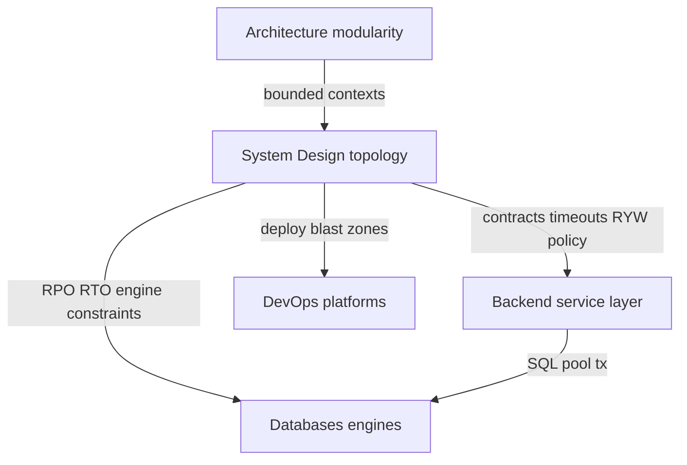
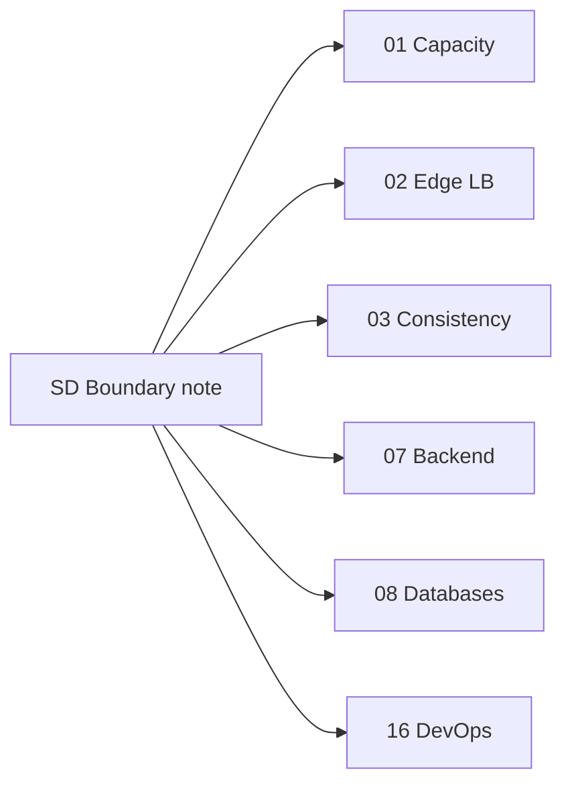
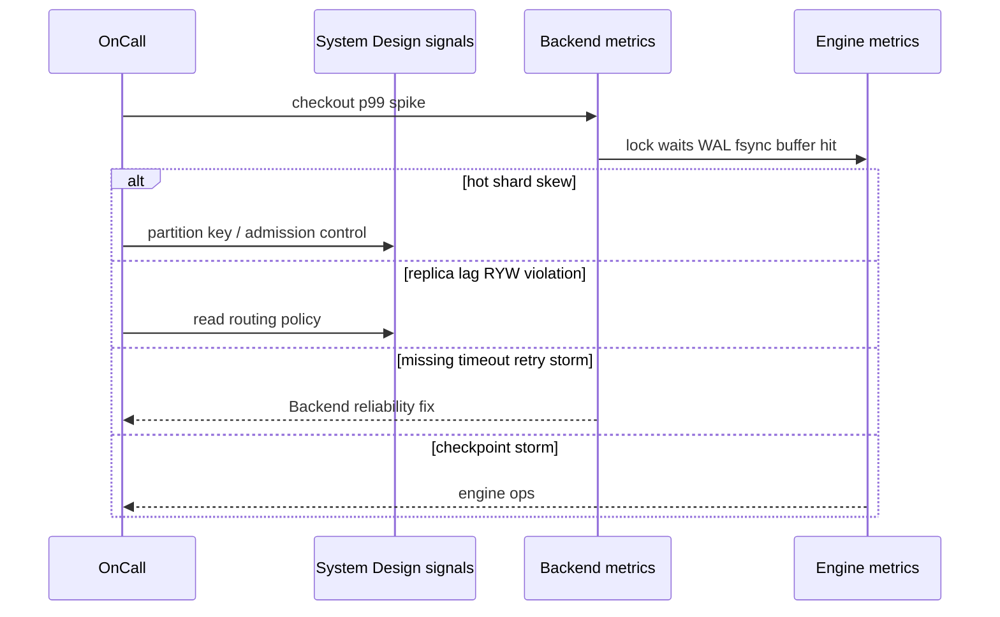

# Backend Databases and System Design Boundaries

## Overview

Three tracks meet at every production storage and traffic decision: **Backend** (how one service uses stores and peers), **Databases** (how engines keep bytes durable and concurrent), and **System Design** (how the product scales across instances, regions, and failure domains). This note is the System Design-side mirror of the Databases boundary note—same map, SD-owned examples and incident routing.

Blurred boundaries produce CAP lectures inside WAL notes, or Kubernetes manifests where quorum math belongs.

## Learning Objectives

- Route any storage/traffic question to Backend, Databases, System Design, DevOps, or Architecture
- Explain why cache-aside client patterns and Express reliability stay in Backend
- Explain why pages/WAL/MVCC/engine replication stay in Databases
- State what System Design uniquely owns: capacity, edge topology, product consistency, blast radius
- Write ADR owner fields that prevent duplicate advice across tracks

## Prerequisites

- [[09-System-Design/00-Orientation-and-Boundaries/Why System Design Exists|Why System Design Exists]]
- [[08-Databases/00-Orientation/Backend Databases and System Design Boundaries|Backend Databases and System Design Boundaries]]
- [[07-Backend/08-Data-Access-and-Persistence-Patterns/Handing Off to Database Engines|Handing Off to Database Engines]]

## Difficulty

`beginner`

## Estimated Time

- Reading: 45 minutes
- Exercises: 30 minutes
- Mini project: 1 hour

## History

Organizations invent the same split operationally: application platform teams, database reliability engineers, and infrastructure/architecture groups. Training materials that merge "SQL + REST + Redis + K8s" into one chapter create shallow generalists who mis-triage incidents. This repository encodes the professional split as pedagogical tracks.

## Problem It Solves

| Misplaced topic | Correct home |
| --- | --- |
| Repository / Unit of Work / outbox client | [[07-Backend/README\|Backend]] |
| Cache-aside, stampede *in one app* | Backend caching module |
| Circuit breaker *in-process* | Backend reliability |
| B-tree pages, WAL redo, MVCC anomalies | [[08-Databases/README\|Databases]] |
| Streaming replication *mechanics*, promote | Databases module 07 |
| Containers, CI, K8s scheduling | [[16-DevOps/README\|DevOps]] |
| Enterprise DDD / modular monolith depth | [[17-Architecture/README\|Architecture]] |
| Global traffic steering, quorum product policy, shard topology | **This track** |

## Internal Implementation

### Boundary map (SD-centric)



**System Design owns**: capacity and latency budgets; L4/L7/edge topology; CAP/PACELC as *product* constraints; partition keys and resharding windows; fleet cache hierarchy; messaging *topology*; multi-region active patterns; designer-level consensus; cascading failure across services.

**Does not own**: Express middleware; ORM N+1; WAL fsync; buffer pools; Helm charts; aggregate design in DDD.

## Mermaid Diagrams

### Structure



### Sequence / Lifecycle — incident ownership



## Examples

### Minimal Example — owner tags on decisions

```typescript
type Owner =
  | "SystemDesign"
  | "Backend"
  | "Databases"
  | "DevOps"
  | "Architecture";

export type Decision = { q: string; owner: Owner; handoff: string };

export const DECISIONS: Decision[] = [
  {
    q: "Should checkout use R=W=majority quorum?",
    owner: "SystemDesign",
    handoff: "[[09-System-Design/03-Consistency-Models-and-CAP/Quorums R plus W and Tunable Consistency|Quorums]]",
  },
  {
    q: "Where does idempotency key live on POST /pay?",
    owner: "Backend",
    handoff: "Backend reliability / data access",
  },
  {
    q: "Why does COMMIT wait on fsync?",
    owner: "Databases",
    handoff: "WAL durability module",
  },
  {
    q: "PodDisruptionBudget for payment pods?",
    owner: "DevOps",
    handoff: "K8s / deploy track",
  },
];
```

### Production-Shaped Example — ADR fragment with track owners

```typescript
export type AdrRow = {
  decision: string;
  owner: Owner;
  nfrLink: string;
  nonGoal: string;
};

export const MULTI_REGION_CART: AdrRow[] = [
  {
    decision: "Active-passive carts; fail over US→EU with RPO 60s",
    owner: "SystemDesign",
    nfrLink: "availability 99.9%, RPO<=60s",
    nonGoal: "Do not redesign MVCC isolation levels here",
  },
  {
    decision: "App uses cache-aside Redis with TTL 5m",
    owner: "Backend",
    nfrLink: "read latency p99 < 50ms regional",
    nonGoal: "Fleet CDN hierarchy is a later SD note",
  },
  {
    decision: "Postgres async replica; sync commit on primary only",
    owner: "Databases",
    nfrLink: "engine durability for primary writes",
    nonGoal: "Global traffic steering stays SD",
  },
];
```

## Trade-offs

| Dimension | Crisp boundaries | Blended mega-tutorials |
| --- | --- | --- |
| Depth | Each track goes production-deep | Everything stays interview-shallow |
| Incidents | Faster ownership routing | Endless war rooms |
| ADRs | One owner per decision | Conflicting "sources of truth" |
| Hiring | Role-aligned prep | Vague full-stack mythology |

### When to Use

- Starting any System Design module
- Writing cross-cutting ADRs
- Triaging "the database is slow" or "Redis is inconsistent" tickets

### When Not to Use

- As a substitute for reading Backend reliability or Databases replication mechanics when those are the actual failure layer

## Exercises

1. Classify fifteen README topics from this track into SD vs handoff (Backend/DB/DevOps/Architecture).
2. Replica lag alert: two SD causes, two engine causes, one Backend routing bug.
3. Where does "exactly-once delivery claim" live vs "unique index prevents double insert"?
4. Annotate a URL shortener diagram with owner tags on every box.
5. Diff this note against the Databases twin—what examples differ and why?

## Mini Project

Take an existing Backend project Architecture.md. Add an `OWNERS` section with wiki links to SD topics for every multi-instance concern.

## Portfolio Project

[[09-System-Design/projects/Distributed Systems Workbench/README|Distributed Systems Workbench]] — `BOUNDARIES.md` listing every external track dependency with one-sentence handoff.

## Interview Questions

1. What does System Design teach that Databases does not?
2. Is split-brain only System Design? (No—engine promote mechanics vs product policy.)
3. Who owns connection pooling?
4. Where do you design CDN edge vs Redis cache-aside?
5. When is Kubernetes the wrong answer to a consistency question?

### Stretch / Staff-Level

1. Design an on-call taxonomy: symptom → first dashboard → owning track.
2. How do you keep three tracks from contradicting each other over two years of edits?

## Common Mistakes

- Re-teaching WAL in a CAP product note
- Claiming SD expertise from knowing one cloud LB checkbox
- Putting enterprise DDD deep-dives in SD modules
- Solving stampede only at fleet layer while app lacks single-flight

## Best Practices

- Duplicate only SD-specific nuance; link outward aggressively
- Every ADR row has an `owner` track
- In incidents, ask "which layer saturated?" before "which vendor?"
- Learn Backend + Databases prerequisites before multi-region modules

## Summary

**System Design** owns fleet topology, capacity, edge entry, product consistency, partitioning, and cross-service failure budgets. **Backend** owns how services call stores and peers reliably. **Databases** owns engine durability and concurrency mechanics. **DevOps** owns platforms; **Architecture** owns enterprise modularity. Keep the handoffs explicit so each track can go deep without lying about scope.

## Further Reading

- [[09-System-Design/README|System Design README]] — Scope Boundaries table
- [[08-Databases/00-Orientation/Backend Databases and System Design Boundaries|Backend Databases and System Design Boundaries]]
- [[07-Backend/08-Data-Access-and-Persistence-Patterns/Handing Off to Database Engines|Handing Off to Database Engines]]

## Related Notes

- [[09-System-Design/00-Orientation-and-Boundaries/Why System Design Exists|Why System Design Exists]]
- [[09-System-Design/00-Orientation-and-Boundaries/Requirements Non-Functional and Workload Modeling|Requirements Non-Functional and Workload Modeling]]
- [[09-System-Design/03-Consistency-Models-and-CAP/CAP and PACELC as Product Constraints|CAP and PACELC as Product Constraints]]
- [[08-Databases/07-Replication-Mechanics/Failover Promote and Split-Brain Mechanics|Failover Promote and Split-Brain Mechanics]]
- [[16-DevOps/README|DevOps]]
- [[17-Architecture/README|Architecture]]

## Progress Checklist

- [ ] Explained from first principles
- [ ] Drew at least one Mermaid diagram
- [ ] Implemented a minimal version
- [ ] Documented trade-offs and non-goals
- [ ] Completed exercises
- [ ] Practiced interview questions aloud
- [ ] Linked prerequisites and dependents
