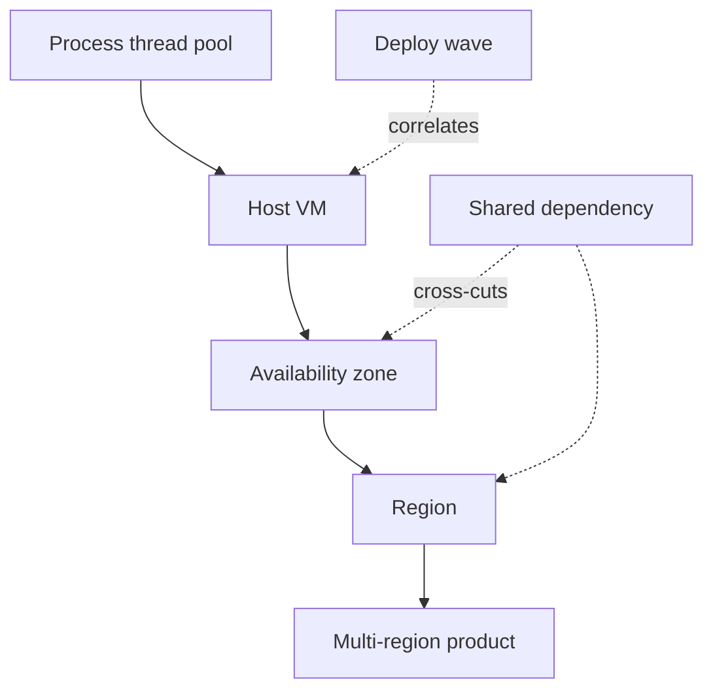
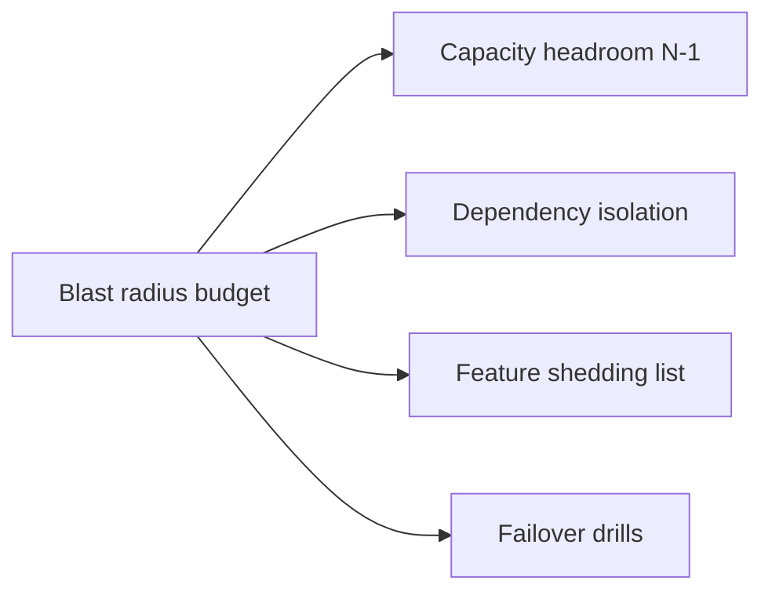
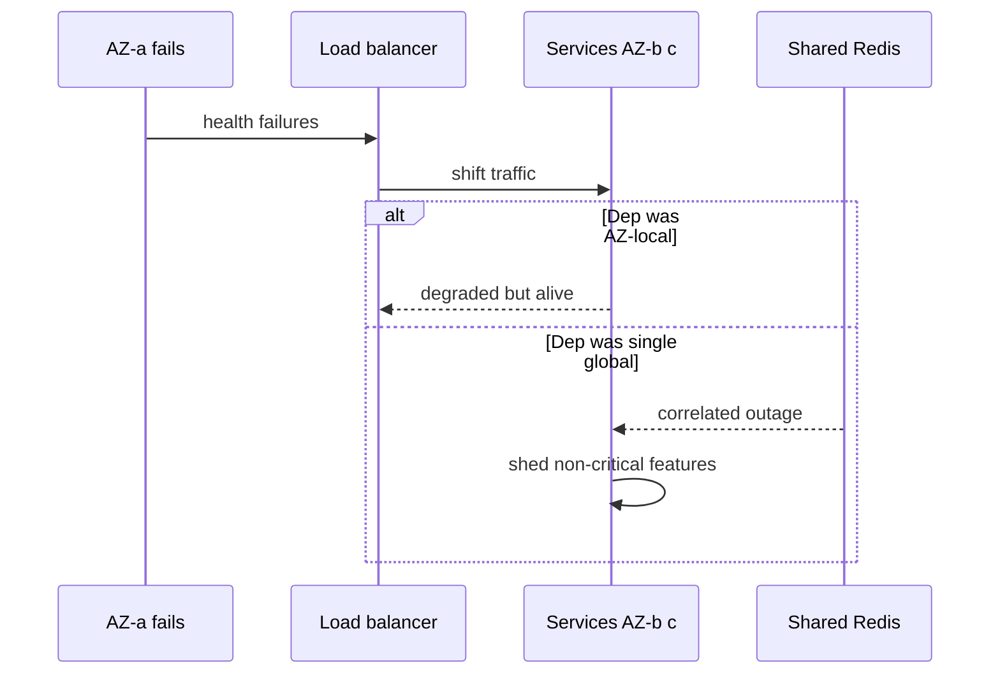

# Failure Domains and Blast Radius Budgets

## Overview

A **failure domain** is a set of components that share fate: one power circuit, one AZ, one Kubernetes cluster, one shared Redis, one deploy wave. **Blast radius** is how much of the product (users, revenue features, data) is impacted when that domain fails.

System design sets **blast-radius budgets** deliberately—"at most one AZ of checkout capacity," "recommendations may die; payments must not"—instead of discovering shared fate in an incident. Backend circuit breakers limit *in-process* damage; this note limits *topology* damage.

## Learning Objectives

- Inventory failure domains from process → host → AZ → region → dependency vendor
- Define blast-radius budgets as product policy with measurable limits
- Distinguish bulkheads at fleet level from in-process breakers
- Reason about correlated failures (bad deploy, thundering herd, DNS)
- Link budgets to later modules on cascading failure and multi-region failover

## Prerequisites

- [[09-System-Design/00-Orientation-and-Boundaries/Requirements Non-Functional and Workload Modeling|Requirements Non-Functional and Workload Modeling]]
- [[07-Backend/06-Reliability-and-Abuse-Resistance/Circuit Breakers and Bulkheads|Circuit Breakers and Bulkheads]]
- [[09-System-Design/00-Orientation-and-Boundaries/Backend Databases and System Design Boundaries|Backend Databases and System Design Boundaries]]

## Difficulty

`intermediate`

## Estimated Time

- Reading: 1 hour
- Exercises: 45 minutes
- Mini project: 2 hours

## History

Aviation and nuclear industries formalized fault containment zones long before cloud AZs. Web ops rediscovered the idea when a single memcached cluster or a global feature flag took down entire products. SRE practice made "blast radius" vernacular: change and failure should be *survivable at a stated scope*.

## Problem It Solves

| Shared-fate accident | Blast-radius design |
| --- | --- |
| One Redis for sessions + rate limit + cache | Separate domains or hard isolation |
| All payment pods in one AZ | Multi-AZ with capacity for N-1 |
| Global config push disables auth | Staged rollout + kill switches per region |
| Retry storm from all clients | Edge admission + jittered backoff (module 02/09) |
| Single primary DB, no RTO story | Failover policy with practiced promote |

## Internal Implementation

### Domain hierarchy



Blast radius budget example: **lose one AZ → ≤ 35% capacity loss, 0% durable data loss, payments available via remaining AZs**.

## Mermaid Diagrams

### Structure



### Sequence / Lifecycle — AZ loss



## Examples

### Minimal Example — budget declaration

```typescript
export type BlastBudget = {
  domain: "az" | "region" | "dependency" | "deploy";
  maxUserImpactPct: number;
  mustSurvive: string[]; // features
  mayDegrade: string[];
  capacityHeadroom: number; // e.g. 1.5 means survive 1 of 3 AZs lost
};

export const CHECKOUT_BUDGETS: BlastBudget[] = [
  {
    domain: "az",
    maxUserImpactPct: 0,
    mustSurvive: ["checkout", "pay", "refund-status"],
    mayDegrade: ["recs", "upsell"],
    capacityHeadroom: 1.6,
  },
  {
    domain: "dependency",
    maxUserImpactPct: 5,
    mustSurvive: ["pay"],
    mayDegrade: ["loyalty-points"],
    capacityHeadroom: 1.0,
  },
];
```

### Production-Shaped Example — shared-fate scanner sketch

```typescript
type Component = {
  id: string;
  az: string;
  deps: string[];
  criticality: "P0" | "P1" | "P2";
};

export function correlatedRisk(components: Component[], depId: string): Component[] {
  return components.filter((c) => c.deps.includes(depId) && c.criticality === "P0");
}

// If many P0 services share depId "redis-global", budget is violated until split or multi-AZ Redis.
```

## Trade-offs

| Dimension | Tight blast budgets | Single shared stack |
| --- | --- | --- |
| Availability | Survives partial failure | Cheaper until it is not |
| Cost | N-1 capacity, duplicate deps | Lower idle spend |
| Complexity | More pools, more config | Simple diagrams |
| Operability | Clear degrade runbooks | All-or-nothing outages |

### When to Use

- Any multi-AZ or multi-service product
- Before adopting a new shared dependency
- When writing availability SLOs above ~99.9%

### When Not to Use

- Solo prototype on one box—still *name* the future domains
- As a substitute for fixing single-threaded app bugs
- Over-isolating until cost and complexity block shipping

## Exercises

1. Draw failure domains for a 3-AZ web app with one managed Postgres and one Redis.
2. Write blast budgets for feed-read vs checkout.
3. Find a correlated failure in a hypothetical: global CDN + origin in one region.
4. Compute capacity headroom for 3 AZs if you must survive one AZ loss at peak.
5. List three Backend breaker configs that do *not* fix a shared Redis fate.

## Mini Project

Author `BLAST_RADIUS.md` for a chat product: domains, budgets, degrade list, and a table of shared dependencies with isolation status.

## Portfolio Project

[[09-System-Design/projects/Multi-Region Failover Playbook Lab/README|Multi-Region Failover Playbook Lab]] — add blast-radius acceptance criteria to the failover drill.

## Interview Questions

1. What is a failure domain? Give four nested examples.
2. How do bulkheads at fleet level differ from circuit breakers?
3. Why does multi-AZ fail if the database is single-AZ?
4. How do you budget for a bad deploy as a failure domain?
5. What is capacity headroom for N-1 AZ survival?

### Stretch / Staff-Level

1. Design an org policy: no P0 service may share a cache cluster with P2 batch jobs.
2. How do you quantify blast radius in dollars for executive risk reviews?

## Common Mistakes

- Equating "multi-AZ LB" with multi-AZ data plane
- One Redis to rule sessions, cache, and locks
- No feature-shedding list—everything is critical
- Ignoring deploy waves as correlated failure
- Setting 99.99% SLO with single-region single-primary DB

## Best Practices

- Name domains in every architecture diagram
- Budget first; buy isolation second
- Practice AZ and dependency loss drills
- Prefer regional stacks over "global singleton" control planes for P0 paths
- Link to [[09-System-Design/09-Failure-Modes-at-Product-Scale/Zone and Fleet Bulkheads|Zone and Fleet Bulkheads]] when designing degrade behavior

## Summary

Availability is not a sticker on a load balancer—it is the **intersection of failure domains you refuse to share**. Blast-radius budgets turn that into product policy: what may die, what must survive, and how much spare capacity exists when a domain vanishes. Pair with Backend breakers for local containment and later SD failure modules for cascades.

## Further Reading

- [[09-System-Design/09-Failure-Modes-at-Product-Scale/Cascading Multi-Service Failure|Cascading Multi-Service Failure]]
- [[09-System-Design/09-Failure-Modes-at-Product-Scale/Zone and Fleet Bulkheads|Zone and Fleet Bulkheads]]
- [[07-Backend/06-Reliability-and-Abuse-Resistance/Circuit Breakers and Bulkheads|Circuit Breakers and Bulkheads]]
- [[09-System-Design/07-Multi-Region-and-Geo/Failover RPO RTO and Split-Brain Product Policy|Failover RPO RTO and Split-Brain Product Policy]]

## Related Notes

- [[09-System-Design/00-Orientation-and-Boundaries/ADR Discipline for Distributed Decisions|ADR Discipline for Distributed Decisions]]
- [[09-System-Design/00-Orientation-and-Boundaries/Requirements Non-Functional and Workload Modeling|Requirements Non-Functional and Workload Modeling]]
- [[09-System-Design/02-Load-Balancing-and-Edge-Entry/Health Checks Drain and Connection Management|Health Checks Drain and Connection Management]]
- [[09-System-Design/README|System Design]]

## Progress Checklist

- [ ] Explained from first principles
- [ ] Drew at least one Mermaid diagram
- [ ] Implemented a minimal version
- [ ] Documented trade-offs and non-goals
- [ ] Completed exercises
- [ ] Practiced interview questions aloud
- [ ] Linked prerequisites and dependents
