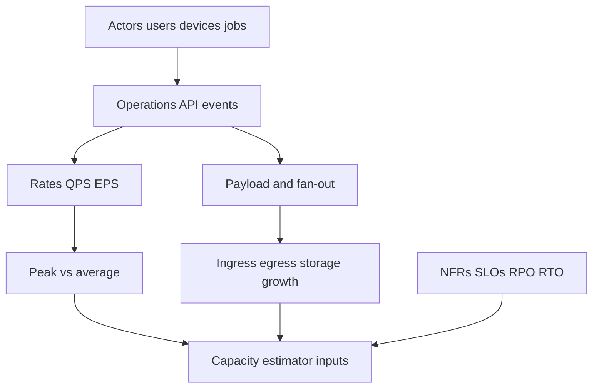
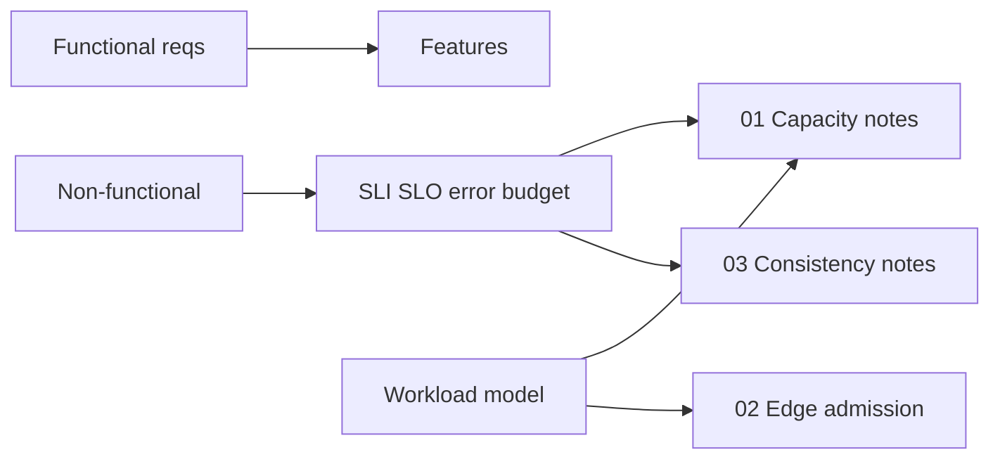
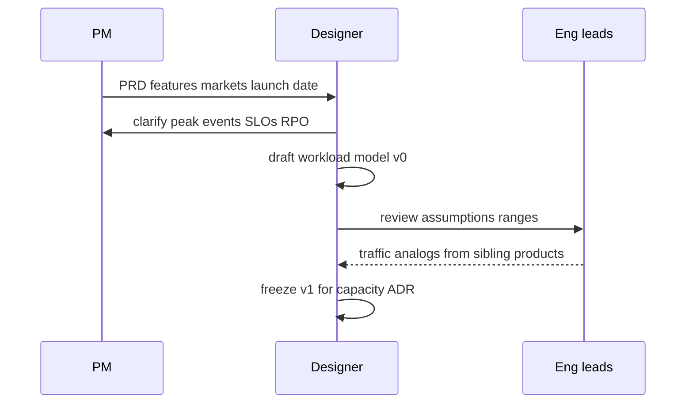

# Requirements Non-Functional and Workload Modeling

## Overview

System design without a **workload model** is decoration. Non-functional requirements (NFRs)—latency percentiles, availability, durability (RPO), recovery (RTO), cost ceilings, compliance geography—only become design constraints when paired with **quantitative demand**: QPS, payload sizes, read/write mix, diurnal curves, and growth.

This note teaches how to extract a workload model from product intent so modules 01–03 (capacity, edge, consistency) have numbers instead of vibes.

## Learning Objectives

- Separate functional features from NFRs and from workload assumptions
- Build a workload model: actors, operations, rates, sizes, locality, burstiness
- Translate SLOs into budgets that later notes consume (latency, error, consistency)
- Document assumption ranges and sensitivity ("if DAU 10×, what breaks first?")
- Avoid false precision—order-of-magnitude honesty beats fake decimals

## Prerequisites

- [[09-System-Design/00-Orientation-and-Boundaries/Why System Design Exists|Why System Design Exists]]
- [[09-System-Design/00-Orientation-and-Boundaries/Backend Databases and System Design Boundaries|Backend Databases and System Design Boundaries]]

## Difficulty

`intermediate`

## Estimated Time

- Reading: 1 hour
- Exercises: 1 hour
- Mini project: 2 hours

## History

Telecom and mainframe capacity planning used Erlang models and busy-hour call attempts long before web QPS. Web-scale practice borrowed SLIs/SLOs from SRE culture: you cannot capacity-plan what you refuse to measure. Modern designs still fail when teams write "highly available" without defining the failure domain or the peak five-minute rate.

## Problem It Solves

| Vague ask | Workload-shaped ask |
| --- | --- |
| "Support millions of users" | 2M DAU, 0.3 sessions/user peak hour, 12 API calls/session → peak QPS |
| "Fast" | p50 ≤ 40ms, p99 ≤ 200ms regional for read path |
| "Never lose data" | RPO = 0 for payments; RPO ≤ 5m for analytics events |
| "Global" | 70% traffic US-East, 20% EU, 10% APAC; GDPR residency for EU PII |
| "Cheap" | ≤ $X/M requests; storage ≤ $Y/TB-month |

## Internal Implementation

### Workload model components



**Actors**: humans, devices, cron/workers, partner webhooks.  
**Operations**: named RPCs/events with read/write and consistency class.  
**Rates**: average, peak, burst (seconds–minutes).  
**Sizes**: request/response bytes, amplification (1 write → N fan-outs).  
**Locality**: region affinity, tenancy, hot keys.  
**Growth**: MoM/YoY and launch cliffs.

## Mermaid Diagrams

### Structure



### Sequence / Lifecycle — from PRD to design inputs



## Examples

### Minimal Example — peak QPS from product stats

```typescript
export type WorkloadOp = {
  name: string;
  readWrite: "R" | "W";
  qpsPeak: number;
  bytesIn: number;
  bytesOut: number;
};

export function peakQpsFromDau(input: {
  dau: number;
  sessionsPerUserPeakHour: number;
  callsPerSession: number;
  peakHourFractionOfDay: number; // e.g. 0.15 of daily calls in peak hour
}): number {
  const dailyCalls = input.dau * input.sessionsPerUserPeakHour * input.callsPerSession;
  // naive: concentrate peakHourFraction into one hour
  return (dailyCalls * input.peakHourFractionOfDay) / 3600;
}

const qps = peakQpsFromDau({
  dau: 2_000_000,
  sessionsPerUserPeakHour: 1.2,
  callsPerSession: 10,
  peakHourFractionOfDay: 0.2,
});
// ~1333 QPS average-in-peak-hour style estimate — still need burst factor
```

### Production-Shaped Example — NFR + workload document

```typescript
export type DesignInputs = {
  product: string;
  assumptions: Record<string, string>;
  ops: WorkloadOp[];
  slo: {
    availability: number;
    latency: { op: string; p50Ms: number; p99Ms: number };
    rpoSeconds: number;
    rtoMinutes: number;
    consistencyClass: "strong" | "ryw" | "eventual";
  };
  growth: { yearlyMultiplier: number; launchSpikeMultiplier: number };
};

export const FEED_READ_PATH: DesignInputs = {
  product: "home-feed-read",
  assumptions: {
    dau: "5e6",
    deviceMix: "80% mobile",
    cacheHitTarget: "0.85",
  },
  ops: [
    { name: "GET /feed", readWrite: "R", qpsPeak: 25_000, bytesIn: 200, bytesOut: 40_000 },
    { name: "POST /post", readWrite: "W", qpsPeak: 800, bytesIn: 8_000, bytesOut: 500 },
  ],
  slo: {
    availability: 0.995,
    latency: { op: "GET /feed", p50Ms: 80, p99Ms: 350 },
    rpoSeconds: 60,
    rtoMinutes: 30,
    consistencyClass: "ryw", // author sees own post
  },
  growth: { yearlyMultiplier: 1.5, launchSpikeMultiplier: 3 },
};
```

## Trade-offs

| Dimension | Explicit workload model | Feature-only PRD |
| --- | --- | --- |
| Capacity | Right-sized fleets | Chronic over/under provision |
| Consistency | Invariants tied to ops | One global "eventual" slogan |
| Risk | Sensitivity known | Surprise launch cliffs |
| Speed of design | Upfront clarification cost | Fast diagrams, slow incidents |

### When to Use

- Before any capacity estimate or technology shortlist
- Launch planning, multi-region expansion, major re-architecture
- Interview openers: state assumptions aloud

### When Not to Use

- As a substitute for measuring production once you have traffic
- Inventing fake precision when only orders of magnitude exist—label ranges

## Exercises

1. Convert 10M MAU, 20% DAU, 5 requests/session, peak factor 3× average into peak QPS.
2. Write SLOs for payments vs public blog reads—contrast RPO and consistency class.
3. Identify three operations in a chat app; mark which need ordering vs best-effort.
4. Add a burst model: 10× for 30 seconds (celebrity post). What NFR changes?
5. List assumptions you would validate with analytics before freezing an ADR.

## Mini Project

Produce a `DesignInputs` JSON/TS for [[09-System-Design/projects/Capacity Estimator Lab/README|Capacity Estimator Lab]] for a URL shortener (redirect + create). Include growth and launch spike.

## Portfolio Project

Workbench: `docs/WORKLOAD.md` per major product surface, reviewed quarterly with real metrics vs assumptions.

## Interview Questions

1. How do you estimate QPS from DAU?
2. What is the difference between an SLO and a workload assumption?
3. Why is average QPS dangerous for capacity?
4. How do you encode GDPR residency in a workload model?
5. What do you do when the PM says "make it real-time"?

### Stretch / Staff-Level

1. Design a company-wide workload schema so capacity, cost, and SLO dashboards share definitions.
2. How do you run a design review when traffic data is missing (new product)?

## Common Mistakes

- Using daily averages for peak provisioning
- One SLO for the whole product (checkout vs marketing pages)
- Ignoring fan-out amplification (1 write → 1M timeline inserts)
- Treating RPO/RTO as infra-only, not product
- Forgetting background jobs in the QPS budget

## Best Practices

- Write assumptions with ranges and owners
- Separate interactive vs batch workload classes
- Tie each SLO to an SLI you can actually measure
- Revisit models after every launch and major incident
- Feed outputs directly into [[09-System-Design/01-Capacity-Latency-and-Bottlenecks/Back-of-Envelope Capacity Estimation|Back-of-Envelope Capacity Estimation]]

## Summary

NFRs state how good the system must be; the **workload model** states how hard it will be pressed. Together they are the only honest inputs to capacity, edge admission, and consistency design. Prefer explicit assumptions and order-of-magnitude math over technology name-dropping.

## Further Reading

- [[09-System-Design/README|System Design README]]
- [[09-System-Design/01-Capacity-Latency-and-Bottlenecks/Back-of-Envelope Capacity Estimation|Back-of-Envelope Capacity Estimation]]
- [[09-System-Design/10-Observability-and-Control-Planes/SLIs SLOs Error Budgets for Multi-Service Systems|SLIs SLOs Error Budgets]]
- [[00-References/System Design/README|System Design References]]

## Related Notes

- [[09-System-Design/00-Orientation-and-Boundaries/Failure Domains and Blast Radius Budgets|Failure Domains and Blast Radius Budgets]]
- [[09-System-Design/00-Orientation-and-Boundaries/ADR Discipline for Distributed Decisions|ADR Discipline for Distributed Decisions]]
- [[09-System-Design/01-Capacity-Latency-and-Bottlenecks/Latency Budgets Percentiles and Tail Behavior|Latency Budgets Percentiles and Tail Behavior]]
- [[09-System-Design/03-Consistency-Models-and-CAP/Choosing Consistency from User-Visible Invariants|Choosing Consistency from User-Visible Invariants]]

## Progress Checklist

- [ ] Explained from first principles
- [ ] Drew at least one Mermaid diagram
- [ ] Implemented a minimal version
- [ ] Documented trade-offs and non-goals
- [ ] Completed exercises
- [ ] Practiced interview questions aloud
- [ ] Linked prerequisites and dependents
