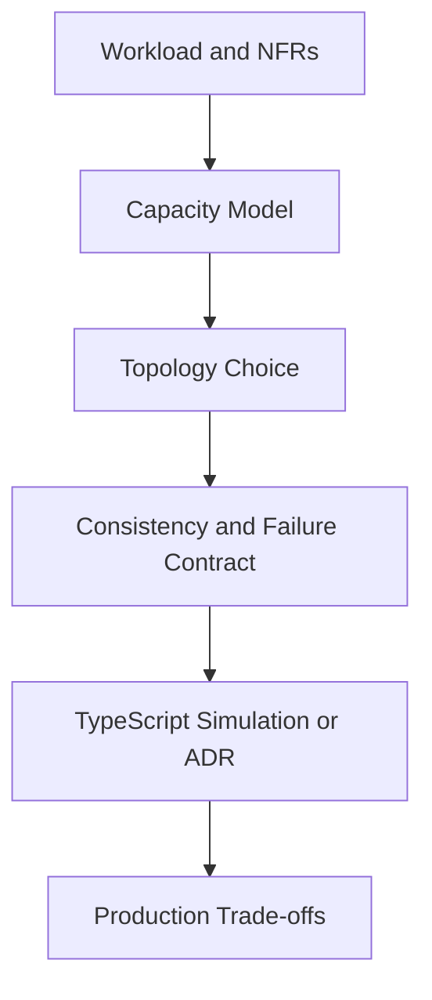
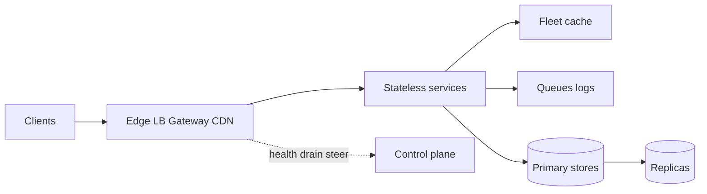
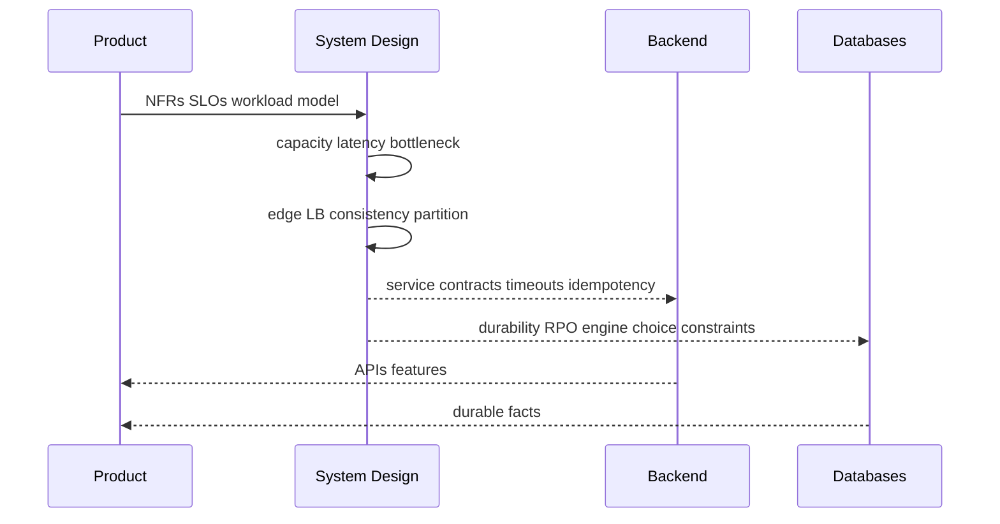

# Why System Design Exists

## Overview

**System design** is the discipline of turning product requirements into a **topology of failure domains**: how many services, where data lives, how traffic enters, what consistency and latency budgets users experience, and what happens when a zone, region, or dependency dies. It sits *above* a single Backend service and *above* a single database engine.

A well-tuned Express handler and a correctly sized PostgreSQL buffer pool still fail the product if read replicas violate read-your-writes, a hot shard saturates one node, or a cascade turns a cache miss into a fleet outage. This track teaches those **fleet-scale contracts**.

## Learning Objectives

- Explain what System Design owns that Backend and Databases do not
- Map the teaching pipeline: NFR → capacity → topology → consistency/failure → ADR/sim → ops
- Distinguish single-box performance from multi-service product SLO design
- Identify when "scale" is a topology problem vs. an engine or app-code problem
- Use [[09-System-Design/README|System Design]] as the map for later modules

## Prerequisites

- [[07-Backend/README|Backend]] — request lifecycle, reliability primitives inside a service
- [[08-Databases/00-Orientation/Backend Databases and System Design Boundaries|Backend Databases and System Design Boundaries]]
- Comfortable reading latency/throughput language (QPS, p99, RPO/RTO)

## Difficulty

`beginner`

## Estimated Time

- Reading: 1 hour
- Exercises: 45 minutes
- Mini project: 1.5 hours

## History

Mainframe and early client-server systems often had one application and one database. The web and cloud eras forced **horizontal scale**: many app instances behind load balancers, caches in front of stores, async queues between write paths and fan-out, and eventually multi-region deployments for latency and disaster recovery.

Industry "system design interview" culture compressed decades of distributed-systems practice into whiteboard templates. Production still needs the same first principles—capacity math, consistency as product policy, blast-radius budgets—without confusing them with Kubernetes YAML or WAL redo algorithms.

## Problem It Solves

| Failure mode without system design | What this track addresses |
| --- | --- |
| Single DB primary dies; product has no RPO/RTO story | Multi-region and failover *product* policy (module 07) |
| p99 blows up though median looks fine | Latency budgets and tail behavior (module 01) |
| One popular key melts a cache/shard | Hot keys, partitioning, admission control (04, 05, 02) |
| "Eventually consistent" surprises users | Consistency from user-visible invariants (module 03) |
| Retry storms amplify outages | Cascading failure and bulkheads (module 09) |
| Team debates L7 vs mesh without contracts | Edge entry and LB roles (module 02) |

Backend owns in-process circuit breakers and cache-aside clients. Databases owns pages, WAL, and MVCC. System Design owns **where those pieces sit in the product graph** and **what users are allowed to see under partition**.

## Internal Implementation

### Teaching contract (how every later note thinks)



### Ownership layers

| Layer | Example question | Home track |
| --- | --- | --- |
| App request | Idempotency key on POST? | [[07-Backend/README\|Backend]] |
| Engine | WAL fsync before COMMIT ack? | [[08-Databases/README\|Databases]] |
| Topology | Active-active inventory across 3 regions? | **This track** |
| Platform | Pod disruption budgets, CI deploys | [[16-DevOps/README\|DevOps]] |
| Enterprise modularity | Bounded contexts, DDD | [[17-Architecture/README\|Architecture]] |

## Mermaid Diagrams

### Structure



### Sequence / Lifecycle — from idea to topology



## Examples

### Minimal Example — naming the problem class

```typescript
type DesignProblem =
  | { kind: "engine"; symptom: string }      // buffer hit, WAL lag, lock wait
  | { kind: "backend"; symptom: string }     // N+1, pool exhaustion, missing timeout
  | { kind: "topology"; symptom: string };   // hot shard, cross-region RYW, cascade

export function classify(symptom: string): DesignProblem {
  if (/fsync|buffer pool|MVCC|WAL/i.test(symptom)) {
    return { kind: "engine", symptom };
  }
  if (/N\+1|connection pool|middleware|idempotency key/i.test(symptom)) {
    return { kind: "backend", symptom };
  }
  return { kind: "topology", symptom };
}

// "Users in EU read stale carts after write in US" → topology (consistency + routing)
```

### Production-Shaped Example — one-page design skeleton

```typescript
export type SystemSketch = {
  workload: { peakQps: number; readWriteRatio: number; payloadBytes: number };
  slo: { availability: number; p99Ms: number; rpoSeconds: number; rtoMinutes: number };
  edge: "dns" | "l4" | "l7" | "cdn+l7";
  stores: Array<{ name: string; role: "primary" | "cache" | "queue" | "search" }>;
  consistency: "strong" | "ryw" | "eventual" | "causal";
  failureBudget: { maxBlastZones: number; degradeFeatures: string[] };
};

export const CHECKOUT_SKETCH: SystemSketch = {
  workload: { peakQps: 12_000, readWriteRatio: 8, payloadBytes: 2_048 },
  slo: { availability: 0.999, p99Ms: 300, rpoSeconds: 0, rtoMinutes: 15 },
  edge: "cdn+l7",
  stores: [
    { name: "orders-pg", role: "primary" },
    { name: "cart-redis", role: "cache" },
    { name: "payments-outbox", role: "queue" },
  ],
  consistency: "strong", // money movement: user-visible invariant
  failureBudget: {
    maxBlastZones: 1,
    degradeFeatures: ["recommendations", "loyalty-points-display"],
  },
};
```

## Trade-offs

| Dimension | Explicit system design | "Just scale the monolith DB" |
| --- | --- | --- |
| Latency | Regional placement, caches, async paths | Cross-world RTT on every write path |
| Operability | Clear blast-radius and runbooks | One box is simpler until it is not |
| Consistency | Product-chosen models | Accidental eventual consistency |
| Cost | Capacity math and right-sizing | Overprovision one primary forever |
| Complexity | More moving parts | Complexity deferred into incidents |

### When to Use

- Product crosses one machine, one zone, or one team boundary
- SLOs include multi-region latency, durability, or graceful degradation
- Interview or ADR asks "how would you design X at scale?"

### When Not to Use

- Prototype with one service and one DB and no SLO yet—ship Backend + Databases first
- As a substitute for fixing N+1 queries or missing indexes
- When the real need is enterprise modularity (Architecture) or container orchestration (DevOps)

## Exercises

1. List five symptoms and classify each as engine / backend / topology using the minimal example.
2. For a URL shortener, write NFRs: peak QPS, p99 redirect latency, RPO/RTO. Link each to a later module.
3. Draw the teaching-contract flowchart for a chat presence feature.
4. Explain why "we use Kubernetes" is not a system design answer by itself.
5. Compare this note's ownership table with [[08-Databases/00-Orientation/Backend Databases and System Design Boundaries|Backend Databases and System Design Boundaries]].

## Mini Project

Draft a one-page `SystemSketch` (TypeScript type above) for a feed timeline. Include workload, SLO, edge, stores, consistency, and failure budget. Store it as an ADR stub citing this note.

## Portfolio Project

[[09-System-Design/projects/Distributed Systems Workbench/README|Distributed Systems Workbench]] — add `docs/WHY.md` linking product features to topology decisions, not engine knobs.

## Interview Questions

1. What is system design, and how is it different from writing scalable code in one service?
2. Walk through NFR → capacity → topology → consistency for a URL shortener.
3. Where do circuit breakers live—Backend or System Design? (Both layers—explain.)
4. Why can p50 look healthy while the product is failing?
5. Name three decisions that belong in Databases, not on the system-design whiteboard.

### Stretch / Staff-Level

1. Your org has strong Backend and DBA teams but no topology ownership. Design a review gate that forces blast-radius and consistency ADRs before multi-region launch.
2. How do you prevent "system design" from becoming endless diagram theater?

## Common Mistakes

- Equating system design with drawing boxes around microservices
- Jumping to Kafka/Cassandra before stating workload and invariants
- Treating CAP as trivia instead of product constraint
- Ignoring cost and operational ownership of every new hop
- Copying FAANG templates without failure budgets

## Best Practices

- Start from user-visible invariants and SLOs, not technology lists
- Separate capacity math from technology choice
- Name the failure domain for every dependency
- Cross-link Backend/Databases/DevOps instead of re-teaching them
- Prefer one clear ADR over five competing diagrams

## Summary

System design exists because products fail across **machines, zones, and consistency windows**, not only inside a process or a storage engine. This track turns workloads and NFRs into capacity models, edge topologies, consistency policies, and blast-radius budgets—then validates them with simulations and ADRs. Use Backend for service patterns, Databases for engine mechanics, and this track for the fleet graph users actually feel.

## Further Reading

- [[09-System-Design/README|System Design README]]
- [[08-Databases/00-Orientation/Backend Databases and System Design Boundaries|Backend Databases and System Design Boundaries]]
- [[07-Backend/06-Reliability-and-Abuse-Resistance/Circuit Breakers and Bulkheads|Circuit Breakers and Bulkheads]]
- [[00-References/System Design/README|System Design References]]

## Related Notes

- [[09-System-Design/00-Orientation-and-Boundaries/Backend Databases and System Design Boundaries|Backend Databases and System Design Boundaries]]
- [[09-System-Design/00-Orientation-and-Boundaries/Requirements Non-Functional and Workload Modeling|Requirements Non-Functional and Workload Modeling]]
- [[09-System-Design/00-Orientation-and-Boundaries/Failure Domains and Blast Radius Budgets|Failure Domains and Blast Radius Budgets]]
- [[09-System-Design/00-Orientation-and-Boundaries/ADR Discipline for Distributed Decisions|ADR Discipline for Distributed Decisions]]
- [[09-System-Design/01-Capacity-Latency-and-Bottlenecks/Back-of-Envelope Capacity Estimation|Back-of-Envelope Capacity Estimation]]

## Progress Checklist

- [ ] Explained from first principles
- [ ] Drew at least one Mermaid diagram
- [ ] Implemented a minimal version
- [ ] Documented trade-offs and non-goals
- [ ] Completed exercises
- [ ] Practiced interview questions aloud
- [ ] Linked prerequisites and dependents
