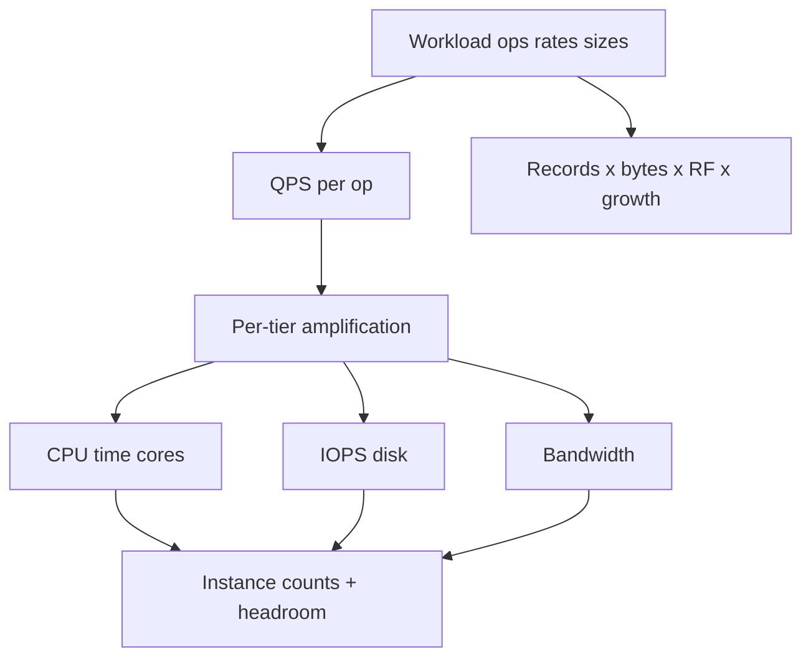
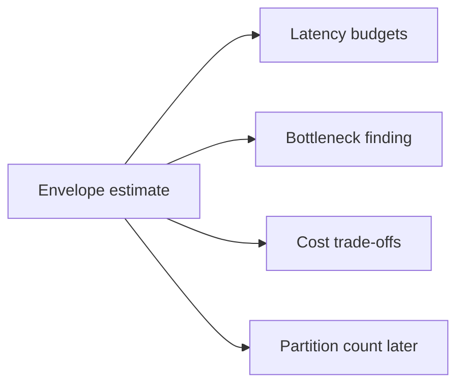
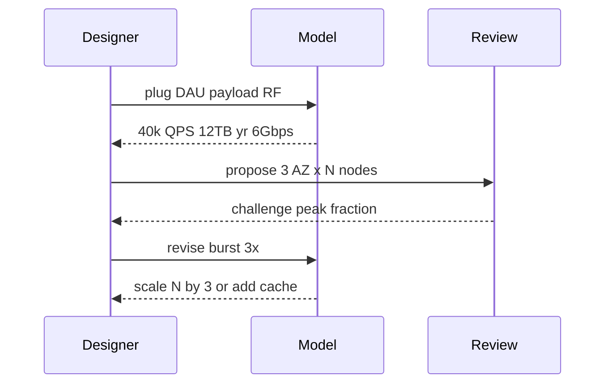

# Back-of-Envelope Capacity Estimation

## Overview

**Back-of-envelope capacity estimation** converts a workload model into order-of-magnitude needs: QPS per tier, storage growth, network bandwidth, and rough instance counts. The goal is not spreadsheet theater—it is to expose impossible designs early (e.g., single-disk random IOPS for a hot key) and to size the first topology.

Estimates feed latency budgets, bottleneck finding, and cost trade-offs in sibling notes.

## Learning Objectives

- Estimate QPS, storage, and bandwidth from DAU/ops assumptions
- Apply powers-of-ten intuition (day→second, MB→TB/year)
- Translate estimates into instance counts with utilization headroom
- Sensitivity-test: which assumption moves capacity the most
- State uncertainty bands instead of fake precision

## Prerequisites

- [[09-System-Design/00-Orientation-and-Boundaries/Requirements Non-Functional and Workload Modeling|Requirements Non-Functional and Workload Modeling]]
- Arithmetic comfort with unit conversions

## Difficulty

`intermediate`

## Estimated Time

- Reading: 1 hour
- Exercises: 1.5 hours
- Mini project: 2 hours

## History

Engineers used envelope math for telephone switches and disk farms before cloud autoscaling. Interview culture popularized "estimate Twitter QPS"; production still needs the same skill when signing reserved capacity or choosing shard counts before traffic exists.

## Problem It Solves

| Blind design | Envelope-informed design |
| --- | --- |
| Pick Cassandra because "scale" | Storage 200 TB/year → object store + DB metadata |
| One 100 Mbps NIC assumed fine | Egress 8 Gbps peak → need aggregation |
| 10 app boxes "feels right" | 25k QPS × 5ms CPU → core count math |
| Ignore replication factor | 3× storage and write amplification |

## Internal Implementation

### Estimation pipeline



Core identities (approximate):

- `QPS_peak ≈ daily_ops × peak_fraction / 86400 × burst`
- `cores ≈ QPS × seconds_cpu_per_req / target_util`
- `storage ≈ records × bytes × RF × (1 + index_overhead) × growth`
- `bandwidth ≈ QPS × bytes × copies` (egress often dominates)

## Mermaid Diagrams

### Structure



### Sequence / Lifecycle — estimate then revise



## Examples

### Minimal Example — QPS and storage

```typescript
export function qpsPeak(opts: {
  dailyOps: number;
  peakDayFraction: number; // fraction of daily ops in peak hour → convert
  burst: number;
}): number {
  const peakHourOps = opts.dailyOps * opts.peakDayFraction;
  const avgInPeakHour = peakHourOps / 3600;
  return avgInPeakHour * opts.burst;
}

export function storageBytes(opts: {
  records: number;
  bytesPerRecord: number;
  rf: number;
  indexOverhead: number;
  years: number;
  yearlyGrowth: number;
}): number {
  let total = 0;
  let records = opts.records;
  for (let y = 0; y < opts.years; y++) {
    total += records * opts.bytesPerRecord * opts.rf * (1 + opts.indexOverhead);
    records *= opts.yearlyGrowth;
  }
  return total;
}

const qps = qpsPeak({ dailyOps: 100_000_000, peakDayFraction: 0.2 / 24, burst: 2 });
// peakDayFraction here as "of day in one hour" ≈ 0.2 means 20% of daily in peak hour
```

### Production-Shaped Example — tiered capacity sheet

```typescript
export type TierEstimate = {
  name: string;
  qps: number;
  cpuMs: number;
  targetUtil: number;
  coresNeeded: number;
  instances: number;
};

export function coresFor(qps: number, cpuMs: number, util: number): number {
  return (qps * (cpuMs / 1000)) / util;
}

export function urlShortenerTiers(redirectQps: number): TierEstimate[] {
  const edge = {
    name: "edge-l7",
    qps: redirectQps,
    cpuMs: 0.3,
    targetUtil: 0.5,
    coresNeeded: 0,
    instances: 0,
  };
  edge.coresNeeded = coresFor(edge.qps, edge.cpuMs, edge.targetUtil);
  edge.instances = Math.ceil(edge.coresNeeded / 8);

  const app = {
    name: "redirect-api",
    qps: redirectQps * 0.2, // 80% CDN hit
    cpuMs: 2,
    targetUtil: 0.6,
    coresNeeded: 0,
    instances: 0,
  };
  app.coresNeeded = coresFor(app.qps, app.cpuMs, app.targetUtil);
  app.instances = Math.ceil(app.coresNeeded / 4);
  return [edge, app];
}
```

## Trade-offs

| Dimension | Envelope first | Build then measure only |
| --- | --- | --- |
| Risk | Catch impossible designs early | Fast start, late surprises |
| Accuracy | ±3–10× typical | Precise but after spend |
| Cost | Cheap thinking | Expensive re-architecture |
| Interviews | Expected skill | Looks unprepared |

### When to Use

- Greenfield designs, capacity ADRs, interview openers
- Before choosing shard count, RF, or multi-region copies
- When autoscaling cannot save you (stateful stores, warm caches)

### When Not to Use

- As a replacement for load tests once traffic shape is known
- Over-fitting to three decimal places of marketing DAU

## Exercises

1. Estimate peak QPS for 50M DAU, 8 requests/user/day, 25% in peak hour, burst 2×.
2. Storage for 1B short URLs × 500 bytes × RF=3 × 5 years at 1.3× growth.
3. Egress bandwidth if 20k QPS × 2 KB response × 2 (AZ replication of traffic).
4. How many 4-core instances for 5k QPS at 3ms CPU and 50% util?
5. Sensitivity: which input (±2×) changes instance count most in exercise 4?

## Mini Project

Implement a small TypeScript CLI in [[09-System-Design/projects/Capacity Estimator Lab/README|Capacity Estimator Lab]] that prints QPS, storage, bandwidth, and instance counts from a JSON workload.

## Portfolio Project

Workbench: `capacity/` folder with envelope sheets per product surface and a changelog when assumptions change.

## Interview Questions

1. Estimate QPS and storage for a URL shortener.
2. Why multiply by replication factor?
3. How do cache hit rates change app-tier QPS?
4. What utilization target do you pick and why?
5. How accurate should envelope math be?

### Stretch / Staff-Level

1. Build a shared estimation library used by FinOps and design reviews.
2. How do you estimate capacity for multi-tenant noisy neighbors?

## Common Mistakes

- Using average QPS for peak provisioning
- Forgetting RF, indexes, and backups in storage
- Ignoring egress costs and NIC limits
- Assuming 100% CPU util is fine
- Skipping cache/CDN hit rate in tier math

## Best Practices

- State assumptions before calculating
- Use powers of ten; round aggressively
- Carry headroom for AZ loss (link blast budgets)
- Revisit after first production metrics
- Separate read path and write path estimates

## Summary

Back-of-envelope estimation turns workload fiction into **capacity constraints**. It will not replace profiling, but it prevents choosing topologies that violate physics. Feed results into latency, bottleneck, and cost notes—and record them in ADRs.

## Further Reading

- [[09-System-Design/projects/Capacity Estimator Lab/README|Capacity Estimator Lab]]
- [[09-System-Design/01-Capacity-Latency-and-Bottlenecks/Latency Budgets Percentiles and Tail Behavior|Latency Budgets Percentiles and Tail Behavior]]
- [[09-System-Design/01-Capacity-Latency-and-Bottlenecks/Cost Performance and Capacity Trade-offs|Cost Performance and Capacity Trade-offs]]

## Related Notes

- [[09-System-Design/00-Orientation-and-Boundaries/Requirements Non-Functional and Workload Modeling|Requirements Non-Functional and Workload Modeling]]
- [[09-System-Design/01-Capacity-Latency-and-Bottlenecks/Throughput Queuing and Littles Law Intuition|Throughput Queuing and Littles Law Intuition]]
- [[09-System-Design/01-Capacity-Latency-and-Bottlenecks/Bottleneck Finding CPU Memory Disk Network|Bottleneck Finding CPU Memory Disk Network]]
- [[09-System-Design/README|System Design]]

## Progress Checklist

- [ ] Explained from first principles
- [ ] Drew at least one Mermaid diagram
- [ ] Implemented a minimal version
- [ ] Documented trade-offs and non-goals
- [ ] Completed exercises
- [ ] Practiced interview questions aloud
- [ ] Linked prerequisites and dependents
