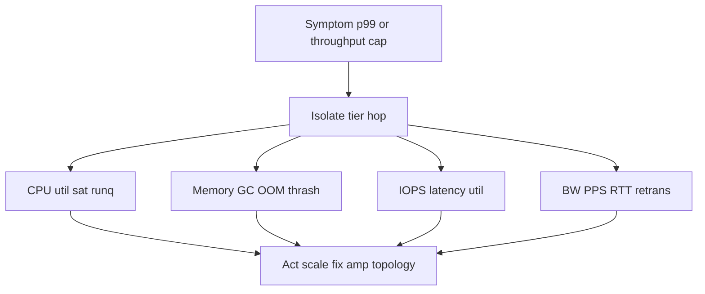
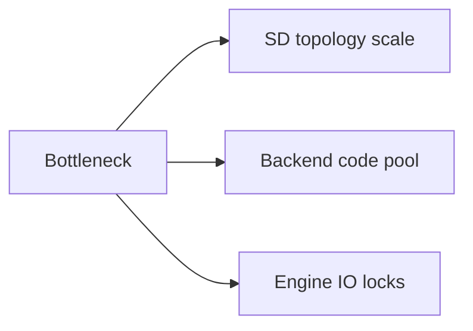
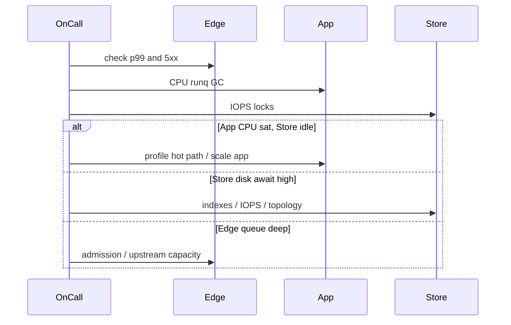

# Bottleneck Finding CPU Memory Disk Network

## Overview

A **bottleneck** is the resource whose saturation limits end-to-end throughput or blows the latency budget: CPU, memory/GC, disk IOPS/throughput, or network bandwidth/PPS/RTT. Finding it requires a method—not guessing "add Redis."

This note gives a production-oriented hunt: USE-style signals (utilization, saturation, errors), tier isolation, and the handoff between System Design topology fixes vs Backend/Databases tuning.

## Learning Objectives

- Apply a systematic bottleneck hunt across CPU, memory, disk, network
- Distinguish saturation from mere high utilization
- Map symptoms to likely tiers (edge, app, cache, store)
- Know when to scale out vs fix amplification vs change topology
- Avoid optimizing a non-bottleneck (Amdahl awareness)

## Prerequisites

- [[09-System-Design/01-Capacity-Latency-and-Bottlenecks/Throughput Queuing and Littles Law Intuition|Throughput Queuing and Littles Law Intuition]]
- [[09-System-Design/01-Capacity-Latency-and-Bottlenecks/Back-of-Envelope Capacity Estimation|Back-of-Envelope Capacity Estimation]]
- [[08-Databases/00-Orientation/Backend Databases and System Design Boundaries|Backend Databases and System Design Boundaries]]

## Difficulty

`intermediate`

## Estimated Time

- Reading: 1.25 hours
- Exercises: 1 hour
- Mini project: 2 hours

## History

Brendan Gregg's USE method and older performance engineering (wait analysis, queueing) formalized what good on-calls already did: for every resource, check utilization, saturation, errors. Distributed systems add *which hop* to the question.

## Problem It Solves

| Wild guess | Methodical finding |
| --- | --- |
| "DB is slow" | Disk util low; lock waits high → engine concurrency |
| "Need more pods" | NIC saturated on existing nodes |
| "Add cache" | CPU already bound in JSON serialize |
| "Network is fine" | Cross-AZ chatty RPCs eat budget |

## Internal Implementation

### Hunt flow



| Resource | Utilization signal | Saturation signal |
| --- | --- | --- |
| CPU | % busy | Run queue length, steal |
| Memory | Working set / limit | GC thrash, swap, OOM |
| Disk | % util, throughput | Await, queue depth |
| Network | Bytes/s, PPS | Drops, retrans, softnet |

## Mermaid Diagrams

### Structure



### Sequence / Lifecycle — isolation experiment



## Examples

### Minimal Example — resource scorecard

```typescript
export type ResourceSnapshot = {
  cpuUtil: number;
  runq: number;
  memUtil: number;
  gcPauseP99Ms: number;
  diskUtil: number;
  diskAwaitMs: number;
  netUtil: number;
  retransPct: number;
};

export function primarySuspect(s: ResourceSnapshot): string[] {
  const hits: string[] = [];
  if (s.cpuUtil > 0.85 || s.runq > 2) hits.push("cpu");
  if (s.memUtil > 0.9 || s.gcPauseP99Ms > 50) hits.push("memory");
  if (s.diskUtil > 0.8 || s.diskAwaitMs > 20) hits.push("disk");
  if (s.netUtil > 0.8 || s.retransPct > 1) hits.push("network");
  return hits.length ? hits : ["none-saturated-check-locks-or-deps"];
}
```

### Production-Shaped Example — amplification vs scale

```typescript
export type Fix =
  | { kind: "scale_out"; tier: string; factor: number }
  | { kind: "reduce_amp"; note: string }
  | { kind: "topology"; note: string }
  | { kind: "handoff"; track: "Backend" | "Databases"; note: string };

export function recommend(symptom: string, suspect: string): Fix {
  if (suspect === "cpu" && /json|serialize|regex/i.test(symptom)) {
    return { kind: "handoff", track: "Backend", note: "profile hot path before buying cores" };
  }
  if (suspect === "disk" && /seq scan|checkpoint/i.test(symptom)) {
    return { kind: "handoff", track: "Databases", note: "indexes / checkpoint tuning" };
  }
  if (suspect === "network" && /cross-az chatty/i.test(symptom)) {
    return { kind: "topology", note: "colocate or batch RPCs; reduce cross-AZ chatter" };
  }
  return { kind: "scale_out", tier: suspect, factor: 1.5 };
}
```

## Trade-offs

| Dimension | Methodical hunt | Instinct scaling |
| --- | --- | --- |
| Cost | Fixes root cause | Buys temporary relief |
| Time to green | May take longer initially | Fast if guess lucky |
| Learning | Builds operable systems | Repeats incidents |
| Risk | Changes right layer | Moves bottleneck |

### When to Use

- Any throughput ceiling or latency SLO burn
- Before major scale-out spend
- Capacity postmortems

### When Not to Use

- Premature micro-optimization without a measured bottleneck
- Blaming network without packet/RTT evidence

## Exercises

1. Given CPU 40%, runq 0, disk await 40ms—where do you look?
2. App CPU sat, DB idle—list three Backend causes and one SD cause.
3. Cross-AZ traffic is 70% of NIC—propose topology changes.
4. Memory util 95%, GC p99 200ms—scale out or fix heap first?
5. Draw a hunt flowchart for "checkout p99" using this note + latency budgets.

## Mini Project

Create a checklist + TypeScript scorecard that ingests mock metrics and prints suspect + recommended fix class.

## Portfolio Project

Workbench: bottleneck runbooks per tier with dashboards and owner tracks.

## Interview Questions

1. How do you find whether CPU or disk is the bottleneck?
2. What is saturation vs utilization?
3. When is scaling out the wrong fix?
4. How do locks appear if resources look idle?
5. How does System Design differ from Databases in bottleneck response?

### Stretch / Staff-Level

1. Build a continuous bottleneck classifier from golden signals.
2. How do you bottleneck-hunt under multi-tenant noisy neighbors?

## Common Mistakes

- Scaling the first slow span without checking children
- Ignoring errors (retrans, OOM kills) while staring at %util
- Caching to hide a write-path disk bottleneck
- Forgetting TLS/PPS limits on "small" instances
- Optimizing non-bottleneck code paths

## Best Practices

- One change at a time; measure after
- Always pair util with saturation and errors
- Separate read and write paths
- Document owner track for the fix
- Keep envelope estimates as a sanity check

## Summary

Bottlenecks are **resource and tier facts**, not vendor narratives. Hunt with utilization, saturation, and errors across CPU, memory, disk, and network; then choose scale-out, amplification reduction, topology change, or a Backend/Databases handoff. Guessing "add cache" without this hunt is how cost and complexity grow.

## Further Reading

- [[08-Databases/12-Production-Database-Ops/Monitoring Checkpoints Lag Bloat Cache Hit|Monitoring Checkpoints Lag Bloat Cache Hit]]
- [[09-System-Design/01-Capacity-Latency-and-Bottlenecks/Cost Performance and Capacity Trade-offs|Cost Performance and Capacity Trade-offs]]
- [[09-System-Design/10-Observability-and-Control-Planes/Capacity Signals and Autoscaling Intents|Capacity Signals and Autoscaling Intents]]

## Related Notes

- [[09-System-Design/01-Capacity-Latency-and-Bottlenecks/Throughput Queuing and Littles Law Intuition|Throughput Queuing and Littles Law Intuition]]
- [[09-System-Design/01-Capacity-Latency-and-Bottlenecks/Latency Budgets Percentiles and Tail Behavior|Latency Budgets Percentiles and Tail Behavior]]
- [[09-System-Design/00-Orientation-and-Boundaries/Backend Databases and System Design Boundaries|Backend Databases and System Design Boundaries]]
- [[09-System-Design/README|System Design]]

## Progress Checklist

- [ ] Explained from first principles
- [ ] Drew at least one Mermaid diagram
- [ ] Implemented a minimal version
- [ ] Documented trade-offs and non-goals
- [ ] Completed exercises
- [ ] Practiced interview questions aloud
- [ ] Linked prerequisites and dependents
