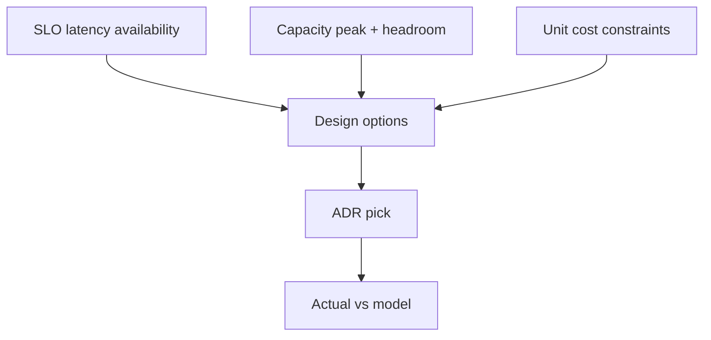
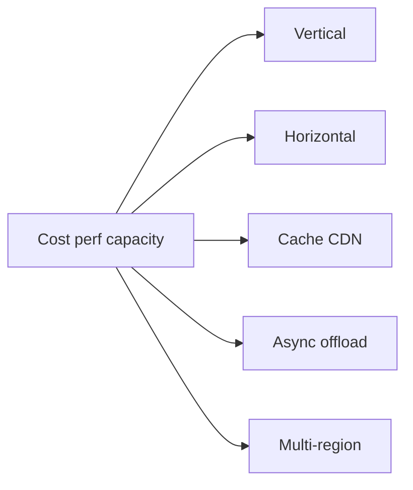
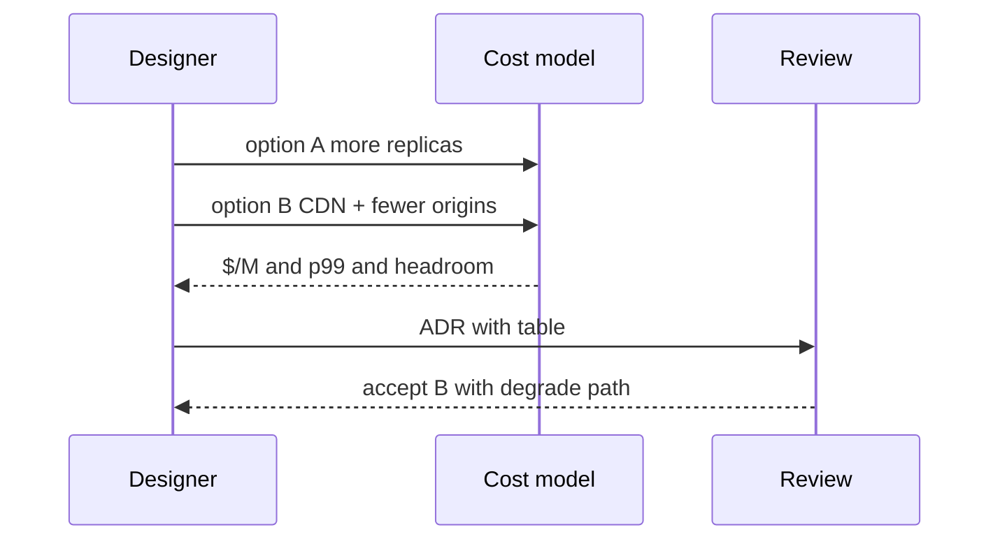

# Cost Performance and Capacity Trade-offs

## Overview

Every topology choice spends money to buy latency, availability, or engineering simplicity. **Cost–performance–capacity trade-offs** make that spend explicit: overprovision for tails and AZ loss, pay for multi-region RPO, or accept degrade paths. System design without cost is incomplete; cost without SLOs is false economy.

This note frames unit economics (per M requests, per TB-month) alongside capacity headroom and performance SLOs for ADRs.

## Learning Objectives

- Express designs in unit cost alongside QPS and p99
- Trade headroom (N-1 AZ, burst) against idle spend
- Compare vertical vs horizontal vs caching vs async offload economically
- Include egress, RF, and dual-writes in true cost
- Record cost consequences in ADRs

## Prerequisites

- [[09-System-Design/01-Capacity-Latency-and-Bottlenecks/Back-of-Envelope Capacity Estimation|Back-of-Envelope Capacity Estimation]]
- [[09-System-Design/01-Capacity-Latency-and-Bottlenecks/Bottleneck Finding CPU Memory Disk Network|Bottleneck Finding CPU Memory Disk Network]]
- [[09-System-Design/00-Orientation-and-Boundaries/ADR Discipline for Distributed Decisions|ADR Discipline for Distributed Decisions]]

## Difficulty

`intermediate`

## Estimated Time

- Reading: 1 hour
- Exercises: 1 hour
- Mini project: 2 hours

## History

Telecom capacity planning always had cost per Erlang. Cloud made elasticity easy and bills surprising—egress and chatty cross-AZ traffic especially. FinOps emerged to reconnect engineering choices to invoices without forcing every team to become accountants.

## Problem It Solves

| Blind spot | Explicit trade-off |
| --- | --- |
| "Multi-region everything" | 2–3× compute + storage + conflict engineering |
| Tiny instances + huge fan-out | Ops toil dominates "savings" |
| Cache to cut DB | Memory + invalidation complexity cost |
| RF=5 "for safety" | 5× storage and write amp |
| Reserved capacity none | Peak tax or stockouts |

## Internal Implementation

### Decision space



Rough unit cost:

`cost_per_M ≈ (compute + store + egress + managed fees) / millions_requests`

True capacity cost includes **idle headroom** required by blast-radius budgets.

## Mermaid Diagrams

### Structure



### Sequence / Lifecycle — option comparison



## Examples

### Minimal Example — compare two designs

```typescript
export type DesignCost = {
  name: string;
  monthlyUsd: number;
  p99Ms: number;
  survivesAzLoss: boolean;
  millionsReqs: number;
};

export function costPerM(d: DesignCost): number {
  return d.monthlyUsd / d.millionsReqs;
}

const a: DesignCost = {
  name: "more-origins",
  monthlyUsd: 40_000,
  p99Ms: 120,
  survivesAzLoss: true,
  millionsReqs: 800,
};
const b: DesignCost = {
  name: "cdn-heavy",
  monthlyUsd: 28_000,
  p99Ms: 80,
  survivesAzLoss: true,
  millionsReqs: 800,
};
// pick on costPerM + p99 + operational complexity (not shown)
```

### Production-Shaped Example — headroom tax

```typescript
export function capacitySpend(opts: {
  peakInstances: number;
  usdPerInstanceMonth: number;
  azCount: number;
  surviveAzFailures: number; // e.g. 1
}): { provisioned: number; headroomTaxPct: number } {
  const needed = Math.ceil(
    (opts.peakInstances * opts.azCount) / (opts.azCount - opts.surviveAzFailures),
  );
  const headroomTaxPct = (needed - opts.peakInstances) / opts.peakInstances;
  return {
    provisioned: needed * opts.usdPerInstanceMonth,
    headroomTaxPct,
  };
}

// 3 AZ, survive 1: provision ~1.5× peak → 50% headroom tax (before reserved discounts)
```

## Trade-offs

| Lever | Buys | Costs |
| --- | --- | --- |
| Overprovision | Tail + AZ survival | Idle $ |
| Caching/CDN | Latency + origin offload | Memory, invalidation, stale risk |
| Async | Write ACK latency | Consistency lag, ops |
| Multi-region | RTT + DR | RF, conflicts, eng time |
| Bigger boxes | Simpler topology | Blast radius, scale limits |

### When to Use

- ADR reviews for topology changes
- Pre-commit of reserved capacity
- Choosing between cache, scale-out, and async

### When Not to Use

- Optimizing pennies before the design meets SLOs
- Ignoring engineering time as a cost (toil is real)

## Exercises

1. Compute headroom tax for 4 AZs surviving 1 failure at peak 100 instances.
2. Compare RF=3 vs RF=5 storage cost for 50 TB logical.
3. When is CDN cheaper than scaling origins? List assumptions.
4. Price cross-AZ traffic for 2 Gbps average (order of magnitude).
5. Write ADR consequences for "save money by single-AZ Redis."

## Mini Project

Spreadsheet or TS model: three designs for a read-heavy API—origins-only, CDN, CDN+regional cache—output $/M, p99, AZ survival.

## Portfolio Project

Workbench: FinOps page linking each ADR to modeled vs actual monthly cost.

## Interview Questions

1. How do you incorporate cost into system design?
2. What is the cost of multi-AZ headroom?
3. When is vertical scaling the right economic choice?
4. How do egress fees change architecture?
5. How do you cost an availability SLO?

### Stretch / Staff-Level

1. Design a cost budget per SLO class (P0 vs P2).
2. How do you prevent FinOps from forcing unsafe single-AZ P0 deps?

## Common Mistakes

- Optimizing instance $/hr while ignoring eng toil and incident cost
- Forgetting backups, indexes, and staging clones in storage
- Multi-region "for free" assumptions
- Cutting headroom that blast budgets require
- Counting only happy-path QPS

## Best Practices

- Put $/M and headroom tax in ADRs
- Price the degrade path (feature shedding) as a valid option
- Reconcile model vs bill monthly
- Attribute egress to owning services
- Never trade P0 invariants for idle savings without an explicit risk accept

## Summary

Capacity and performance are purchased with money and complexity. Good system design **names the trade-off**: how much headroom, which SLO, which consistency, at what unit cost. Record it; measure it; supersede the ADR when the economics or SLOs change.

## Further Reading

- [[09-System-Design/00-Orientation-and-Boundaries/Failure Domains and Blast Radius Budgets|Failure Domains and Blast Radius Budgets]]
- [[09-System-Design/00-Orientation-and-Boundaries/ADR Discipline for Distributed Decisions|ADR Discipline for Distributed Decisions]]
- [[09-System-Design/05-Caching-at-Product-Scale/Cache Hierarchies CDN Edge Regional App|Cache Hierarchies CDN Edge Regional App]]

## Related Notes

- [[09-System-Design/01-Capacity-Latency-and-Bottlenecks/Back-of-Envelope Capacity Estimation|Back-of-Envelope Capacity Estimation]]
- [[09-System-Design/01-Capacity-Latency-and-Bottlenecks/Bottleneck Finding CPU Memory Disk Network|Bottleneck Finding CPU Memory Disk Network]]
- [[09-System-Design/07-Multi-Region-and-Geo/Multi-Region Active-Passive Active-Active Patterns|Multi-Region Active-Passive Active-Active Patterns]]
- [[09-System-Design/README|System Design]]

## Progress Checklist

- [ ] Explained from first principles
- [ ] Drew at least one Mermaid diagram
- [ ] Implemented a minimal version
- [ ] Documented trade-offs and non-goals
- [ ] Completed exercises
- [ ] Practiced interview questions aloud
- [ ] Linked prerequisites and dependents
