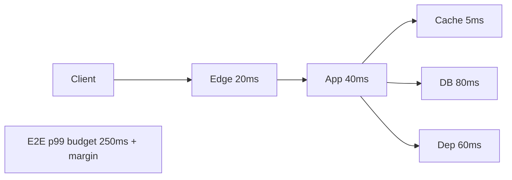
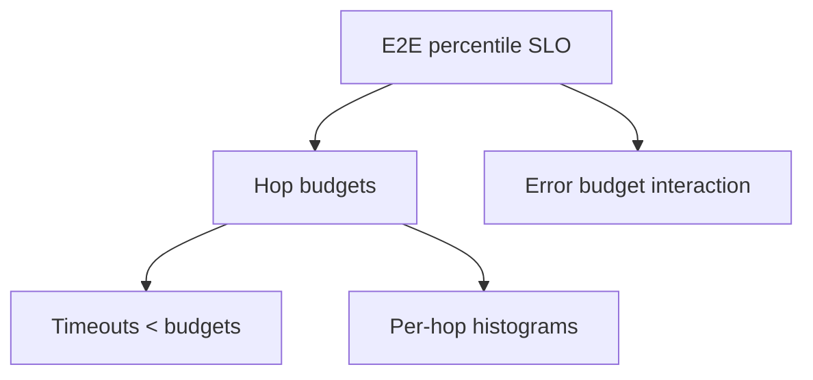
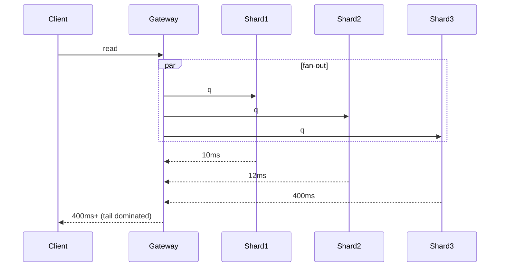

# Latency Budgets Percentiles and Tail Behavior

## Overview

Users experience **tail latency**, not averages. A **latency budget** allocates an end-to-end SLO (e.g., p99 ≤ 300ms) across hops: edge, app, cache, DB, dependencies. Percentiles (p50/p95/p99/p99.9) describe the distribution; **tail behavior** arises from queueing, GC, slow disks, retries, and fan-out (one slow shard ruins the whole request).

This note teaches budget allocation and why means lie.

## Learning Objectives

- Define latency SLOs with percentiles and success criteria
- Allocate hop budgets that sum (with margin) to the end-to-end SLO
- Explain why fan-out amplifies tails
- Relate retries and timeouts to tail inflation
- Connect budgets to Little's Law and bottleneck notes

## Prerequisites

- [[09-System-Design/01-Capacity-Latency-and-Bottlenecks/Back-of-Envelope Capacity Estimation|Back-of-Envelope Capacity Estimation]]
- [[09-System-Design/00-Orientation-and-Boundaries/Requirements Non-Functional and Workload Modeling|Requirements Non-Functional and Workload Modeling]]

## Difficulty

`intermediate`

## Estimated Time

- Reading: 1 hour
- Exercises: 1 hour
- Mini project: 2 hours

## History

Telephony and HPC tracked percentiles before web SRE popularized "the long tail." Jeff Dean's talks on latency tails and hedged requests shaped modern practice: eliminate variance, hedge carefully, and never SLO on averages alone.

## Problem It Solves

| Misleading metric | Reality |
| --- | --- |
| Mean 40ms | 1% of users at 2s → complaints |
| p99 on one service | Gateway + 5 fan-outs → product p99 much worse |
| No hop budget | DB "uses" entire SLO; edge has no margin |
| Infinite retries | Tail and load explode together |

## Internal Implementation

### Budget allocation



Fan-out rule of thumb: if you wait for *k* parallel independent backends each with slow-tail probability *p*, P(at least one slow) ≈ 1−(1−p)^k.

## Mermaid Diagrams

### Structure



### Sequence / Lifecycle — tail amplification



## Examples

### Minimal Example — budget table + check

```typescript
export type HopBudget = { name: string; p99Ms: number };

export function fitsBudget(e2eP99: number, hops: HopBudget[], marginMs: number): boolean {
  const sum = hops.reduce((a, h) => a + h.p99Ms, 0);
  return sum + marginMs <= e2eP99;
}

const ok = fitsBudget(300, [
  { name: "edge", p99Ms: 30 },
  { name: "app", p99Ms: 50 },
  { name: "db", p99Ms: 120 },
  { name: "payments", p99Ms: 80 },
], 20);
```

### Production-Shaped Example — fan-out tail probability

```typescript
/** Probability at least one of k backends exceeds its local tail threshold */
export function anySlow(k: number, pSlow: number): number {
  return 1 - Math.pow(1 - pSlow, k);
}

// 20 shards, each 1% chance of being in local "slow" bucket → ~18% requests hit a slow shard
const p = anySlow(20, 0.01);

export type TimeoutPolicy = {
  hop: string;
  timeoutMs: number;
  retries: number;
  hedgeAfterMs?: number;
};

// Timeouts must be < remaining budget; retries need admission control
export const READ_POLICY: TimeoutPolicy[] = [
  { hop: "cache", timeoutMs: 20, retries: 1 },
  { hop: "db", timeoutMs: 100, retries: 0 },
  { hop: "search", timeoutMs: 80, retries: 1, hedgeAfterMs: 40 },
];
```

## Trade-offs

| Dimension | Percentile SLOs + budgets | Average-only monitoring |
| --- | --- | --- |
| User truth | Captures pain | Hides victims |
| Engineering | Forces variance reduction | Optimizes the wrong thing |
| Cost | More headroom, hedging cost | Cheaper until churn |
| Complexity | Histograms, exemplars | Simple means |

### When to Use

- Any user-facing interactive path
- Multi-hop and fan-out architectures
- Setting timeouts and retry policies

### When Not to Use

- Pure offline batch where throughput matters more than latency
- Using p99.99 as a hammer without enough traffic for statistical meaning

## Exercises

1. Allocate a 200ms p99 budget across CDN, gateway, app, cache, DB.
2. Compute anySlow(50, 0.005). Interpret for a scatter/gather API.
3. Why might client-side p99 exceed server p99?
4. Design timeouts for a 3-hop chain totaling 150ms budget.
5. Explain how synchronized GC across replicas creates correlated tails.

## Mini Project

Build a histogram aggregator in TypeScript that merges hop samples and reports p50/p95/p99; simulate fan-out of N backends.

## Portfolio Project

Workbench: latency budget sheets per API with SLO burn alerts tied to hop histograms.

## Interview Questions

1. Why not SLO on average latency?
2. How do you budget latency across microservices?
3. What is tail amplification under fan-out?
4. When do hedged requests help or hurt?
5. How do retries interact with tails and load?

### Stretch / Staff-Level

1. Design an org-wide latency budget registry enforced in gateway configs.
2. How do you SLO multi-region reads with different RTT floors?

## Common Mistakes

- Summing p99s incorrectly without margin or correlation thinking
- Timeouts longer than remaining budget
- Retrying non-idempotent calls
- Looking only at app metrics, ignoring edge and DB
- Percentiles on tiny sample windows

## Best Practices

- Measure histograms at each hop with consistent units
- Keep timeouts strictly inside budgets
- Reduce variance before adding instances
- Prefer fewer serial hops on critical paths
- Pair with [[09-System-Design/01-Capacity-Latency-and-Bottlenecks/Throughput Queuing and Littles Law Intuition|Little's Law]] when queues grow

## Summary

Latency design is **budgeting and tail control**. Percentiles make user pain visible; hop budgets make ownership actionable; fan-out and retries explain why healthy medians still fail product SLOs. Treat averages as debugging clues, never as contracts.

## Further Reading

- [[09-System-Design/10-Observability-and-Control-Planes/SLIs SLOs Error Budgets for Multi-Service Systems|SLIs SLOs Error Budgets]]
- [[09-System-Design/01-Capacity-Latency-and-Bottlenecks/Throughput Queuing and Littles Law Intuition|Throughput Queuing and Littles Law Intuition]]
- [[00-References/System Design/README|System Design References]]

## Related Notes

- [[09-System-Design/01-Capacity-Latency-and-Bottlenecks/Back-of-Envelope Capacity Estimation|Back-of-Envelope Capacity Estimation]]
- [[09-System-Design/01-Capacity-Latency-and-Bottlenecks/Bottleneck Finding CPU Memory Disk Network|Bottleneck Finding CPU Memory Disk Network]]
- [[09-System-Design/02-Load-Balancing-and-Edge-Entry/Edge Admission Control and Global Traffic Steering|Edge Admission Control and Global Traffic Steering]]
- [[09-System-Design/README|System Design]]

## Progress Checklist

- [ ] Explained from first principles
- [ ] Drew at least one Mermaid diagram
- [ ] Implemented a minimal version
- [ ] Documented trade-offs and non-goals
- [ ] Completed exercises
- [ ] Practiced interview questions aloud
- [ ] Linked prerequisites and dependents
