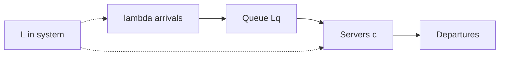
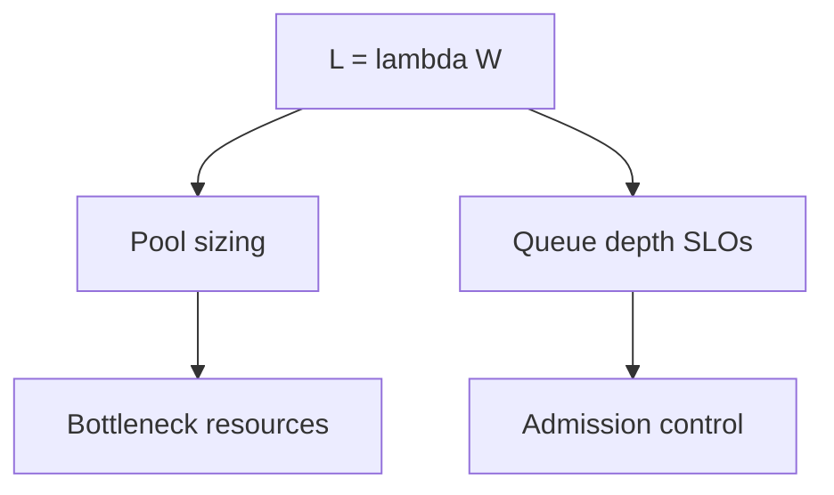
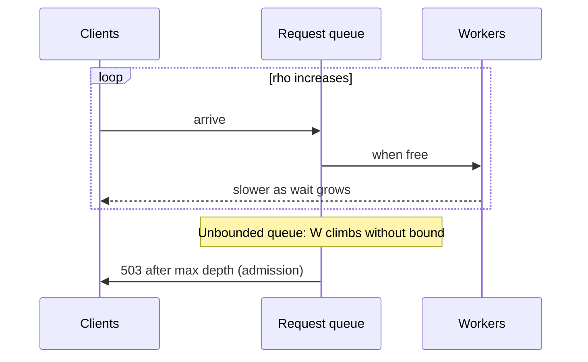

# Throughput Queuing and Littles Law Intuition

## Overview

**Little's Law** relates concurrency, throughput, and latency: for a stable system, \(L = \lambda W\) (average in-system items = arrival rate × average time in system). System designers use it to reason about thread/connection pools, queue depth, and why latency explodes as utilization approaches 1.

This note builds *intuition*—not a full queueing-theory course—so you can size pools and spot saturation before the bottleneck note drills into CPU/disk/net.

## Learning Objectives

- State Little's Law and apply it to request pipelines
- Relate utilization to waiting time (intuition from M/M/1-style curves)
- Size concurrency (workers, connections) from target latency and QPS
- Explain why unbounded queues turn latency SLOs into fiction
- Connect queue metrics to admission control at the edge

## Prerequisites

- [[09-System-Design/01-Capacity-Latency-and-Bottlenecks/Latency Budgets Percentiles and Tail Behavior|Latency Budgets Percentiles and Tail Behavior]]
- [[09-System-Design/01-Capacity-Latency-and-Bottlenecks/Back-of-Envelope Capacity Estimation|Back-of-Envelope Capacity Estimation]]

## Difficulty

`intermediate`

## Estimated Time

- Reading: 1 hour
- Exercises: 1 hour
- Mini project: 2 hours

## History

Little's Law (1961) is distribution-free for long-run averages in stable systems. Web frameworks rediscovered it as "how many in-flight requests can we hold?" Cloud autoscaling often reacts to CPU while ignoring queue depth—the leading indicator of latency fire.

## Problem It Solves

| Symptom | Queue/Little framing |
| --- | --- |
| Latency climbs though CPU 60% | Waiting in queue before service |
| "Just add a bigger queue" | Stores more delay; does not raise μ |
| Connection pool too small | Throughput capped; wait on pool |
| Connection pool too large | Oversubscribe DB; latency thrash |
| Autoscaler lag | Queue already deep before new pods warm |

## Internal Implementation

### Pipeline view



Identities designers use:

- \(L = \lambda W\) (in-system)
- Rough service concurrency needed: \(L_{service} \approx \lambda \times W_{service}\)
- Utilization \(\rho = \lambda / (c \mu)\); as \(\rho \to 1\), wait grows sharply

## Mermaid Diagrams

### Structure



### Sequence / Lifecycle — saturation



## Examples

### Minimal Example — in-flight from QPS and latency

```typescript
/** Little's Law: L = lambda * W (W in seconds) */
export function inFlight(qps: number, latencyMs: number): number {
  return qps * (latencyMs / 1000);
}

// 5000 QPS, 50ms average residency → ~250 concurrent requests in system
const L = inFlight(5000, 50);

export function workersNeeded(qps: number, serviceMs: number, util: number): number {
  const busy = qps * (serviceMs / 1000); // required busy workers
  return Math.ceil(busy / util);
}
```

### Production-Shaped Example — bounded queue + shed

```typescript
export type QueueConfig = {
  workers: number;
  maxQueue: number;
  serviceMs: number;
};

export type AdmitResult = "run" | "queue" | "shed";

export function admit(
  cfg: QueueConfig,
  active: number,
  queued: number,
): AdmitResult {
  if (active < cfg.workers) return "run";
  if (queued < cfg.maxQueue) return "queue";
  return "shed";
}

/** Expected wait rough check: if queued/qps exceeds budget, shed earlier */
export function queueWaitMs(queued: number, qps: number): number {
  if (qps <= 0) return 0;
  return (queued / qps) * 1000;
}
```

## Trade-offs

| Dimension | Bounded queues + Little sizing | Unbounded accept |
| --- | --- | --- |
| Latency | Predictable under load | Melts at peak |
| Availability | Shed some to save many | Everyone slow |
| Utilization | Leave headroom | Chase 100% |
| Complexity | Tunable knobs | Simple until outage |

### When to Use

- Sizing thread/connection/worker pools
- Setting gateway max-in-flight and queue depths
- Explaining latency vs throughput curves in reviews

### When Not to Use

- Assuming M/M/1 formulas are exact for every system—use as intuition
- Applying long-run averages to tiny burst windows without care

## Exercises

1. At 2k QPS and 100ms average latency, how many requests in system?
2. Service time 10ms, 1k QPS, target util 70%—how many workers?
3. Queue depth 5k at 1k QPS—approximate wait? Is it inside a 200ms budget?
4. Why does doubling workers not always halve latency?
5. Relate this note to edge admission control (module 02).

## Mini Project

Simulate a fixed worker pool with bounded queue in TypeScript; plot latency vs offered load and mark the shed point.

## Portfolio Project

Workbench: pool-sizing calculator wired to capacity estimates and latency budgets.

## Interview Questions

1. State Little's Law and give a web example.
2. How do you size a connection pool to a database?
3. Why do unbounded queues hurt SLOs?
4. What happens to latency as utilization approaches 100%?
5. How is queue depth a better scale signal than CPU sometimes?

### Stretch / Staff-Level

1. Design multi-tenant fair queuing with per-tenant Little budgets.
2. How do you apply Little's Law across a multi-hop distributed trace?

## Common Mistakes

- Confusing service time with total latency (ignores wait)
- Infinite queues as "reliability"
- Oversizing pools until the downstream becomes the queue
- Autoscaling on CPU only
- Treating law as instant equality under non-stationary load

## Best Practices

- Budget wait time separately from service time
- Cap queues; shed early with clear 503/429 semantics
- Size pools from \(\lambda W\) plus headroom for AZ loss
- Watch queue depth and wait histograms
- Link sheds to [[09-System-Design/02-Load-Balancing-and-Edge-Entry/Edge Admission Control and Global Traffic Steering|Edge Admission Control]]

## Summary

Throughput and latency are coupled through **concurrency and queues**. Little's Law gives a stable-system compass for in-flight sizing; utilization curves explain tail explosions; bounded queues turn overload into controlled degradation. Use this intuition before chasing micro-optimizations on the wrong resource.

## Further Reading

- [[09-System-Design/01-Capacity-Latency-and-Bottlenecks/Bottleneck Finding CPU Memory Disk Network|Bottleneck Finding CPU Memory Disk Network]]
- [[09-System-Design/02-Load-Balancing-and-Edge-Entry/Edge Admission Control and Global Traffic Steering|Edge Admission Control and Global Traffic Steering]]
- [[09-System-Design/06-Messaging-Streams-and-Async-Topologies/Backpressure Consumer Lag and Load Shedding|Backpressure Consumer Lag and Load Shedding]]

## Related Notes

- [[09-System-Design/01-Capacity-Latency-and-Bottlenecks/Latency Budgets Percentiles and Tail Behavior|Latency Budgets Percentiles and Tail Behavior]]
- [[09-System-Design/01-Capacity-Latency-and-Bottlenecks/Cost Performance and Capacity Trade-offs|Cost Performance and Capacity Trade-offs]]
- [[07-Backend/06-Reliability-and-Abuse-Resistance/Circuit Breakers and Bulkheads|Circuit Breakers and Bulkheads]]
- [[09-System-Design/README|System Design]]

## Progress Checklist

- [ ] Explained from first principles
- [ ] Drew at least one Mermaid diagram
- [ ] Implemented a minimal version
- [ ] Documented trade-offs and non-goals
- [ ] Completed exercises
- [ ] Practiced interview questions aloud
- [ ] Linked prerequisites and dependents
