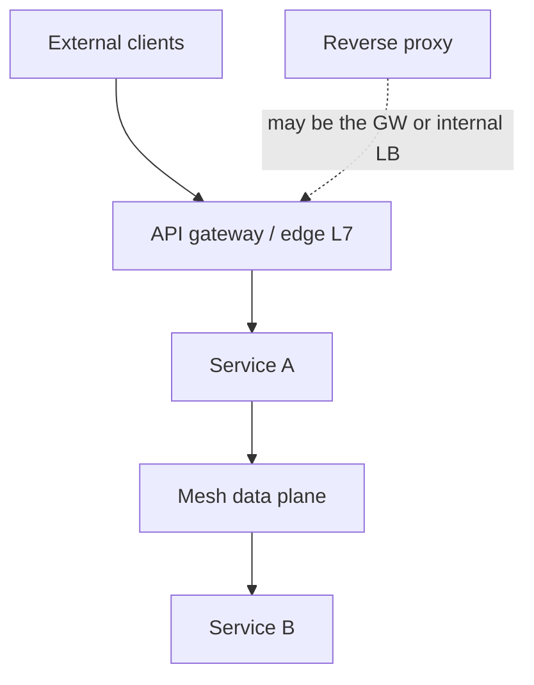
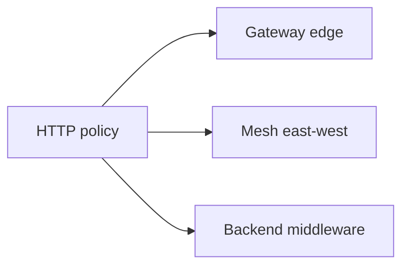
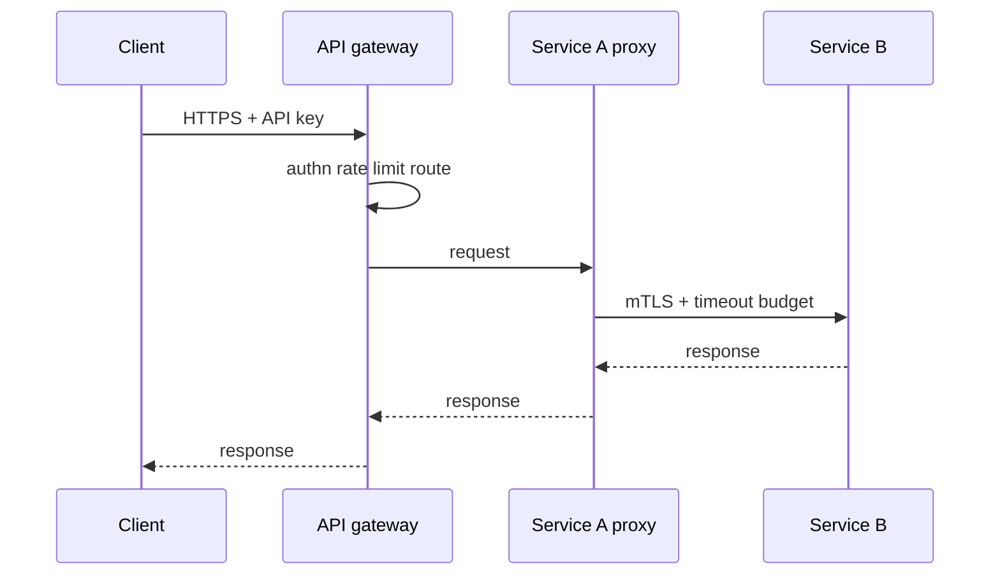

# API Gateway vs Reverse Proxy vs Service Mesh Concepts

## Overview

Three L7-ish roles are constantly conflated: a **reverse proxy** forwards HTTP to upstreams (often with TLS and basic routing); an **API gateway** adds *product edge policy*—authn/authz hooks, rate limits, request shaping, API versioning, developer-facing catalogs; a **service mesh** focuses on *east-west* service-to-service policy—mTLS, retries, traffic splits—usually via sidecars or ambient proxies.

This note clarifies **concepts and ownership** for system design. Express middleware auth stays Backend; mesh platform install stays DevOps.

## Learning Objectives

- Define reverse proxy, API gateway, and service mesh by responsibility, not vendor
- Place north-south vs east-west policy without duplication wars
- Decide when gateway + mesh is justified vs a single proxy tier
- Identify double-retry and double-timeout anti-patterns
- Cross-link Backend for app auth and DevOps for data-plane plumbing

## Prerequisites

- [[09-System-Design/02-Load-Balancing-and-Edge-Entry/Load Balancer Roles L4 vs L7|Load Balancer Roles L4 vs L7]]
- [[09-System-Design/00-Orientation-and-Boundaries/Backend Databases and System Design Boundaries|Backend Databases and System Design Boundaries]]

## Difficulty

`intermediate`

## Estimated Time

- Reading: 1 hour
- Exercises: 45 minutes
- Mini project: 2 hours

## History

NGINX/HAProxy popularized reverse proxies. API gateways (Kong, Apigee, cloud API GW) bundled cross-cutting edge concerns as microservices proliferated. Service meshes (Istio, Linkerd, Consul) arose to standardize east-west without rewriting every app. Many outages come from stacking all three with conflicting timeouts.

## Problem It Solves

| Confusion | Clarified ownership |
| --- | --- |
| "Mesh replaces gateway" | Different traffic directions and audiences |
| Auth only in mesh | External clients still need edge identity |
| Retries in gateway + mesh + app | Amplification storms |
| Gateway as ESB | Hidden coupling, hard debugging |

## Internal Implementation

### Traffic directions



| Concern | Reverse proxy | API gateway | Service mesh |
| --- | --- | --- | --- |
| Primary plane | N-S or internal | North-south | East-west |
| Routing | Host/path | + API products | + service identity |
| Auth | Optional TLS | Token validation, API keys | mTLS workload ID |
| Rate limit | Basic | Product quotas | Sometimes local |
| Retries | Optional | Edge policy | Default temptation |

## Mermaid Diagrams

### Structure



### Sequence / Lifecycle — request with clear layers



## Examples

### Minimal Example — responsibility labels

```typescript
export type Layer = "reverse_proxy" | "api_gateway" | "service_mesh" | "backend_app";

export const OWNERS: Record<string, Layer> = {
  "TLS terminate at edge": "api_gateway",
  "Path /v1/orders routing": "api_gateway",
  "Per-tenant quota": "api_gateway",
  "mTLS between order and payment": "service_mesh",
  "Idempotency key handling": "backend_app",
  "JWT claim business authorization": "backend_app",
  "Simple internal host routing": "reverse_proxy",
};
```

### Production-Shaped Example — timeout budget without double retry

```typescript
export type HopPolicy = {
  layer: Layer;
  timeoutMs: number;
  retries: number; // prefer 0 at most one layer
};

export const ORDER_READ: HopPolicy[] = [
  { layer: "api_gateway", timeoutMs: 300, retries: 0 },
  { layer: "service_mesh", timeoutMs: 200, retries: 1 }, // only idempotent GETs
  { layer: "backend_app", timeoutMs: 150, retries: 0 },
];

export function assertSingleRetryLayer(hops: HopPolicy[]): boolean {
  return hops.filter((h) => h.retries > 0).length <= 1;
}
```

## Trade-offs

| Dimension | Gateway + mesh | Single proxy tier |
| --- | --- | --- |
| Policy clarity | Strong separation N-S/E-W | Simpler ops |
| Cost | Two data planes | Fewer hops |
| Safety | Risk of policy duplication | Risk of missing E-W mTLS |
| Team fit | Platform + edge teams | One team owns all |

### When to Use

- Gateway: external API products, partner traffic, edge quotas
- Reverse proxy: straightforward TLS+route without full API product surface
- Mesh: many services needing uniform mTLS/telemetry/traffic split
- Combine when org scale justifies both—with one retry owner

### When Not to Use

- Mesh for a 3-service app "because cloud native"
- Gateway as a second application layer (business workflows)
- Re-implementing Backend authZ exclusively at the edge for complex domain rules

## Exercises

1. Label ten concerns from a checkout path with `OWNERS`.
2. Find a double-retry risk in a hypothetical Envoy+Kong+app stack.
3. When is a reverse proxy enough for an internal admin UI?
4. Draw N-S vs E-W for a BFF + 4 services.
5. What stays in [[07-Backend/README|Backend]] even if you have a gateway?

## Mini Project

Write an ADR: "Edge gateway only" vs "Gateway + mesh" for a 15-service org; include timeout/retry matrix.

## Portfolio Project

Workbench: policy matrix doc mapping each cross-cutting concern to exactly one layer.

## Interview Questions

1. API gateway vs reverse proxy vs service mesh?
2. Where should rate limiting live?
3. Why are retries dangerous across layers?
4. Does a mesh replace load balancers?
5. North-south vs east-west?

### Stretch / Staff-Level

1. Design a progressive adoption path from reverse proxy → gateway → selective mesh.
2. How do you govern policy so product teams cannot each invent timeouts?

## Common Mistakes

- Three layers all retrying
- Putting domain workflows in the gateway
- Mesh for external internet clients
- Assuming mTLS equals user authorization
- No shared latency budget across hops

## Best Practices

- One owner per concern (authn edge vs authZ app often split intentionally)
- Explicit timeout DAG
- Prefer idempotent retries only
- Start simpler; add mesh when E-W pain is real
- Keep Express reliability patterns in Backend

## Summary

Reverse proxies forward; API gateways enforce **edge product policy**; service meshes standardize **service-to-service** policy. They can compose, but only with a single clear owner for retries, timeouts, and auth boundaries. Concept clarity prevents expensive double data planes and cascade amplifiers.

## Further Reading

- [[07-Backend/README|Backend]] — app auth and middleware
- [[16-DevOps/README|DevOps]] — mesh platforms
- [[09-System-Design/02-Load-Balancing-and-Edge-Entry/Edge Admission Control and Global Traffic Steering|Edge Admission Control and Global Traffic Steering]]
- [[18-Security/README|Security]]

## Related Notes

- [[09-System-Design/02-Load-Balancing-and-Edge-Entry/Load Balancer Roles L4 vs L7|Load Balancer Roles L4 vs L7]]
- [[09-System-Design/02-Load-Balancing-and-Edge-Entry/Health Checks Drain and Connection Management|Health Checks Drain and Connection Management]]
- [[09-System-Design/00-Orientation-and-Boundaries/Backend Databases and System Design Boundaries|Backend Databases and System Design Boundaries]]
- [[09-System-Design/README|System Design]]

## Progress Checklist

- [ ] Explained from first principles
- [ ] Drew at least one Mermaid diagram
- [ ] Implemented a minimal version
- [ ] Documented trade-offs and non-goals
- [ ] Completed exercises
- [ ] Practiced interview questions aloud
- [ ] Linked prerequisites and dependents
