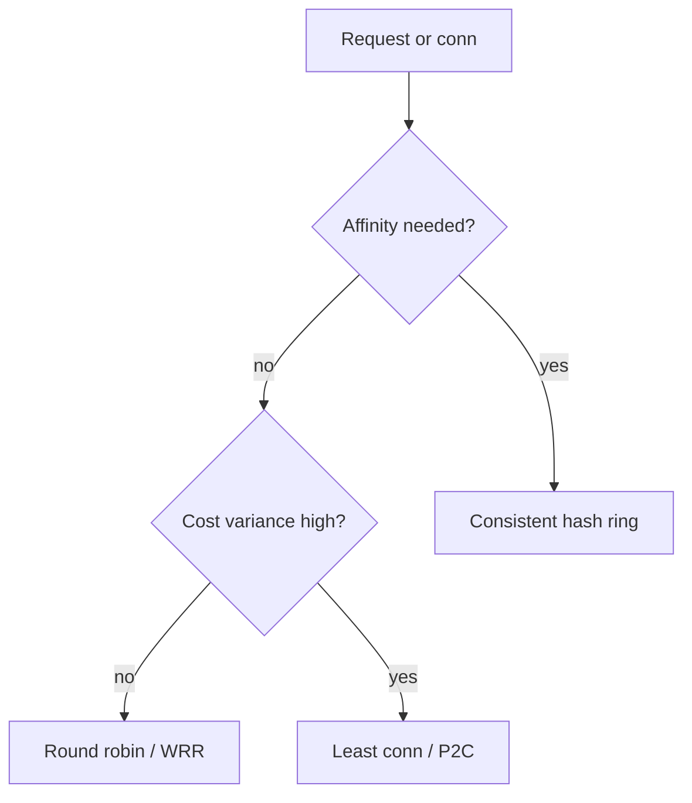
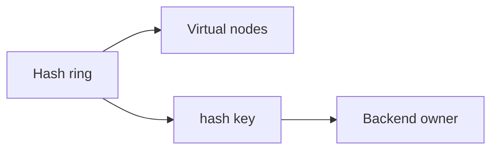
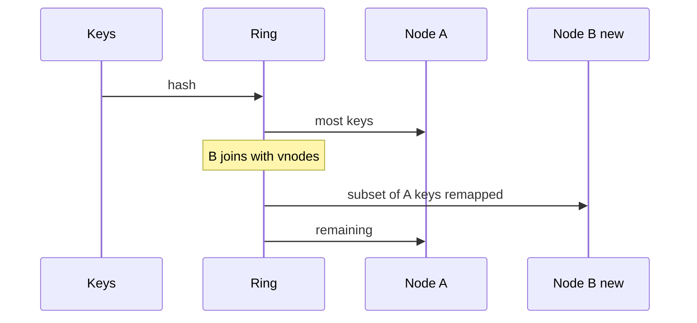

# Algorithms Round Robin Least Conn Consistent Hash

## Overview

Load balancers need a **scheduling algorithm**: which backend gets the next connection or request. **Round robin (RR)** spreads evenly when backends are homogeneous and request costs similar. **Least connections** tracks in-flight work and helps with uneven request durations. **Consistent hashing** maps keys (client IP, session, shard key) onto a ring so affinity survives membership churn with minimal remapping—critical for caches and sticky stateful sessions.

This note develops first-principles intuition and small TypeScript simulations; deeper partition rings appear again in sharding modules.

## Learning Objectives

- Implement mental models for RR, weighted RR, least-conn, and consistent hash
- Choose algorithms from workload variance and affinity needs
- Explain virtual nodes and membership changes on a hash ring
- Recognize failure modes: thundering remaps, herd on one node, sticky imbalance
- Relate LB hashing to partition keys without merging tracks

## Prerequisites

- [[09-System-Design/02-Load-Balancing-and-Edge-Entry/Load Balancer Roles L4 vs L7|Load Balancer Roles L4 vs L7]]
- Basic hashing intuition

## Difficulty

`intermediate`

## Estimated Time

- Reading: 1.25 hours
- Exercises: 1.5 hours
- Mini project: 3 hours

## History

RR and least-conn come from classical OS scheduling and appliance LBs. Consistent hashing (Karger et al.; popularized by Dynamo/CDNs) solved cache and DHT membership churn. Modern Envoy/cloud LBs expose variants (P2C power-of-two choices, maglev) that improve on naive RR under real variance.

## Problem It Solves

| Workload | Poor choice | Better fit |
| --- | --- | --- |
| Homogeneous short HTTP | Overbuilt hash | RR / WRR |
| Mixed long uploads + APIs | RR piles on busy nodes | Least-conn / P2C |
| Cache frontends | RR destroys hit rate | Consistent hash on key |
| Session sticky without shared store | Random | Hash affinity (with caveats) |

## Internal Implementation

### Algorithm family



Consistent hash: place backends (× virtual nodes) on a circle; map `hash(key)` clockwise to successor. Add/remove moves only nearby keys.

## Mermaid Diagrams

### Structure



### Sequence / Lifecycle — node join remapping



## Examples

### Minimal Example — RR and least-conn

```typescript
export function roundRobin(n: number, i: number): number {
  return i % n;
}

export function leastConn(conns: number[]): number {
  let best = 0;
  for (let i = 1; i < conns.length; i++) {
    if (conns[i] < conns[best]) best = i;
  }
  return best;
}
```

### Production-Shaped Example — consistent hash with vnodes

```typescript
import { createHash } from "crypto";

function h(s: string): number {
  return createHash("sha256").update(s).digest().readUInt32BE(0);
}

export class HashRing {
  private points: Array<{ hash: number; node: string }> = [];

  constructor(nodes: string[], vnodes = 100) {
    for (const node of nodes) {
      for (let v = 0; v < vnodes; v++) {
        this.points.push({ hash: h(`${node}#${v}`), node });
      }
    }
    this.points.sort((a, b) => a.hash - b.hash);
  }

  get(key: string): string {
    const x = h(key);
    for (const p of this.points) {
      if (p.hash >= x) return p.node;
    }
    return this.points[0].node;
  }
}

// Power of two choices sketch
export function p2c(conns: number[]): number {
  const a = Math.floor(Math.random() * conns.length);
  let b = Math.floor(Math.random() * conns.length);
  if (b === a) b = (b + 1) % conns.length;
  return conns[a] <= conns[b] ? a : b;
}
```

## Trade-offs

| Algorithm | Upside | Downside | When it matters |
| --- | --- | --- | --- |
| RR | Simple, even if equal | Ignores load variance | Homogeneous fleets |
| Least-conn | Tracks in-flight | Needs accurate conn counts; slow nodes attract less but may be sick | Heterogeneous duration |
| Consistent hash | Stable affinity | Hot keys; imbalance without vnodes | Caches, sticky partitions |
| P2C | Near-optimal with little state | Randomness; still no hard affinity | High variance HTTP |

### When to Use

- RR/WRR for stateless equal backends
- Least-conn/P2C when request costs vary
- Consistent hash for cache locality or shard affinity at the edge of a pool

### When Not to Use

- Consistent hash as a substitute for proper shared session store when sticky fails on deploy
- RR alone for multi-minute streaming connections
- Client-side hashing without coordinating membership updates

## Exercises

1. Simulate RR vs least-conn with a mix of 10ms and 2s requests.
2. Build a ring; measure % keys moved when adding a 4th node with 100 vnodes.
3. Why can least-conn send traffic to a slow dying node?
4. Design affinity for WebSocket upgrades vs REST on the same VIP.
5. Compare LB consistent hash with data-plane shard hashing (module 04)—what differs?

## Mini Project

Extend [[09-System-Design/projects/Load Balancer From Scratch/README|Load Balancer From Scratch]] with RR, least-conn, and consistent-hash modes plus a remapping metric on join/leave.

## Portfolio Project

Workbench: algorithm comparison notebook (latency fairness, remap %, hot-key sensitivity).

## Interview Questions

1. Round robin vs least connections?
2. Explain consistent hashing and virtual nodes.
3. What happens to a hash ring when a node dies?
4. How do you handle hot keys with consistent hashing?
5. What is power-of-two choices?

### Stretch / Staff-Level

1. Compare Maglev vs ring hashing for Google-scale VIP schedulers.
2. Design weighted consistent hashing for heterogeneous cache node sizes.

## Common Mistakes

- Sticky sessions without drain-aware membership
- Too few vnodes → imbalance
- Hashing mutable headers (breaks affinity)
- Assuming least-conn equals least latency
- Remapping entire cache fleet on every deploy

## Best Practices

- Prefer stateless + shared store over sticky when possible
- Use enough vnodes; monitor load skew
- Combine health removal with gentle connection drain
- Consider P2C for general HTTP
- Document algorithm choice in edge ADRs

## Summary

Scheduling algorithms encode fairness vs affinity vs variance tolerance. RR is the baseline; least-conn/P2C handle uneven work; consistent hashing preserves locality across churn. Pick from workload physics, then simulate membership events before production.

## Further Reading

- [[09-System-Design/04-Partitioning-Sharding-and-Placement/Range Hash and Directory-Based Sharding|Range Hash and Directory-Based Sharding]]
- [[09-System-Design/projects/Load Balancer From Scratch/README|Load Balancer From Scratch]]
- [[05-Algorithms/README|Algorithms]] — hashing foundations

## Related Notes

- [[09-System-Design/02-Load-Balancing-and-Edge-Entry/Load Balancer Roles L4 vs L7|Load Balancer Roles L4 vs L7]]
- [[09-System-Design/02-Load-Balancing-and-Edge-Entry/Health Checks Drain and Connection Management|Health Checks Drain and Connection Management]]
- [[09-System-Design/05-Caching-at-Product-Scale/Hot Keys Stampede and Thundering Herd at Scale|Hot Keys Stampede and Thundering Herd at Scale]]
- [[09-System-Design/README|System Design]]

## Progress Checklist

- [ ] Explained from first principles
- [ ] Drew at least one Mermaid diagram
- [ ] Implemented a minimal version
- [ ] Documented trade-offs and non-goals
- [ ] Completed exercises
- [ ] Practiced interview questions aloud
- [ ] Linked prerequisites and dependents
