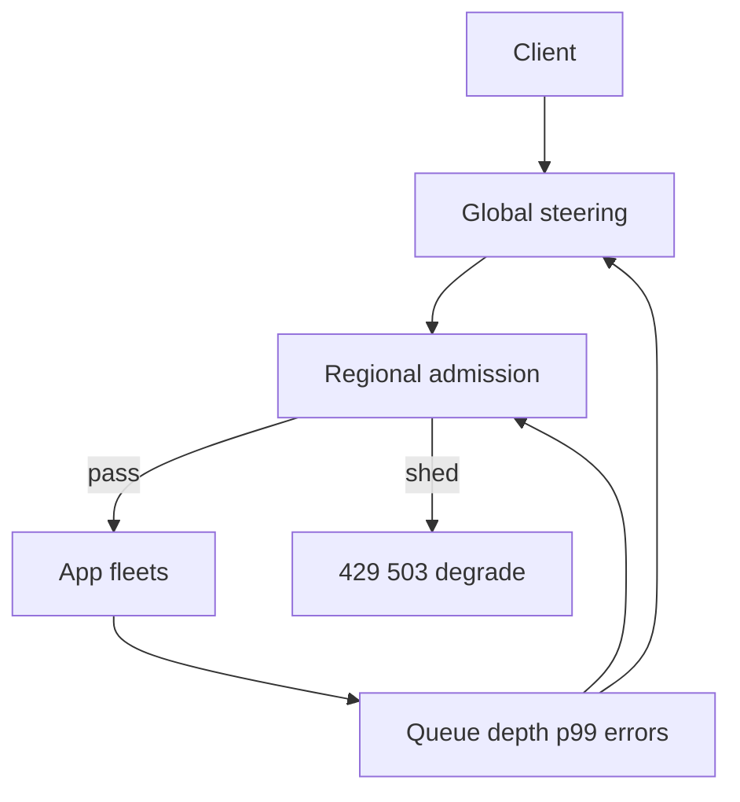
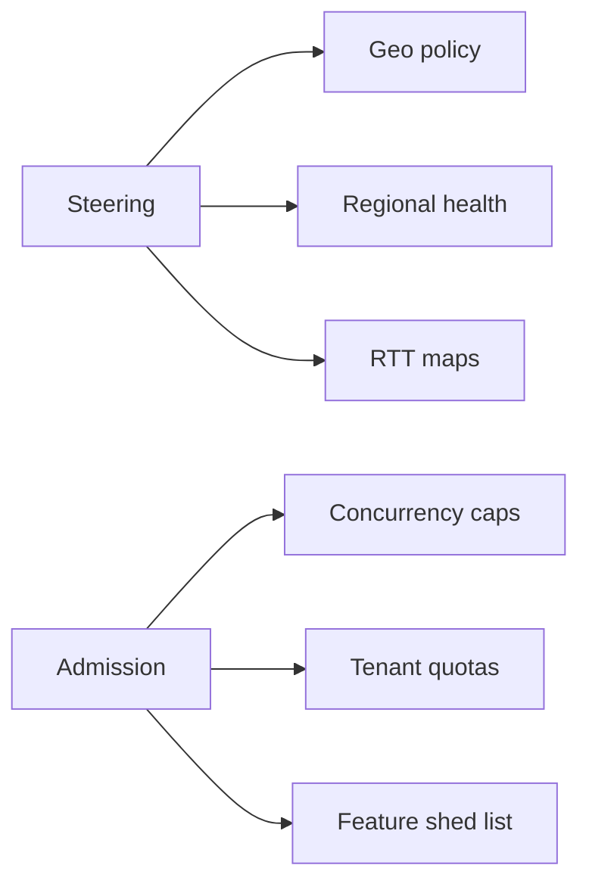
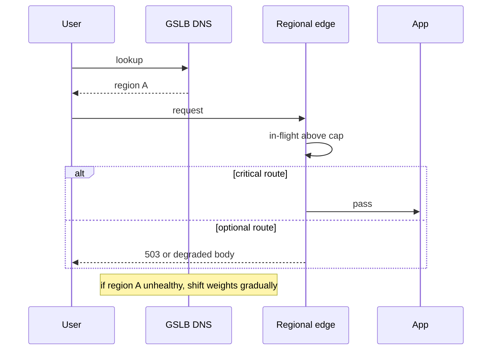

# Edge Admission Control and Global Traffic Steering

## Overview

**Admission control** decides which requests enter the system under load—shedding, throttling, or degrading early so the core stays within latency budgets. **Global traffic steering** decides *which region/VIP* receives clients: DNS/GSLB, anycast, latency-based routing, geo policy, and failover weights.

Together they form the outermost control loop of system design: protect capacity and place users before application logic runs. In-process breakers remain Backend; this note is fleet-edge policy.

## Learning Objectives

- Design admission policies from queue depth, concurrency, and error budgets
- Differentiate throttle (429) vs shed (503) vs degrade (partial response)
- Explain DNS TTL, GSLb health, and failover steering trade-offs
- Avoid herding during regional failover
- Tie steering to RPO/RTO and consistency constraints (later modules)

## Prerequisites

- [[09-System-Design/02-Load-Balancing-and-Edge-Entry/Health Checks Drain and Connection Management|Health Checks Drain and Connection Management]]
- [[09-System-Design/01-Capacity-Latency-and-Bottlenecks/Throughput Queuing and Littles Law Intuition|Throughput Queuing and Littles Law Intuition]]
- [[09-System-Design/00-Orientation-and-Boundaries/Failure Domains and Blast Radius Budgets|Failure Domains and Blast Radius Budgets]]

## Difficulty

`advanced`

## Estimated Time

- Reading: 1.25 hours
- Exercises: 1.5 hours
- Mini project: 3 hours

## History

Telephony used call-blocking grades; web edges relearned admission during flash crowds. Global Server Load Balancing evolved from DNS tricks to health-aware traffic directors. SRE practice: "the best place to drop load is the edge."

## Problem It Solves

| Failure mode | Edge policy |
| --- | --- |
| Retry storm melts origins | Admit with concurrency caps; retry-after |
| All regions oversubscribed equally | Fair regional capacity + shed |
| DNS failover flocks everyone at once | Weighted shift, low TTL carefully, warm standby |
| GDPR users pinned wrongly | Geo/policy steering constraints |
| Brownout everywhere | Degrade non-critical routes first |

## Internal Implementation

### Control loops



Admission tokens: max in-flight, token buckets per API key/IP/route, adaptive concurrency (TCP Vegas-like / latency gradient).  
Steering: DNS weights, anycast catchment, HTTP 3xx to regional endpoints, traffic director policies.

## Mermaid Diagrams

### Structure



### Sequence / Lifecycle — regional brownout



## Examples

### Minimal Example — concurrency admission

```typescript
export class ConcurrencyAdmit {
  constructor(private maxInFlight: number, private inFlight = 0) {}

  tryEnter(): boolean {
    if (this.inFlight >= this.maxInFlight) return false;
    this.inFlight++;
    return true;
  }

  leave(): void {
    this.inFlight = Math.max(0, this.inFlight - 1);
  }
}
```

### Production-Shaped Example — steer + priority shed

```typescript
export type RouteClass = "P0" | "P1" | "P2";

export function admit(
  route: RouteClass,
  util: number, // 0..1 estimated regional util
): "pass" | "degrade" | "shed" {
  if (util < 0.7) return "pass";
  if (util < 0.85) return route === "P2" ? "degrade" : "pass";
  if (util < 0.95) return route === "P0" ? "pass" : "shed";
  return route === "P0" ? "degrade" : "shed";
}

export type SteerDecision = {
  region: string;
  weight: number;
  reason: "latency" | "geo" | "failover" | "capacity";
};

export function normalizeWeights(ds: SteerDecision[]): SteerDecision[] {
  const sum = ds.reduce((a, d) => a + d.weight, 0) || 1;
  return ds.map((d) => ({ ...d, weight: d.weight / sum }));
}
```

## Trade-offs

| Dimension | Aggressive edge shed | Admit-all |
| --- | --- | --- |
| Core latency | Protected | Melts |
| User experience | Some fail fast | Everyone slow |
| Fairness | Needs quotas | Noisy neighbors win |
| Steering slow TTL | Stable clients | Slow failover |
| Steering fast TTL | Fast failover | DNS herd + cache chaos |

### When to Use

- Any public edge with flash-crowd risk
- Multi-region products with failover
- Tenant multi-tenancy with noisy neighbors

### When Not to Use

- Shedding without a priority model (random pain)
- Global DNS flaps for tiny blips
- Replacing Backend breakers entirely (need both layers)

## Exercises

1. Set max in-flight from Little's Law for 5k QPS × 100ms target.
2. Design P0/P1/P2 shed order for a social app.
3. DNS TTL 60s vs 300s for failover RTO—trade-offs.
4. How do you prevent all clients retrying a failed region simultaneously?
5. Link steering to active-passive constraints when RPO=0.

## Mini Project

Simulate two regions with capacity caps; implement weight shift and priority admission; plot accepted P0 vs shed P2 under a 3× spike.

## Portfolio Project

[[09-System-Design/projects/Multi-Region Failover Playbook Lab/README|Multi-Region Failover Playbook Lab]] — add steering + admission runbook chapters.

## Interview Questions

1. What is admission control at the edge?
2. 429 vs 503 under overload?
3. How does GSLB work at a high level?
4. Why can DNS-based failover be slow or herdy?
5. How do you combine regional steering with consistency requirements?

### Stretch / Staff-Level

1. Design adaptive concurrency control using latency gradients.
2. Multi-region steering under partial consistency (read-your-writes sticky).

## Common Mistakes

- Only shedding randomly without critical-path protection
- Infinite client retries without Retry-After
- Failing over to a cold region
- Steering on latency alone ignoring capacity
- No load test of admission itself

## Best Practices

- Fail fast at the edge; protect P0
- Gradual weight shifts; warm standbys
- Publish Retry-After and idempotency expectations
- Measure admitted vs shed by route class
- ADR-link steering to multi-region consistency policy

## Summary

The edge is where **overload becomes policy** and **geography becomes placement**. Admission control preserves latency budgets by refusing excess; global steering places users on healthy, legal, capacitated regions. Design both with blast-radius and consistency constraints—not as afterthought DNS toggles.

## Further Reading

- [[09-System-Design/07-Multi-Region-and-Geo/Multi-Region Active-Passive Active-Active Patterns|Multi-Region Active-Passive Active-Active Patterns]]
- [[09-System-Design/09-Failure-Modes-at-Product-Scale/Graceful Degradation and Feature Shedding|Graceful Degradation and Feature Shedding]]
- [[07-Backend/06-Reliability-and-Abuse-Resistance/Circuit Breakers and Bulkheads|Circuit Breakers and Bulkheads]]

## Related Notes

- [[09-System-Design/02-Load-Balancing-and-Edge-Entry/API Gateway vs Reverse Proxy vs Service Mesh Concepts|API Gateway vs Reverse Proxy vs Service Mesh Concepts]]
- [[09-System-Design/01-Capacity-Latency-and-Bottlenecks/Latency Budgets Percentiles and Tail Behavior|Latency Budgets Percentiles and Tail Behavior]]
- [[09-System-Design/00-Orientation-and-Boundaries/Failure Domains and Blast Radius Budgets|Failure Domains and Blast Radius Budgets]]
- [[09-System-Design/README|System Design]]

## Progress Checklist

- [ ] Explained from first principles
- [ ] Drew at least one Mermaid diagram
- [ ] Implemented a minimal version
- [ ] Documented trade-offs and non-goals
- [ ] Completed exercises
- [ ] Practiced interview questions aloud
- [ ] Linked prerequisites and dependents
