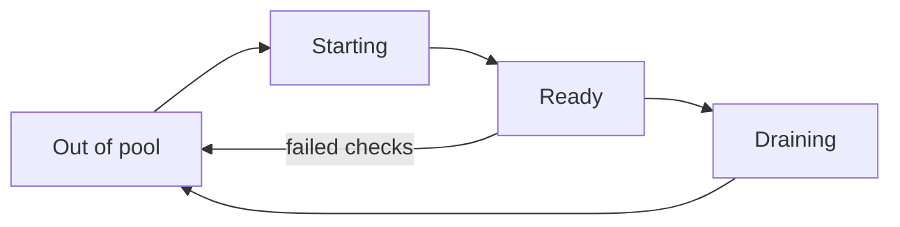
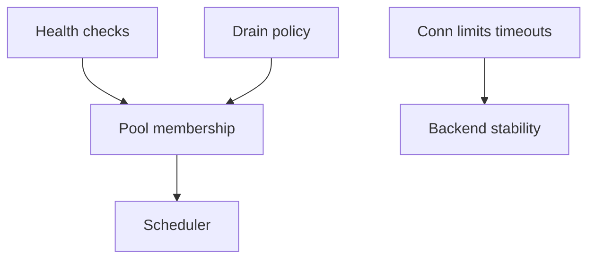
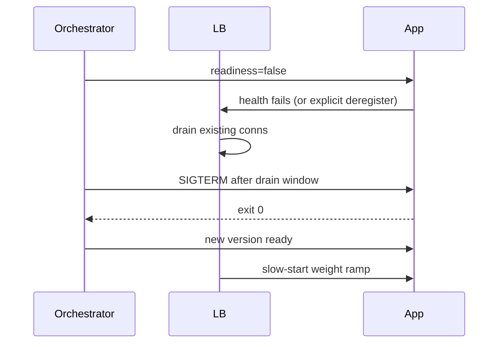

# Health Checks Drain and Connection Management

## Overview

A backend that is "up" to TCP but failing requests still burns your error budget. **Health checks** decide membership; **drain** (connection draining / graceful deregistration) removes a backend from rotation while finishing in-flight work; **connection management** covers keep-alives, max connections, timeouts, and slow-start after (re)join.

This note is the operability contract of edge entry—where deploys and outages meet the LB.

## Learning Objectives

- Design shallow vs deep health checks without cascading failure
- Implement drain sequences compatible with deploys and scale-in
- Tune connection limits, idle timeouts, and slow-start
- Avoid flapping and thundering rejoin
- Hand off container lifecycle details to DevOps while keeping product contracts here

## Prerequisites

- [[09-System-Design/02-Load-Balancing-and-Edge-Entry/Load Balancer Roles L4 vs L7|Load Balancer Roles L4 vs L7]]
- [[09-System-Design/02-Load-Balancing-and-Edge-Entry/Algorithms Round Robin Least Conn Consistent Hash|Algorithms Round Robin Least Conn Consistent Hash]]
- [[09-System-Design/00-Orientation-and-Boundaries/Failure Domains and Blast Radius Budgets|Failure Domains and Blast Radius Budgets]]

## Difficulty

`intermediate`

## Estimated Time

- Reading: 1 hour
- Exercises: 1 hour
- Mini project: 2 hours

## History

Hardware LBs used simple ICMP/TCP checks; HTTP `/health` became standard with web fleets. Kubernetes readiness/liveness split the idea further—platform-specific mechanics live in DevOps, but the *product* rules (what "ready" means, how long to drain) are system design.

## Problem It Solves

| Failure mode | Contract fix |
| --- | --- |
| TCP open while app deadlocked | Deep check on critical dependency path (carefully) |
| Deploy kills in-flight requests | Drain + readiness false before SIGTERM |
| Health check hits primary DB | Shared fate + load amplification |
| Instant full weight on cold cache | Slow-start / warm-up |
| Flap on intermittent errors | Thresholds hysteresis |

## Internal Implementation

### Membership state machine



Health: success/failure thresholds, interval, timeout.  
Drain: stop new sends; wait `min(max_drain, idle_or_complete)`; then close.  
Connections: pool sizes at LB→backend; idle timeout < app idle; max conn per backend.

## Mermaid Diagrams

### Structure



### Sequence / Lifecycle — graceful deploy



## Examples

### Minimal Example — health hysteresis

```typescript
export type HealthState = { fails: number; successes: number; healthy: boolean };

export function onCheck(
  s: HealthState,
  ok: boolean,
  unhealthyThreshold = 3,
  healthyThreshold = 2,
): HealthState {
  if (ok) {
    const successes = s.successes + 1;
    const healthy = s.healthy || successes >= healthyThreshold;
    return { fails: 0, successes, healthy };
  }
  const fails = s.fails + 1;
  const healthy = s.healthy && fails < unhealthyThreshold;
  return { fails, successes: 0, healthy };
}
```

### Production-Shaped Example — drain + deep check policy

```typescript
export type HealthPolicy = {
  path: string;
  deep: boolean;
  timeoutMs: number;
  intervalMs: number;
  dependencies: string[]; // must be local or bulkheaded
};

export type DrainPolicy = {
  deregisterWaitMs: number;
  maxDrainMs: number;
  forceClose: boolean;
};

export const API_POLICY = {
  health: {
    path: "/readyz",
    deep: true,
    timeoutMs: 200,
    intervalMs: 5_000,
    dependencies: ["local-cache", "db-pool-not-exhausted"], // not "hit primary with query"
  } satisfies HealthPolicy,
  drain: {
    deregisterWaitMs: 5_000,
    maxDrainMs: 30_000,
    forceClose: true,
  } satisfies DrainPolicy,
  slowStartSeconds: 60,
};
```

## Trade-offs

| Dimension | Deep checks | Shallow checks |
| --- | --- | --- |
| Accuracy | Reflects real readiness | May pass on dead app logic |
| Risk | Cascading if check = real traffic | False healthy |
| Load | Extra QPS to deps | Cheap |
| Drain long | Safer requests | Faster deploys, more 499/502 |

### When to Use

- Always: hysteresis, explicit drain on scale-in/deploy
- Deep checks: only with bulkheaded, cheap signals
- Slow-start: caches, JIT, connection-heavy runtimes

### When Not to Use

- Health checks that perform expensive full business transactions
- Infinite drain windows that block emergency eviction
- Liveness probes that restart pods on downstream blips (platform anti-pattern—see DevOps)

## Exercises

1. Design `/livez` vs `/readyz` semantics for an API with Postgres + Redis.
2. Compute health-check QPS: 200 backends × 0.2 Hz.
3. Why might least-conn + failing deep checks cause oscillations?
4. Write a drain timeline for 60s max with long WebSockets.
5. List three signals that belong in readiness vs metrics-only alerts.

## Mini Project

Simulate a pool with flappy health and measure error rate with/without hysteresis and drain.

## Portfolio Project

[[09-System-Design/projects/Load Balancer From Scratch/README|Load Balancer From Scratch]] — add health state machine, drain, and slow-start.

## Interview Questions

1. Shallow vs deep health checks?
2. How does connection draining work during deploys?
3. What is slow-start?
4. How do you prevent health-check cascades?
5. Difference between readiness and liveness (conceptually)?

### Stretch / Staff-Level

1. Design active health checks vs passive outlier ejection together.
2. Global rate limit on health-check fan-out during brownouts.

## Common Mistakes

- TCP check only for HTTP apps
- Ready while migrations running
- Cutting drain below p99 request duration
- Health endpoint authenticated behind broken IdP (self-outage)
- Rejoin at full weight with empty cache

## Best Practices

- Hysteresis on fail/success
- Ready means "accept traffic now," not "process is alive"
- Drain before kill; align with platform termination grace (DevOps)
- Budget health-check load
- Pair with [[09-System-Design/02-Load-Balancing-and-Edge-Entry/Edge Admission Control and Global Traffic Steering|Edge Admission Control]] under overload

## Summary

Membership is a state machine: **check, drain, connect, warm**. Shallow checks are cheap but blind; deep checks are honest but dangerous if they share fate with production deps. Drain and slow-start turn deploys from outages into controlled membership changes.

## Further Reading

- [[16-DevOps/README|DevOps]] — pod lifecycle, PDB
- [[09-System-Design/09-Failure-Modes-at-Product-Scale/Cascading Multi-Service Failure|Cascading Multi-Service Failure]]
- [[09-System-Design/projects/Load Balancer From Scratch/README|Load Balancer From Scratch]]

## Related Notes

- [[09-System-Design/02-Load-Balancing-and-Edge-Entry/Load Balancer Roles L4 vs L7|Load Balancer Roles L4 vs L7]]
- [[09-System-Design/02-Load-Balancing-and-Edge-Entry/API Gateway vs Reverse Proxy vs Service Mesh Concepts|API Gateway vs Reverse Proxy vs Service Mesh Concepts]]
- [[09-System-Design/00-Orientation-and-Boundaries/Failure Domains and Blast Radius Budgets|Failure Domains and Blast Radius Budgets]]
- [[09-System-Design/README|System Design]]

## Progress Checklist

- [ ] Explained from first principles
- [ ] Drew at least one Mermaid diagram
- [ ] Implemented a minimal version
- [ ] Documented trade-offs and non-goals
- [ ] Completed exercises
- [ ] Practiced interview questions aloud
- [ ] Linked prerequisites and dependents
