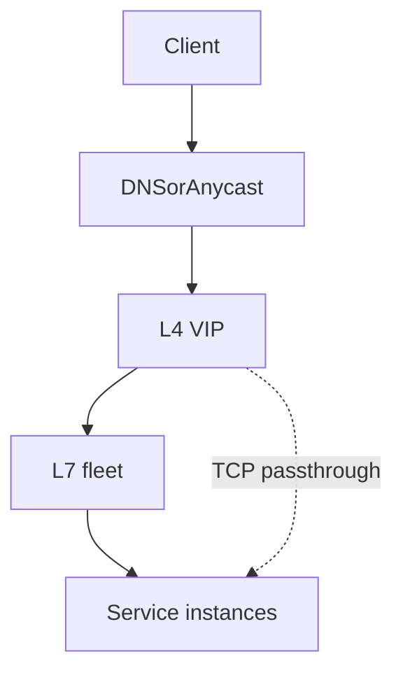
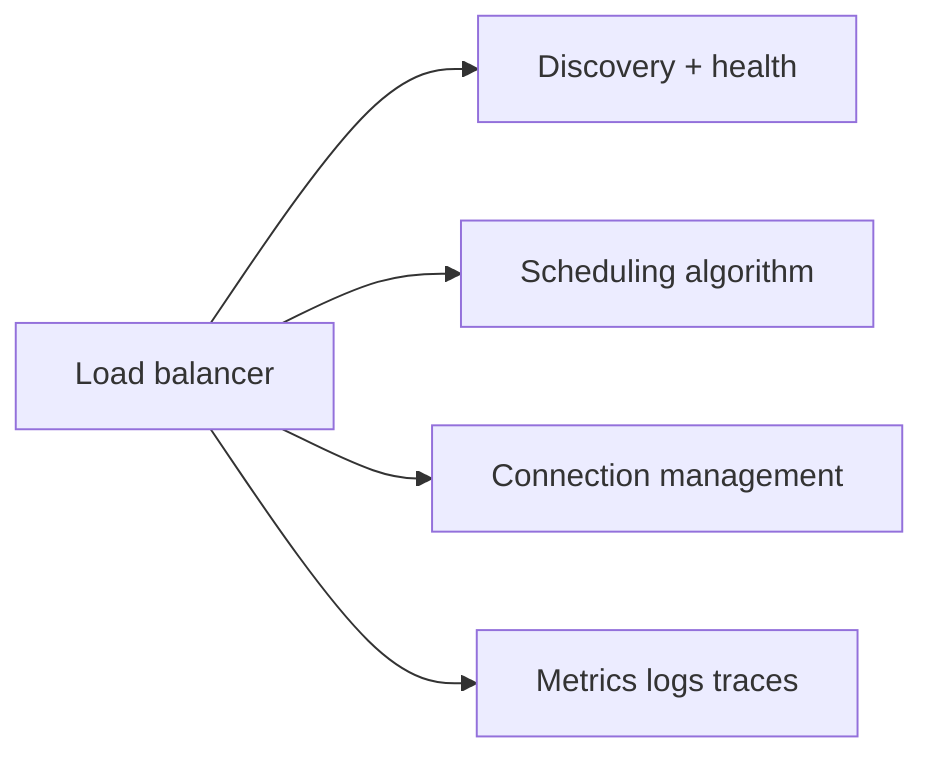
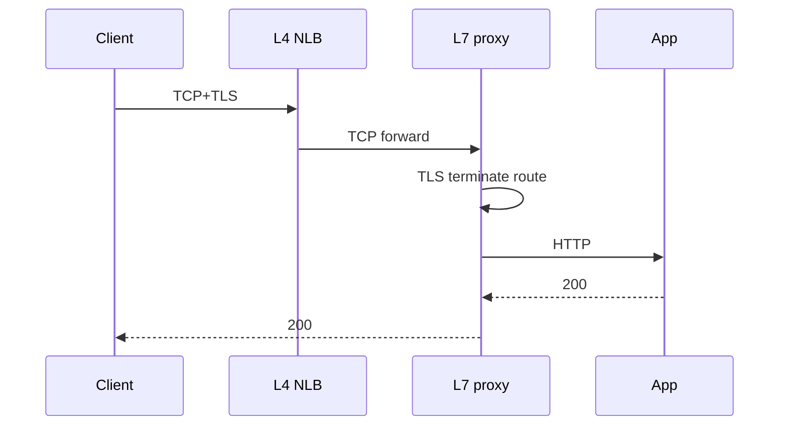

# Load Balancer Roles L4 vs L7

## Overview

A **load balancer (LB)** distributes traffic across backends and is often the first place health, drain, and TLS terminate. **L4** balancers forward TCP/UDP (or IP) flows with minimal inspection; **L7** balancers understand HTTP/gRPC routes, headers, and sometimes payloads—enabling path-based routing, authn hooks, and richer retries at higher cost and complexity.

This note defines roles in a product topology—not vendor checkboxes—and hands platform plumbing to DevOps when needed.

## Learning Objectives

- Contrast L4 and L7 responsibilities, performance, and failure modes
- Place LBs in edge, internal, and data-plane roles
- Explain TLS termination and passthrough trade-offs
- Know when a second LB hop is justified
- Separate LB topology from service-mesh and API-gateway concepts (sibling note)

## Prerequisites

- [[09-System-Design/00-Orientation-and-Boundaries/Why System Design Exists|Why System Design Exists]]
- [[09-System-Design/01-Capacity-Latency-and-Bottlenecks/Back-of-Envelope Capacity Estimation|Back-of-Envelope Capacity Estimation]]

## Difficulty

`intermediate`

## Estimated Time

- Reading: 1 hour
- Exercises: 45 minutes
- Mini project: 2 hours

## History

Hardware L4 appliances dominated data centers; software L7 (HAProxy, NGINX, Envoy, cloud ALBs) became default for HTTP microservices. Modern clouds expose both Network Load Balancers (L4) and Application Load Balancers (L7). The OSI nicknames are imperfect but universally used in design reviews.

## Problem It Solves

| Need | Typical layer |
| --- | --- |
| Millions of TCP connections, low overhead | L4 |
| Path `/api` vs `/static`, header routing | L7 |
| Preserve client IP simply | L4 / PROXY protocol / L7 headers |
| WAF, request transform, canary by header | L7 (+ gateway) |
| Non-HTTP protocols (DB, custom TCP) | L4 |

## Internal Implementation

### Role placement



L4: 5-tuple hash or connection tracking to backends; health via TCP/ICMP/custom.  
L7: terminate TLS (often), parse HTTP, choose upstream pool, manage retries/timeouts per route.

## Mermaid Diagrams

### Structure



### Sequence / Lifecycle — HTTP via L4 then L7



## Examples

### Minimal Example — choose layer

```typescript
export type Proto = "http" | "grpc" | "tcp-db" | "udp-game";

export function preferredLb(proto: Proto, needs: { pathRoute: boolean; ultraLowOverhead: boolean }): "L4" | "L7" | "L4+L7" {
  if (proto === "tcp-db" || proto === "udp-game") return "L4";
  if (needs.pathRoute) return needs.ultraLowOverhead ? "L4+L7" : "L7";
  if (proto === "http" || proto === "grpc") return "L7";
  return "L4";
}
```

### Production-Shaped Example — topology sketch with budgets

```typescript
export type LbHop = {
  layer: "L4" | "L7";
  role: "edge" | "internal";
  tls: "passthrough" | "terminate" | "reencrypt";
  p99BudgetMs: number;
};

export const EDGE_STACK: LbHop[] = [
  { layer: "L4", role: "edge", tls: "passthrough", p99BudgetMs: 1 },
  { layer: "L7", role: "edge", tls: "terminate", p99BudgetMs: 5 },
];

// Internal East-West often L7 mesh or L4 only—see gateway vs mesh note
```

## Trade-offs

| Dimension | L4 | L7 |
| --- | --- | --- |
| Performance | Higher CPS, lower CPU/req | More CPU, richer features |
| Visibility | Flow-level | Request-level |
| Routing power | Coarse | Fine (path/header) |
| Failure modes | Conn tracking limits | Parse bugs, slowloris, config complexity |
| Proto support | Any TCP/UDP | HTTP-family primarily |

### When to Use

- L4: extreme connection scale, non-HTTP, TLS passthrough to specialized terminators
- L7: HTTP APIs, canaries, per-route timeouts, header-based affinity
- L4+L7: DDoS/VIP tier in front of HTTP fleet

### When Not to Use

- L7 for Postgres protocol (use L4/proxy designed for DB)
- Multiple L7 hops without a latency budget
- Treating cloud "ALB" as a substitute for product API gateway policy (sibling note)

## Exercises

1. Design edge for HTTPS API + raw TCP IoT—where is L4 vs L7?
2. TLS terminate at L7 vs passthrough to app—list trade-offs.
3. Estimate CPU: 50k RPS HTTP with header routing—why might L7 dominate cost?
4. When does L4 blackhole healthy apps? (health check mismatch)
5. Cross-link to algorithms note: where does least-conn run?

## Mini Project

Document an ADR for your URL shortener edge: L4, L7, or both, with TLS choice and p99 hop budget.

## Portfolio Project

[[09-System-Design/projects/Load Balancer From Scratch/README|Load Balancer From Scratch]] — implement L7 routing table in front of a dumb L4 simulator.

## Interview Questions

1. Difference between L4 and L7 load balancing?
2. Where should TLS terminate and why?
3. Why put L4 in front of L7?
4. How do health checks differ by layer?
5. Is an API gateway the same as L7 LB?

### Stretch / Staff-Level

1. Design a global anycast L4 + regional L7 for a 10M RPS static+API mix.
2. How do you capacity-plan L7 proxy fleets separately from apps?

## Common Mistakes

- One giant L7 for all protocols
- No hop latency budget for proxy fleets
- Health checks that pass while app is saturated (shallow TCP open)
- Assuming L4 preserves HTTP semantics for retries
- Ignoring PROXY protocol / X-Forwarded-For correctness for abuse controls

## Best Practices

- Match layer to protocol and routing needs
- Budget CPU for L7; scale proxies on RPS and CPS
- Keep TLS policy explicit in ADRs
- Separate edge LB from service mesh data plane conceptually
- Pair with [[09-System-Design/02-Load-Balancing-and-Edge-Entry/Health Checks Drain and Connection Management|Health Checks Drain and Connection Management]]

## Summary

L4 moves connections cheaply; L7 understands requests expensively. Product topologies often use both: L4 for VIP/scale, L7 for HTTP policy. Choose deliberately, budget the hop, and do not confuse LB roles with gateways or meshes.

## Further Reading

- [[09-System-Design/02-Load-Balancing-and-Edge-Entry/Algorithms Round Robin Least Conn Consistent Hash|Algorithms Round Robin Least Conn Consistent Hash]]
- [[09-System-Design/02-Load-Balancing-and-Edge-Entry/API Gateway vs Reverse Proxy vs Service Mesh Concepts|API Gateway vs Reverse Proxy vs Service Mesh Concepts]]
- [[16-DevOps/README|DevOps]] — platform LB provisioning

## Related Notes

- [[09-System-Design/02-Load-Balancing-and-Edge-Entry/Health Checks Drain and Connection Management|Health Checks Drain and Connection Management]]
- [[09-System-Design/02-Load-Balancing-and-Edge-Entry/Edge Admission Control and Global Traffic Steering|Edge Admission Control and Global Traffic Steering]]
- [[09-System-Design/README|System Design]]

## Progress Checklist

- [ ] Explained from first principles
- [ ] Drew at least one Mermaid diagram
- [ ] Implemented a minimal version
- [ ] Documented trade-offs and non-goals
- [ ] Completed exercises
- [ ] Practiced interview questions aloud
- [ ] Linked prerequisites and dependents
