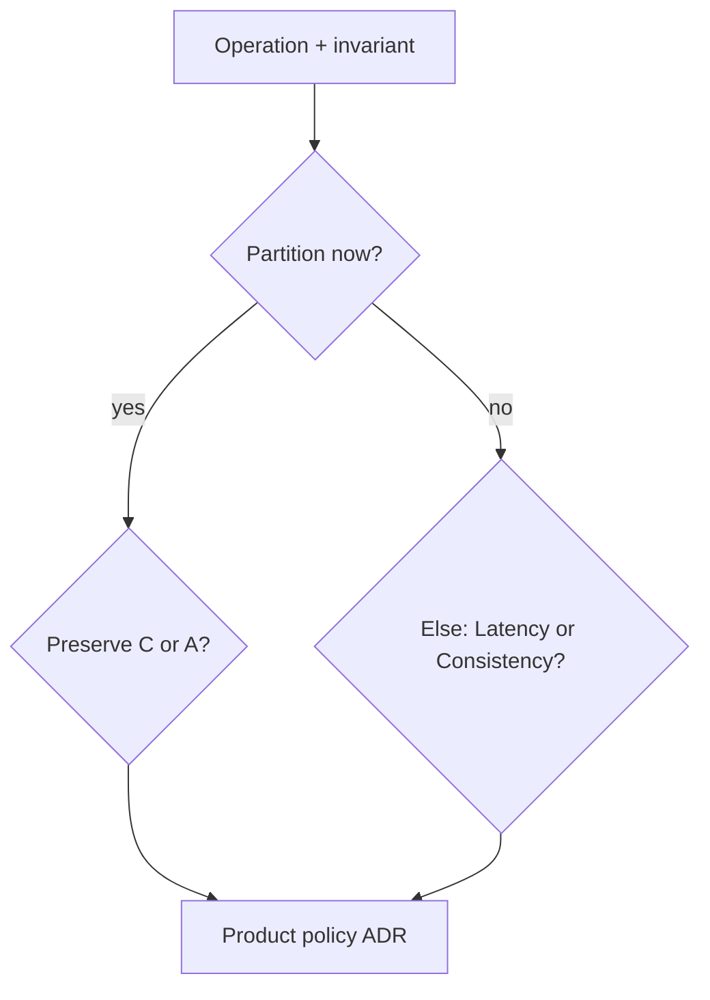
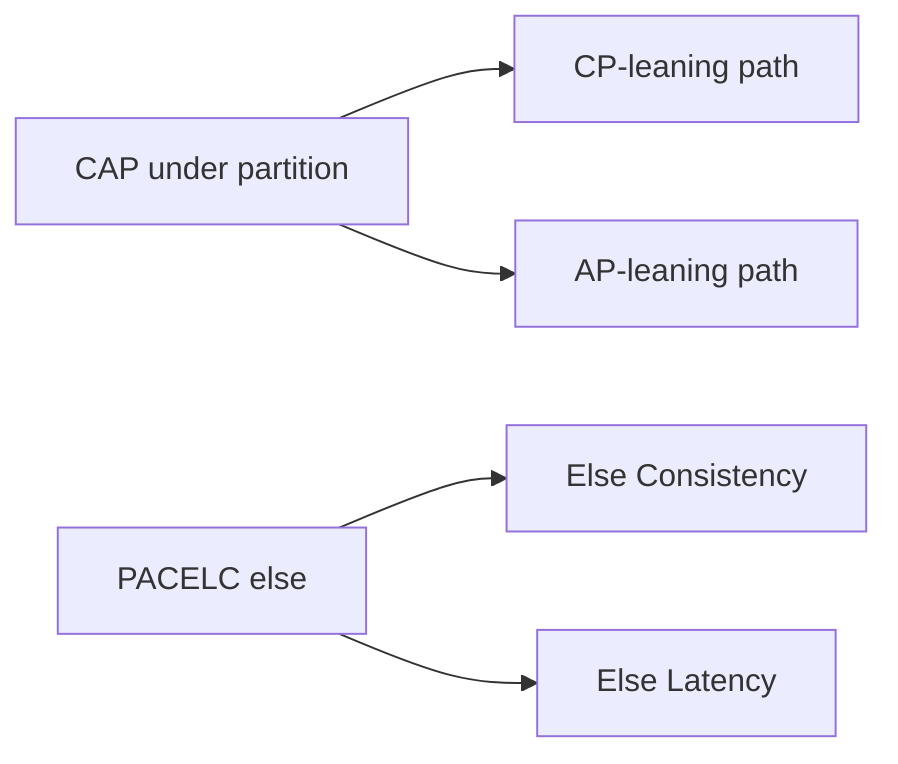
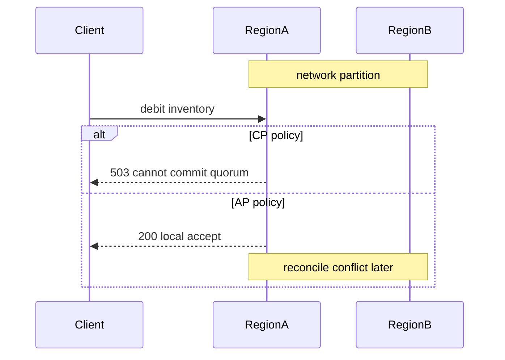

# CAP and PACELC as Product Constraints

## Overview

**CAP** (Consistency, Availability, Partition tolerance) is often memorized as trivia. In production it is a **product constraint under network partition**: when the system cannot communicate across a cut, do you refuse requests (preserve a consistency contract) or serve possibly stale/divergent answers (preserve availability)?

**PACELC** extends the story for the common case—*Else*, when the system is not partitioned, do you choose Latency or Consistency? Most designs spend their life in EL/EC trade-offs, not in dramatic partitions.

Engine isolation/MVCC lives in Databases; this note is about **user-visible product policy**.

## Learning Objectives

- State CAP precisely (partition forces C vs A trade-off for a given operation)
- Apply PACELC to day-to-day latency vs consistency choices
- Map product invariants to CP-leaning vs AP-leaning paths
- Avoid false dichotomies ("Cassandra is AP" as a totalizing slogan)
- Hand off engine mechanisms to Databases; keep policy here

## Prerequisites

- [[09-System-Design/00-Orientation-and-Boundaries/Requirements Non-Functional and Workload Modeling|Requirements Non-Functional and Workload Modeling]]
- [[09-System-Design/00-Orientation-and-Boundaries/Backend Databases and System Design Boundaries|Backend Databases and System Design Boundaries]]
- [[08-Databases/05-Transactions-and-Isolation/ACID as Engine Contracts|ACID as Engine Contracts]] (conceptual ACID)

## Difficulty

`intermediate`

## Estimated Time

- Reading: 1.25 hours
- Exercises: 1 hour
- Mini project: 2 hours

## History

Brewer's CAP conjecture (2000) and the later proof/refinement clarified that partition tolerance is not optional on real networks—you choose behavior *when* partitions happen. PACELC (Abadi) answered the critique that CAP ignores latency trade-offs in the normal case. Interview culture compressed both into buzzwords; this track restores product meaning.

## Problem It Solves

| Product question | Constraint framing |
| --- | --- |
| Inventory decrement across regions during split | CP-leaning: refuse or fence writes |
| Social like counts during split | AP-leaning: accept, reconcile later |
| Checkout read-after-write same region | PACELC: prefer C (or sticky RYW) even if slower |
| Global profile read latency | PACELC: prefer L with bounded staleness |

## Internal Implementation

### Decision framing



Important nuances:

- CAP applies per **operation/invariant**, not per "the database brand."
- Availability in CAP means every non-failing node returns a response—not "99.99% SLO."
- Strong consistency usually costs cross-node coordination → latency (PACELC).

## Mermaid Diagrams

### Structure



### Sequence / Lifecycle — partition choice



## Examples

### Minimal Example — label operations

```typescript
export type CapBias = "CP" | "AP";
export type PacelcElse = "C" | "L";

export type OpPolicy = {
  name: string;
  invariant: string;
  underPartition: CapBias;
  elseNormal: PacelcElse;
};

export const OPS: OpPolicy[] = [
  {
    name: "reserve_sku",
    invariant: "never oversell SKU",
    underPartition: "CP",
    elseNormal: "C",
  },
  {
    name: "record_like",
    invariant: "likes eventually accurate",
    underPartition: "AP",
    elseNormal: "L",
  },
];
```

### Production-Shaped Example — ADR fragment

```typescript
export const ADR_CAP = {
  id: "ADR-030",
  decision: "Payments authorize path is CP-leaning; feed counters AP-leaning",
  consequences: [
    "Payments may 503 during cross-region partition",
    "Feed counts may diverge briefly; conflict policy = sum CRDT",
    "Normal-case payments use sync quorum (PACELC Else C)",
  ],
  nonGoals: ["Changing Postgres isolation levels—Databases track"],
};
```

## Trade-offs

| Bias | Upside | Downside | When it matters |
| --- | --- | --- | --- |
| CP-leaning | Safer invariants | Refuse under partition | Money, inventory, identity |
| AP-leaning | Keep accepting | Conflicts/staleness | Telemetry, likes, caches |
| Else C | Stronger reads/writes | Higher latency | RYW, financial reads |
| Else L | Snappy UX | Stale windows | Public content |

### When to Use

- Any multi-node or multi-region design review
- Interview answers that need product grounding
- Splitting one "database" into multiple operation policies

### When Not to Use

- As a reason to avoid learning actual consistency models (next notes)
- As engine selection bingo without invariants
- For single-node prototypes without pretending CAP applies dramatically

## Exercises

1. Label five ops in an e-commerce app with CAP bias + PACELC else.
2. Why is "we use MongoDB so we're AP" a weak statement?
3. During partition, is serving stale reads "Availability"? Discuss.
4. Map RPO=0 multi-region to CAP leanings.
5. Contrast this note with [[08-Databases/07-Replication-Mechanics/Synchronous vs Asynchronous Durability|Synchronous vs Asynchronous Durability]].

## Mini Project

Write ADR-030 style policies for a chat app: message send, presence, typing indicators.

## Portfolio Project

[[09-System-Design/projects/Consistency and Quorum Demo/README|Consistency and Quorum Demo]] — document which demo modes are CP vs AP leaning.

## Interview Questions

1. Explain CAP without slogans.
2. What does PACELC add?
3. Give CP and AP examples in one product.
4. Does partition tolerance mean you ignore partitions? (No.)
5. How does latency relate when not partitioned?

### Stretch / Staff-Level

1. Design a policy engine that routes ops to different stores by CAP class.
2. How do you test partition behavior in staging without lying to yourself?

## Common Mistakes

- Treating CAP as three knobs you dial freely always
- Brand-level AP/CP labels
- Ignoring Else (PACELC) where users feel latency daily
- Confusing durability (fsync) with consistency across replicas
- Using CAP to avoid specifying conflict policies

## Best Practices

- Per-operation policies in ADRs
- Name the invariant first
- Teach engineers partition drills for CP paths (expected 503s)
- Link to quorum and conflict notes for mechanisms
- Keep engine isolation out of CAP whiteboard answers unless asked

## Summary

CAP asks what you sacrifice **under partition**; PACELC asks what you sacrifice **for latency when healthy**. Both are product constraints derived from user-visible invariants—not database marketing. State policies per operation, then implement with quorums, routing, and conflict rules in sibling notes.

## Further Reading

- [[09-System-Design/03-Consistency-Models-and-CAP/Strong Eventual Causal and Read-Your-Writes|Strong Eventual Causal and Read-Your-Writes]]
- [[09-System-Design/03-Consistency-Models-and-CAP/Quorums R plus W and Tunable Consistency|Quorums R plus W and Tunable Consistency]]
- [[08-Databases/07-Replication-Mechanics/Failover Promote and Split-Brain Mechanics|Failover Promote and Split-Brain Mechanics]]

## Related Notes

- [[09-System-Design/03-Consistency-Models-and-CAP/Choosing Consistency from User-Visible Invariants|Choosing Consistency from User-Visible Invariants]]
- [[09-System-Design/00-Orientation-and-Boundaries/ADR Discipline for Distributed Decisions|ADR Discipline for Distributed Decisions]]
- [[09-System-Design/07-Multi-Region-and-Geo/Failover RPO RTO and Split-Brain Product Policy|Failover RPO RTO and Split-Brain Product Policy]]
- [[09-System-Design/README|System Design]]

## Progress Checklist

- [ ] Explained from first principles
- [ ] Drew at least one Mermaid diagram
- [ ] Implemented a minimal version
- [ ] Documented trade-offs and non-goals
- [ ] Completed exercises
- [ ] Practiced interview questions aloud
- [ ] Linked prerequisites and dependents
