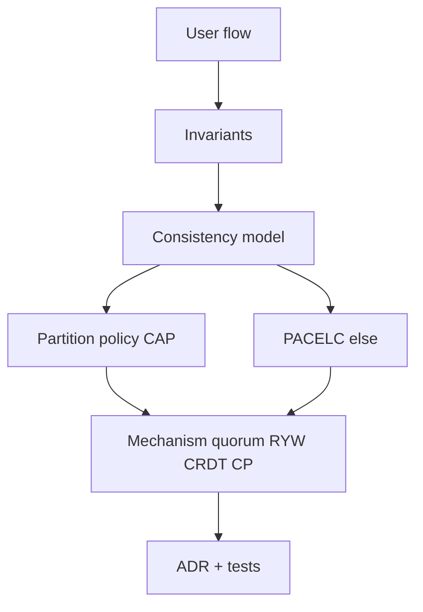
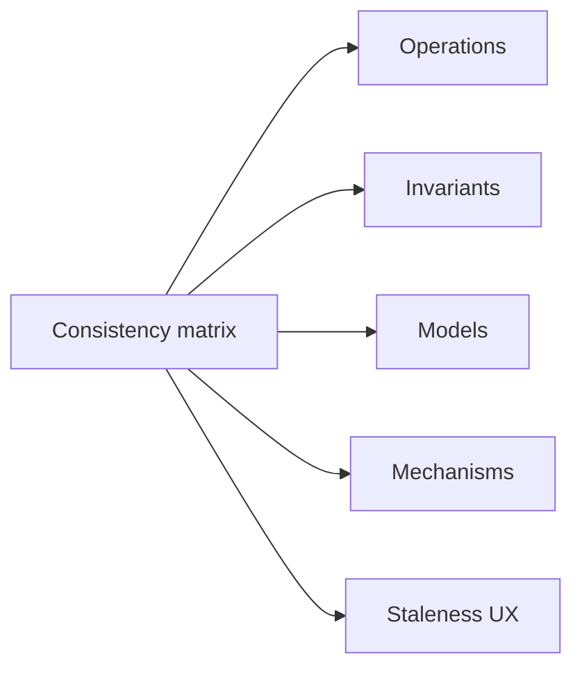
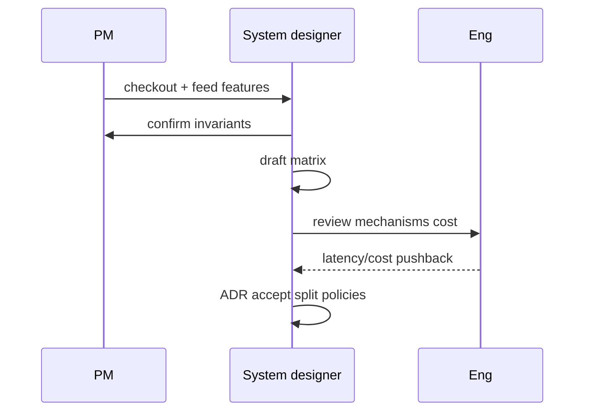

# Choosing Consistency from User-Visible Invariants

## Overview

Technology choice follows **invariants**: statements that must remain true in every history users can observe—"never oversell SKU," "author sees own post," "balance never negative," "likes eventually within 1%." This note is the **method** that closes module 03: start from invariants, derive consistency model, CAP/PACELC bias, quorum class, and conflict policy, then record an ADR.

It synthesizes prior notes into a repeatable design workflow used in interviews and production reviews.

## Learning Objectives

- Elicit user-visible invariants from product flows
- Map invariants to consistency models and partition behavior
- Produce a per-operation consistency matrix
- Select mechanisms (sticky RYW, quorum, CRDT, CP reject) without brand-first thinking
- Write ADRs that freeze the matrix and list non-goals (engine internals)

## Prerequisites

- [[09-System-Design/03-Consistency-Models-and-CAP/CAP and PACELC as Product Constraints|CAP and PACELC as Product Constraints]]
- [[09-System-Design/03-Consistency-Models-and-CAP/Strong Eventual Causal and Read-Your-Writes|Strong Eventual Causal and Read-Your-Writes]]
- [[09-System-Design/03-Consistency-Models-and-CAP/Quorums R plus W and Tunable Consistency|Quorums R plus W and Tunable Consistency]]
- [[09-System-Design/03-Consistency-Models-and-CAP/Conflict Policies LWW and CRDT Product Use|Conflict Policies LWW and CRDT Product Use]]
- [[09-System-Design/00-Orientation-and-Boundaries/ADR Discipline for Distributed Decisions|ADR Discipline for Distributed Decisions]]

## Difficulty

`advanced`

## Estimated Time

- Reading: 1 hour
- Exercises: 2 hours
- Mini project: 3 hours

## History

Formal methods use invariants; product teams rediscover them after consistency incidents. The best system-design interviews already do this implicitly ("what must never happen?"). This note makes the workflow explicit and repo-native.

## Problem It Solves

| Anti-method | Invariant method |
| --- | --- |
| Pick Cassandra then invent UX | UX invents store/policy constraints |
| One consistency for whole app | Per-operation matrix |
| "Eventual is fine" | Bounded staleness + conflict story |
| Fix in incident forever | ADR prevents regression |

## Internal Implementation

### Workflow



Invariant checklist prompts:

1. What must never be observed?
2. What may be briefly wrong, and for how long?
3. What happens under partition—fail or diverge?
4. Multi-object or single-key?
5. Who merges conflicts—code, CRDT, or human?

## Mermaid Diagrams

### Structure



### Sequence / Lifecycle — design review



## Examples

### Minimal Example — invariant → model

```typescript
export type Invariant = {
  id: string;
  statement: string;
  severity: "P0" | "P1" | "P2";
};

export function suggestModel(inv: Invariant): string {
  if (/never oversell|never negative|exactly once money/i.test(inv.statement)) {
    return "strong + CP under partition";
  }
  if (/sees own|after edit refresh/i.test(inv.statement)) {
    return "ryw";
  }
  if (/reply after parent|no time-travel causality/i.test(inv.statement)) {
    return "causal";
  }
  return "eventual + explicit conflict policy";
}
```

### Production-Shaped Example — consistency matrix

```typescript
export type MatrixRow = {
  op: string;
  invariant: string;
  model: "strong" | "causal" | "ryw" | "eventual";
  partition: "CP" | "AP";
  else: "C" | "L";
  mechanism: string;
  conflict?: string;
};

export const MARKETPLACE: MatrixRow[] = [
  {
    op: "reserve_stock",
    invariant: "never oversell SKU",
    model: "strong",
    partition: "CP",
    else: "C",
    mechanism: "single-region primary or W=quorum sync; reject if no quorum",
  },
  {
    op: "update_profile",
    invariant: "user sees own profile after save",
    model: "ryw",
    partition: "AP",
    else: "C",
    mechanism: "version token / read-after-write routing",
    conflict: "LWW on displayName",
  },
  {
    op: "like_item",
    invariant: "count converges; brief skew OK",
    model: "eventual",
    partition: "AP",
    else: "L",
    mechanism: "async replicate",
    conflict: "G-Counter",
  },
];
```

## Trade-offs

| Approach | Upside | Downside |
| --- | --- | --- |
| Per-op matrix | Right cost per path | More policies to operate |
| One global strong | Simple story | Latency/availability tax |
| One global eventual | Scale | P0 invariant breaches |

### When to Use

- Every multi-region or multi-primary design
- Interview system design openings
- Before selecting databases/queues for a new domain

### When Not to Use

- As a substitute for reading mechanism notes—you still need quorums/CRDTs
- Inventing fake invariants to justify a preferred tech

## Exercises

1. Build a matrix for Discord-like chat: send, edit, presence, typing.
2. Identify two invariants that force CP and two that allow AP in banking+social hybrid.
3. Convert `MARKETPLACE` into ADR-040 with blast-radius notes.
4. Where does Backend idempotency sit relative to these invariants?
5. Challenge: can RYW alone save oversell? Why/why not?

## Mini Project

Author a full consistency matrix + ADR for a URL shortener (create, redirect, analytics). Include partition behavior.

## Portfolio Project

[[09-System-Design/projects/Distributed Systems Workbench/README|Distributed Systems Workbench]] — `docs/CONSISTENCY_MATRIX.md` generated per product surface; tests that induce lag/partition and assert invariants.

## Interview Questions

1. How do you choose a consistency model?
2. Walk invariants → mechanisms for a rideshare matching system.
3. When is eventual consistency unacceptable?
4. How do you explain different policies in one product?
5. What do you put in the ADR?

### Stretch / Staff-Level

1. Create an org template for consistency matrices reviewed with security/compliance.
2. Formalize invariant tests in CI with fault injection.

## Common Mistakes

- Starting from vendor features
- One row for the whole system
- Invariants that are really SLOs ("fast") without safety content
- Mechanisms without partition behavior
- No UX for allowed staleness

## Best Practices

- Write invariants in user language first
- Split P0 vs P2 ruthlessly
- Prefer fail-closed for P0 under partition
- Attach mechanisms and conflict policies to each row
- Revisit matrix when expanding to new regions

## Summary

Consistency is not a database personality—it is the **enforcement of user-visible invariants** under concurrency, lag, and partition. Elicit invariants, fill a per-operation matrix (model, CAP, PACELC, mechanism, conflict), and freeze it in an ADR. That workflow is the product of module 03 and the gateway to partitioning and multi-region modules.

## Further Reading

- [[09-System-Design/00-Orientation-and-Boundaries/ADR Discipline for Distributed Decisions|ADR Discipline for Distributed Decisions]]
- [[09-System-Design/07-Multi-Region-and-Geo/Replica Lag as User-Facing Consistency Budget|Replica Lag as User-Facing Consistency Budget]]
- [[09-System-Design/projects/Consistency and Quorum Demo/README|Consistency and Quorum Demo]]
- [[09-System-Design/README|System Design]]

## Related Notes

- [[09-System-Design/03-Consistency-Models-and-CAP/CAP and PACELC as Product Constraints|CAP and PACELC as Product Constraints]]
- [[09-System-Design/03-Consistency-Models-and-CAP/Strong Eventual Causal and Read-Your-Writes|Strong Eventual Causal and Read-Your-Writes]]
- [[09-System-Design/03-Consistency-Models-and-CAP/Quorums R plus W and Tunable Consistency|Quorums R plus W and Tunable Consistency]]
- [[09-System-Design/03-Consistency-Models-and-CAP/Conflict Policies LWW and CRDT Product Use|Conflict Policies LWW and CRDT Product Use]]
- [[09-System-Design/04-Partitioning-Sharding-and-Placement/Partition Keys Hotspots and Skew|Partition Keys Hotspots and Skew]]
- [[09-System-Design/README|System Design]]

## Progress Checklist

- [ ] Explained from first principles
- [ ] Drew at least one Mermaid diagram
- [ ] Implemented a minimal version
- [ ] Documented trade-offs and non-goals
- [ ] Completed exercises
- [ ] Practiced interview questions aloud
- [ ] Linked prerequisites and dependents
