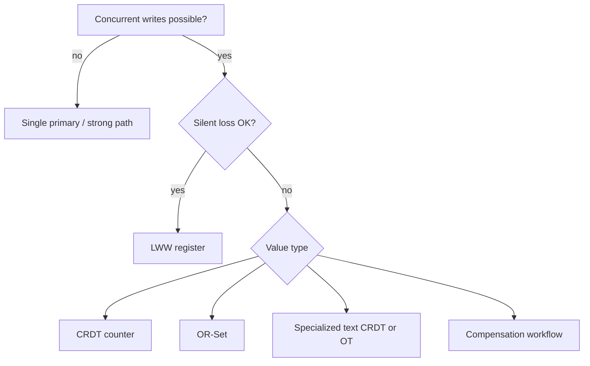
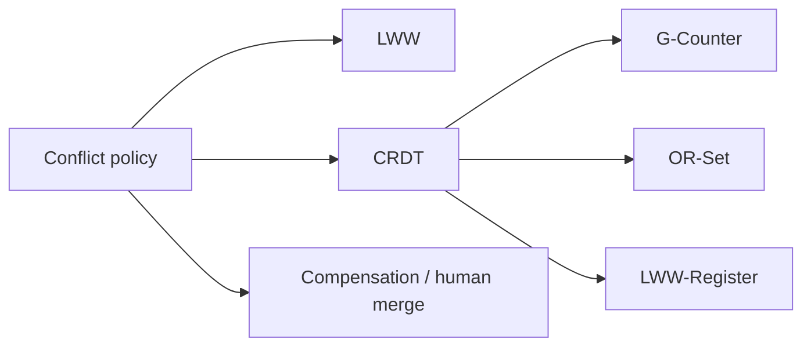
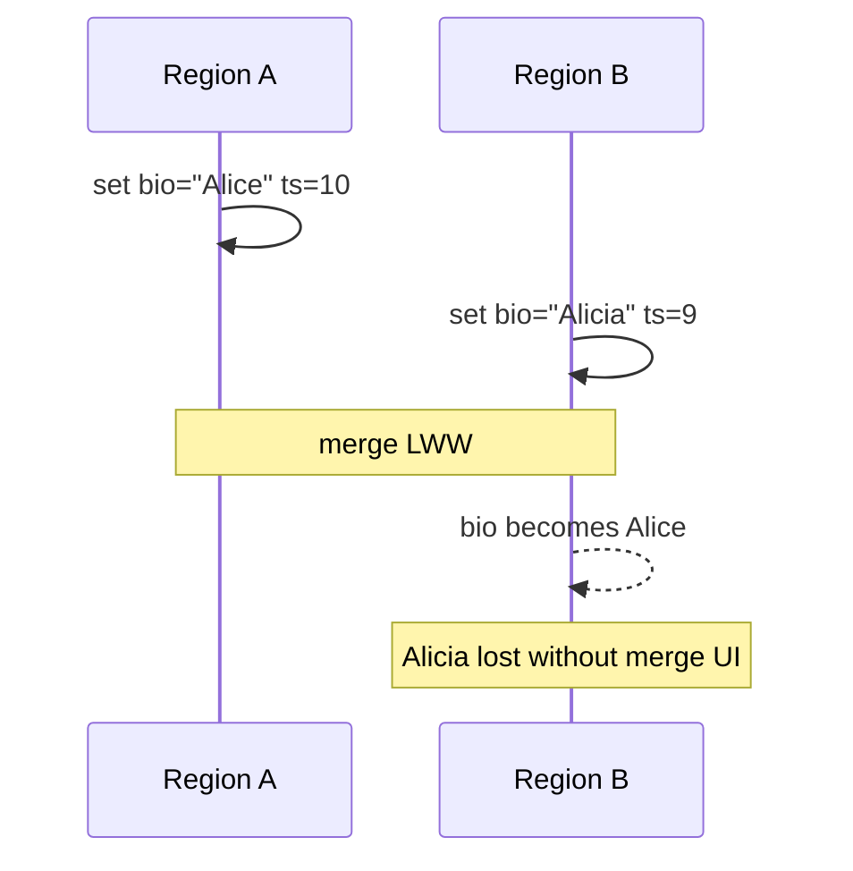

# Conflict Policies LWW and CRDT Product Use

## Overview

When AP-leaning or multi-primary designs accept concurrent writes, you need a **conflict policy**: how replicas converge. **Last-Write-Wins (LWW)** picks a winner via timestamp (or logical time)—simple, lossy. **CRDTs** (Conflict-free Replicated Data Types) merge concurrent updates mathematically so replicas converge without coordination for supported types (G-Counter, OR-Set, LWW-Register, etc.).

This note is **product use**: which UX can tolerate silent loss, which needs merge semantics, and how to ADR the choice. Deep CRDT proofs stay light; engine merge internals are not Databases MVCC.

## Learning Objectives

- Explain LWW failure modes (clock skew, silent data loss)
- Match CRDT types to product values (counters, sets, registers, maps)
- Decide when manual merge / compensation workflows beat automatic policies
- Connect policies to active-active multi-region designs
- Avoid "we'll just LWW" for inventory and identity

## Prerequisites

- [[09-System-Design/03-Consistency-Models-and-CAP/Quorums R plus W and Tunable Consistency|Quorums R plus W and Tunable Consistency]]
- [[09-System-Design/03-Consistency-Models-and-CAP/Strong Eventual Causal and Read-Your-Writes|Strong Eventual Causal and Read-Your-Writes]]

## Difficulty

`advanced`

## Estimated Time

- Reading: 1.25 hours
- Exercises: 1.5 hours
- Mini project: 3 hours

## History

LWW dominated early multi-master SQL and Dynamo-style stores. CRDT research (Shapiro et al.) enabled collaborative editors and eventually consistent counters/sets with clearer semantics. Industry still overuses LWW because it is one config flag.

## Problem It Solves

| Concurrent updates | Bad policy | Better fit |
| --- | --- | --- |
| Two devices edit profile bio | LWW drops one silently | LWW-Register OK if UX accepts OR field-level merge |
| Likes from many regions | LWW loses counts | G-Counter / PN-Counter |
| Shopping cart adds | LWW drops items | OR-Set |
| Inventory stock | LWW / naive CRDT | CP reservation or careful bounded counters + compensation |

## Internal Implementation

### Policy selection



LWW: `max(timestamp)` wins; ties broken by node id. Requires tolerable clock policy.  
CRDTs: merge is commutative, associative, idempotent → eventual convergence.

## Mermaid Diagrams

### Structure



### Sequence / Lifecycle — LWW loss



## Examples

### Minimal Example — LWW register

```typescript
export type Lww<T> = { value: T; ts: number; node: string };

export function lwwMerge<T>(a: Lww<T>, b: Lww<T>): Lww<T> {
  if (a.ts !== b.ts) return a.ts > b.ts ? a : b;
  return a.node >= b.node ? a : b;
}
```

### Production-Shaped Example — policy table + counter CRDT sketch

```typescript
export type ConflictPolicy =
  | { kind: "lww" }
  | { kind: "gcounter" }
  | { kind: "orset" }
  | { kind: "compensate"; workflow: string };

export const FIELD_POLICY: Record<string, ConflictPolicy> = {
  displayName: { kind: "lww" },
  likeCount: { kind: "gcounter" },
  cartItems: { kind: "orset" },
  stock: { kind: "compensate", workflow: "reserve-and-reconcile" },
};

export type GCounter = Record<string, number>;

export function gInc(c: GCounter, node: string, n = 1): GCounter {
  return { ...c, [node]: (c[node] ?? 0) + n };
}

export function gMerge(a: GCounter, b: GCounter): GCounter {
  const keys = new Set([...Object.keys(a), ...Object.keys(b)]);
  const out: GCounter = {};
  for (const k of keys) out[k] = Math.max(a[k] ?? 0, b[k] ?? 0);
  return out;
}

export function gValue(c: GCounter): number {
  return Object.values(c).reduce((x, y) => x + y, 0);
}
```

## Trade-offs

| Policy | Upside | Downside | When it matters |
| --- | --- | --- | --- |
| LWW | Simple ops | Silent loss, clock skew | Low-stakes registers |
| CRDT | Automatic merge | Type limits; tombstone growth | Counters, sets, collab |
| Compensation | Correct business invariants | Complexity, UX debt | Money, stock |
| Freeze/reject | No silent merge bugs | Availability hit | CP paths |

### When to Use

- LWW: rarely changing metadata where loss is acceptable and visible
- CRDTs: associative aggregates and collaborative collections
- Compensation: real-world business constraints CRDTs cannot express alone

### When Not to Use

- LWW for concurrent document editing of critical legal text
- Unbounded OR-Sets without tombstone compaction strategy
- CRDT shopping-cart as if it enforces payment invariants

## Exercises

1. Show LWW losing a cart item; redesign with OR-Set.
2. Implement gInc/gMerge tests for two nodes.
3. Why is stock not a plain G-Counter?
4. How does clock skew create surprising LWW winners?
5. ADR: profile fields vs wallet balance conflict policies.

## Mini Project

TypeScript sim: two regions concurrently update a cart under LWW vs OR-Set; print final states.

## Portfolio Project

[[09-System-Design/projects/Consistency and Quorum Demo/README|Consistency and Quorum Demo]] — conflict policy playground.

## Interview Questions

1. What is last-write-wins?
2. What problem do CRDTs solve?
3. Give a bad LWW use case.
4. G-Counter vs PN-Counter?
5. How do conflict policies relate to CAP AP paths?

### Stretch / Staff-Level

1. Design tombstone compaction for OR-Sets at global scale.
2. Hybrid: CRDT edges with CP core for checkout.

## Common Mistakes

- Default LWW on entire JSON documents
- Ignoring clock sync assumptions
- CRDT theater without UX for merge results
- Using CRDTs to dodge domain invariants
- No metrics on conflict rates

## Best Practices

- Per-field policies, not whole-row LWW
- Measure conflict frequency; high rates signal design smell
- Prefer CP for money; AP+CRDT for social aggregates
- Document lossiness in UX copy when LWW used
- Plan compaction/tombstones operationally

## Summary

Concurrent writes demand an explicit **merge story**. LWW is operationally easy and semantically harsh; CRDTs merge well-typed values safely; compensation workflows handle business reality. Choose from user-visible loss tolerance, then encode the policy in ADRs and simulations—not as a silent database default.

## Further Reading

- [[09-System-Design/07-Multi-Region-and-Geo/Multi-Region Active-Passive Active-Active Patterns|Multi-Region Active-Passive Active-Active Patterns]]
- [[09-System-Design/03-Consistency-Models-and-CAP/Choosing Consistency from User-Visible Invariants|Choosing Consistency from User-Visible Invariants]]
- [[09-System-Design/projects/Consistency and Quorum Demo/README|Consistency and Quorum Demo]]

## Related Notes

- [[09-System-Design/03-Consistency-Models-and-CAP/Quorums R plus W and Tunable Consistency|Quorums R plus W and Tunable Consistency]]
- [[09-System-Design/03-Consistency-Models-and-CAP/CAP and PACELC as Product Constraints|CAP and PACELC as Product Constraints]]
- [[09-System-Design/08-Coordination-Consensus-and-Locks/Clocks Skew Ordering and Happens-Before|Clocks Skew Ordering and Happens-Before]]
- [[09-System-Design/README|System Design]]

## Progress Checklist

- [ ] Explained from first principles
- [ ] Drew at least one Mermaid diagram
- [ ] Implemented a minimal version
- [ ] Documented trade-offs and non-goals
- [ ] Completed exercises
- [ ] Practiced interview questions aloud
- [ ] Linked prerequisites and dependents
