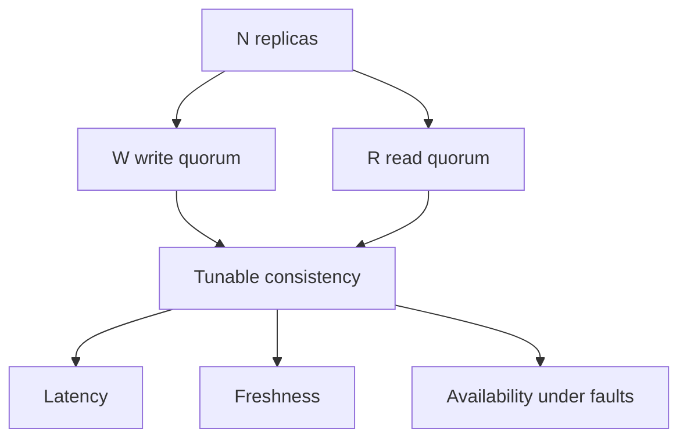
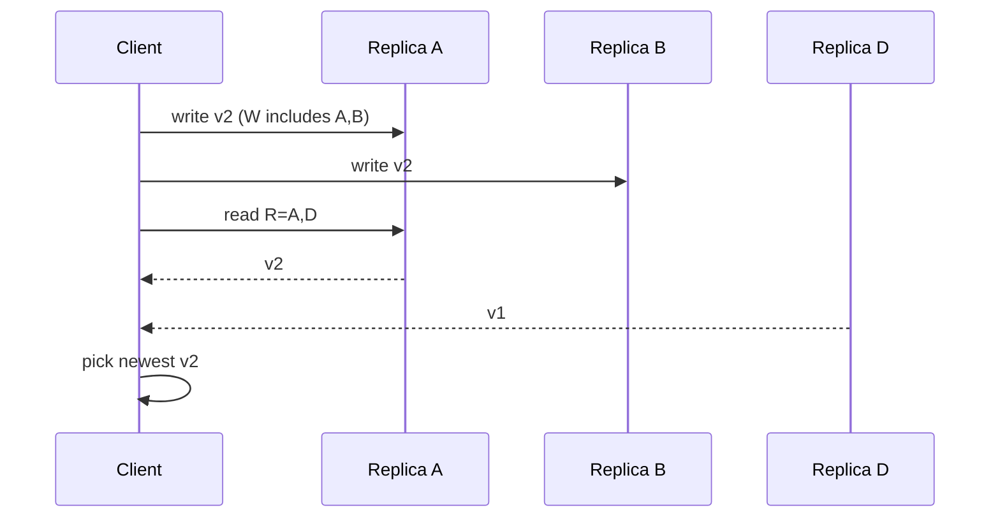

# Quorums R plus W and Tunable Consistency

## Overview

In a replica set of size **N**, a **write quorum W** and **read quorum R** define how many replicas must acknowledge a write or contribute to a read. The classic rule of thumb: if **R + W > N**, overlapping quorums guarantee a read sees the latest successful write (under common assumptions)—the backbone of **tunable consistency** in leaderless and some leader-based systems.

This note teaches the product math and failure modes. Engine-level sync commit / WAL shipping remains Databases.

## Learning Objectives

- Compute and interpret N, R, W configurations
- Explain why R+W>N yields read-your-latest-write under ideal conditions
- Tune for latency (small W/R) vs safety (large overlap)
- Reason about stale reads when R+W≤N and about availability when quorums unreachable
- Design per-operation quorum classes

## Prerequisites

- [[09-System-Design/03-Consistency-Models-and-CAP/Strong Eventual Causal and Read-Your-Writes|Strong Eventual Causal and Read-Your-Writes]]
- [[09-System-Design/03-Consistency-Models-and-CAP/CAP and PACELC as Product Constraints|CAP and PACELC as Product Constraints]]

## Difficulty

`advanced`

## Estimated Time

- Reading: 1.25 hours
- Exercises: 1.5 hours
- Mini project: 3 hours

## History

Quorum systems predate Dynamo; Amazon's Dynamo paper popularized tunable N/R/W for shopping carts. Cassandra and Riak made the knobs operational. Teams still misconfigure `ONE` everywhere then wonder why RYW fails.

## Problem It Solves

| Goal | Typical knobs (N=3) |
| --- | --- |
| Fast writes, tolerate stale reads | W=1, R=1 (R+W≤N) |
| Stronger read-after-write | W=2, R=2 (R+W>N) |
| Survive 1 replica down for writes | W=2 (need 2 of 3) |
| Read from anywhere cheapest | R=1 with repair |

## Internal Implementation

### Overlap intuition


Assumptions matter: no Byzantine nodes, successful write fully applied on W nodes, readers pick newest timestamp/version, no partial failures mid-write without repair.

Sloppy quorums / hinted handoff change the story—treat as AP mechanisms with repair.

## Mermaid Diagrams

### Structure



### Sequence / Lifecycle — R+W>N read path



## Examples

### Minimal Example — overlap check

```typescript
export function strongReadPossible(n: number, r: number, w: number): boolean {
  return r + w > n;
}

export function tolerateDeadForWrite(n: number, w: number): number {
  return n - w; // how many may be down and still form W
}

// N=5, W=3, R=3 → strongReadPossible true; tolerateDeadForWrite = 2
```

### Production-Shaped Example — per-op classes

```typescript
export type QuorumClass = {
  name: string;
  n: number;
  r: number;
  w: number;
  timeoutMs: number;
};

export const CLASSES: QuorumClass[] = [
  { name: "cart_mutate", n: 3, r: 2, w: 2, timeoutMs: 100 },
  { name: "metrics_ingest", n: 3, r: 1, w: 1, timeoutMs: 20 },
  { name: "password_change", n: 3, r: 2, w: 3, timeoutMs: 200 }, // W=N durable-ish
];

export function assertClasses(cs: QuorumClass[]): string[] {
  return cs
    .filter((c) => c.name.includes("password") || c.name.includes("cart"))
    .filter((c) => !strongReadPossible(c.n, c.r, c.w))
    .map((c) => `${c.name} lacks R+W>N`);
}
```

## Trade-offs

| Config | Latency | Freshness | Availability |
| --- | --- | --- | --- |
| W=1,R=1 | Best | Weak | Best |
| W=2,R=1 (N=3) | Write medium | Weak reads | Survive 1 down write if W reachable |
| W=2,R=2 | Higher | Stronger | Need 2 up for both |
| W=N | Slowest writes | Durable on all | Fragile writes |

### When to Use

- Leaderless or multi-master style stores with versioned values
- Explicitly tunable managed services exposing R/W
- Teaching/interview quorum reasoning

### When Not to Use

- Assuming R+W>N fixes causal cross-key transactions (it does not)
- Blindly copying Dynamo settings without repair/read-repair story
- Using quorums as substitute for single-primary when invariants need serial cross-object txs

## Exercises

1. For N=5, list (R,W) pairs with R+W>N and rank by write latency.
2. How many replicas can die and still serve W=3, N=5?
3. Why can R+W>N still return stale data with clocks/versions wrong?
4. Design classes for shopping cart vs product catalog browse.
5. Contrast quorum sync with [[08-Databases/07-Replication-Mechanics/Synchronous vs Asynchronous Durability|sync durability]].

## Mini Project

Build a TypeScript quorum simulator: N nodes, partial writes, read newest; show R+W≤N stale cases.

## Portfolio Project

[[09-System-Design/projects/Consistency and Quorum Demo/README|Consistency and Quorum Demo]] — interactive N/R/W with induced failures.

## Interview Questions

1. What is R+W>N?
2. Trade-offs of W=1 vs W=quorum?
3. Does R+W>N give linearizability always? (Caveats.)
4. How do you choose N?
5. What is read repair?

### Stretch / Staff-Level

1. Analyze sloppy quorums + hinted handoff impact on the R+W rule.
2. Quorum designs across multiple regions with asymmetric RTT.

## Common Mistakes

- W=ONE in production for money paths
- Ignoring timeouts → silent undersized quorums
- No version/timestamp strategy
- Thinking quorum replaces transactions across keys
- Forgetting disk failure ≠ node down for durability

## Best Practices

- Per-operation quorum classes in ADRs
- Timeouts + explicit failure to client when quorum misses
- Monitor undersized quorum rates
- Pair with conflict policies when concurrent writes allowed
- Load-test failover with reduced N

## Summary

**N/R/W** tunability makes consistency a dial: overlap for freshness, smaller quorums for latency and availability. The R+W>N rule is powerful but assumption-laden—use it as product math, implement versions/repair, and escalate to stronger coordination when cross-object invariants demand it.

## Further Reading

- [[09-System-Design/projects/Consistency and Quorum Demo/README|Consistency and Quorum Demo]]
- [[09-System-Design/03-Consistency-Models-and-CAP/Conflict Policies LWW and CRDT Product Use|Conflict Policies LWW and CRDT Product Use]]
- [[09-System-Design/08-Coordination-Consensus-and-Locks/Consensus Intuition Raft and Paxos for Designers|Consensus Intuition Raft and Paxos for Designers]]

## Related Notes

- [[09-System-Design/03-Consistency-Models-and-CAP/Strong Eventual Causal and Read-Your-Writes|Strong Eventual Causal and Read-Your-Writes]]
- [[09-System-Design/03-Consistency-Models-and-CAP/Choosing Consistency from User-Visible Invariants|Choosing Consistency from User-Visible Invariants]]
- [[09-System-Design/07-Multi-Region-and-Geo/Sync Async and Semi-Sync as Latency SLOs|Sync Async and Semi-Sync as Latency SLOs]]
- [[09-System-Design/README|System Design]]

## Progress Checklist

- [ ] Explained from first principles
- [ ] Drew at least one Mermaid diagram
- [ ] Implemented a minimal version
- [ ] Documented trade-offs and non-goals
- [ ] Completed exercises
- [ ] Practiced interview questions aloud
- [ ] Linked prerequisites and dependents
