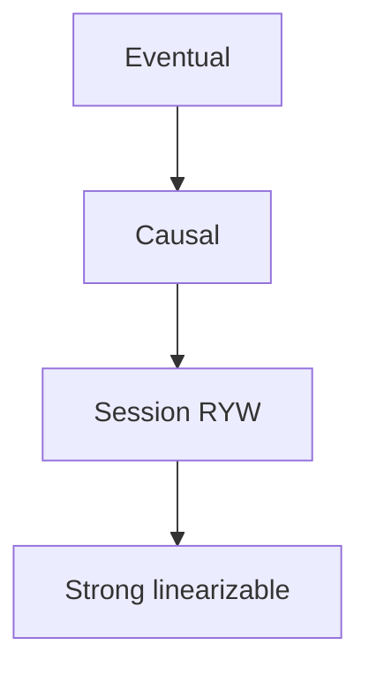
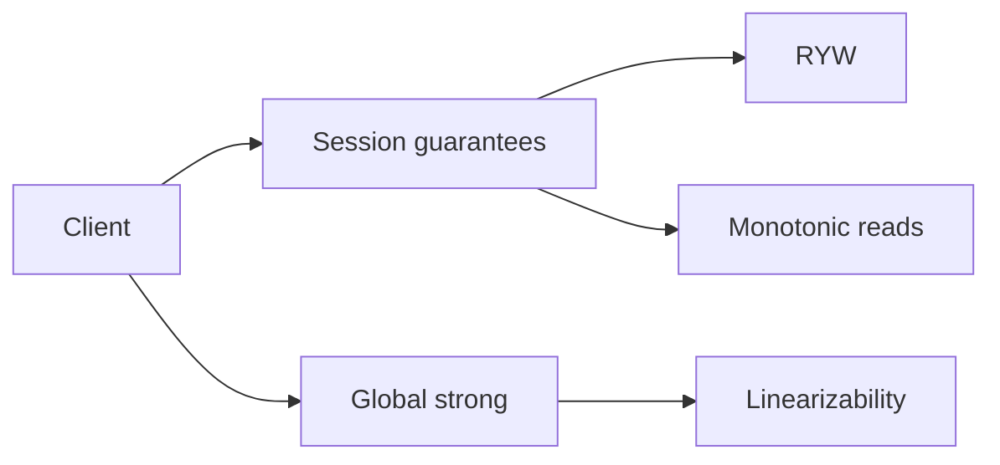
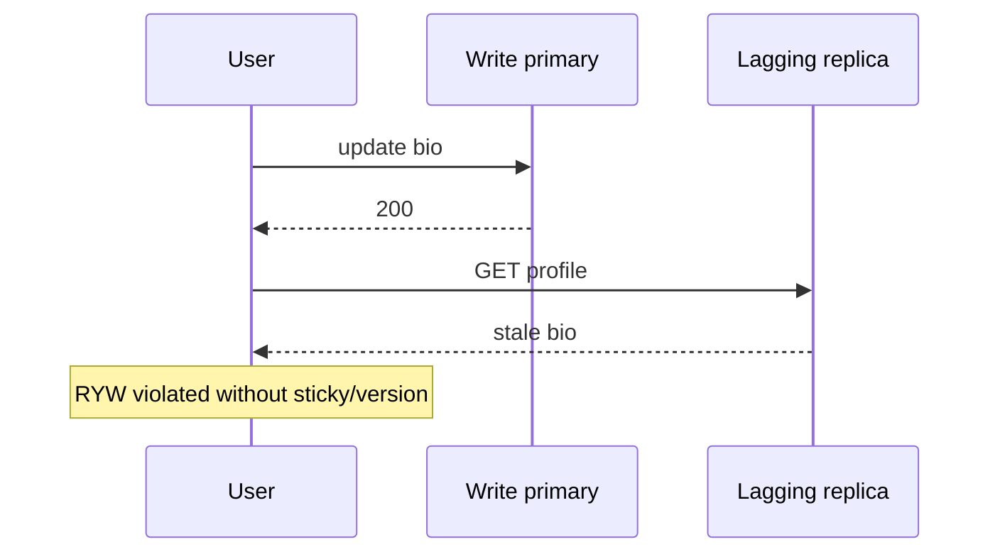

# Strong Eventual Causal and Read-Your-Writes

## Overview

Consistency models describe **which histories clients may observe**. **Strong (linearizable / sequential)** means operations appear on a single global timeline. **Eventual** means replicas converge if updates stop, without saying much about intermediate reads. **Causal** preserves happens-before (if A causally precedes B, everyone sees A before B). **Read-your-writes (RYW)** is a session guarantee: a client sees its own writes.

Product design picks models per surface. Engine isolation anomalies are Databases; session routing for RYW is often System Design + Backend together.

## Learning Objectives

- Define strong, eventual, causal, and RYW in client-observable terms
- Give product examples where each is necessary or wasteful
- Explain how sticky sessions, primary reads, and version tokens implement RYW
- Relate causal consistency to message ordering and multi-object updates
- Avoid "eventual" as a vague excuse for broken UX

## Prerequisites

- [[09-System-Design/03-Consistency-Models-and-CAP/CAP and PACELC as Product Constraints|CAP and PACELC as Product Constraints]]
- [[08-Databases/07-Replication-Mechanics/Replica Lag and Read-Your-Writes at Connection Level|Replica Lag and Read-Your-Writes at Connection Level]]

## Difficulty

`intermediate`

## Estimated Time

- Reading: 1.25 hours
- Exercises: 1.5 hours
- Mini project: 3 hours

## History

Distributed computing formalized linearizability (Herlihy & Wing) and sequential consistency; databases popularized eventual consistency for scale; causal consistency and session guarantees (RYW, monotonic reads) emerged as middle grounds users actually understand ("I don't see my own post").

## Problem It Solves

| User-visible bug | Missing guarantee |
| --- | --- |
| Refresh shows old profile after edit | RYW |
| Reply appears before parent comment | Causal |
| Two wallets disagree after transfer | Strong (cross-object) |
| Metrics dashboards differ for minutes | Often OK eventual |

## Internal Implementation

### Guarantee ladder (simplified)



Not every system sits on a total order of strength for all properties, but this ladder is a useful design intuition.

Mechanisms (product level):

- Strong: quorum sync, single primary, consensus
- RYW: read from primary, sticky replica, "read at ≥ write version"
- Causal: dependency tracking, vector clocks, causal broadcasts
- Eventual: async replication + conflict policy

## Mermaid Diagrams

### Structure



### Sequence / Lifecycle — RYW violation



## Examples

### Minimal Example — model tags

```typescript
export type Model = "strong" | "causal" | "ryw" | "eventual";

export const FEED: Record<string, Model> = {
  createPost: "ryw", // author must see own post
  publicTimeline: "eventual",
  threadReplies: "causal",
  transferBalance: "strong",
};
```

### Production-Shaped Example — version token RYW

```typescript
export type Session = { userId: string; readAfter?: number };

export function routeRead(session: Session, replicas: { id: string; version: number; isPrimary: boolean }[]) {
  if (session.readAfter == null) {
    return replicas.find((r) => !r.isPrimary) ?? replicas[0];
  }
  const ok = replicas.filter((r) => r.version >= session.readAfter!);
  return ok.find((r) => r.isPrimary) ?? ok[0] ?? replicas.find((r) => r.isPrimary)!;
}

export function afterWrite(session: Session, writeVersion: number): Session {
  return { ...session, readAfter: Math.max(session.readAfter ?? 0, writeVersion) };
}
```

## Trade-offs

| Model | Upside | Downside | When it matters |
| --- | --- | --- | --- |
| Strong | Simple mental model | Latency/availability cost | Money, uniqueness |
| Causal | Natural conversation order | Metadata/tracking cost | Threads, workflows |
| RYW | Fixes "I can't see my write" | Sticky/version routing | Sessions, profiles |
| Eventual | Scale + low latency | UX surprises | Aggregates, caches |

### When to Use

- Strong: ledger-like invariants
- Causal: collaborative/order-sensitive feeds
- RYW: almost all authenticated mutation UIs
- Eventual: high-scale approximate views with explicit staleness UX

### When Not to Use

- Eventual for checkout inventory without conflict/compensation design
- Strong everywhere as a default—unnecessary latency
- Claiming causal while only offering per-key eventual

## Exercises

1. Classify ten Instagram-like ops into models.
2. Design RYW without sticky sessions using tokens.
3. Show a history allowed by eventual but forbidden by causal.
4. When do monotonic reads matter independently of RYW?
5. Link engine replica lag note to this product RYW design.

## Mini Project

Simulate primary + 2 lagging replicas; implement `routeRead` and demonstrate RYW pass/fail.

## Portfolio Project

[[09-System-Design/projects/Consistency and Quorum Demo/README|Consistency and Quorum Demo]] — modes for strong/eventual/RYW with client traces.

## Interview Questions

1. Difference between strong and eventual consistency?
2. What is read-your-writes?
3. What does causal consistency buy you?
4. How do you implement RYW with read replicas?
5. Is eventual consistency "wrong"? When is it right?

### Stretch / Staff-Level

1. Design causal consistency across multiple microservices without a global clock.
2. Session guarantees under multi-device login.

## Common Mistakes

- "Eventual" without convergence deadline or conflict policy
- Sticky load balancing as only RYW strategy (breaks on failover)
- Linearizability claimed while using async replicas for reads
- Ignoring client-side caches that violate RYW
- Conflating durability with consistency

## Best Practices

- Name the model per API in ADRs
- Prefer version/token RYW over brittle stickiness alone
- Show staleness in UX when eventual
- Test with induced replica lag
- Separate model choice from store brand

## Summary

Consistency models are **contracts about observable order and freshness**. Strong, causal, RYW, and eventual each fix different user-visible failures at different costs. Pick from UX invariants, implement with routing/quorums/metadata, and never hide behind the word "eventual" without a convergence story.

## Further Reading

- [[09-System-Design/03-Consistency-Models-and-CAP/Quorums R plus W and Tunable Consistency|Quorums R plus W and Tunable Consistency]]
- [[09-System-Design/03-Consistency-Models-and-CAP/Conflict Policies LWW and CRDT Product Use|Conflict Policies LWW and CRDT Product Use]]
- [[08-Databases/07-Replication-Mechanics/Replica Lag and Read-Your-Writes at Connection Level|Replica Lag and Read-Your-Writes at Connection Level]]

## Related Notes

- [[09-System-Design/03-Consistency-Models-and-CAP/CAP and PACELC as Product Constraints|CAP and PACELC as Product Constraints]]
- [[09-System-Design/03-Consistency-Models-and-CAP/Choosing Consistency from User-Visible Invariants|Choosing Consistency from User-Visible Invariants]]
- [[09-System-Design/05-Caching-at-Product-Scale/When Caching Lies Read-Your-Writes Cross-Region|When Caching Lies Read-Your-Writes Cross-Region]]
- [[09-System-Design/README|System Design]]

## Progress Checklist

- [ ] Explained from first principles
- [ ] Drew at least one Mermaid diagram
- [ ] Implemented a minimal version
- [ ] Documented trade-offs and non-goals
- [ ] Completed exercises
- [ ] Practiced interview questions aloud
- [ ] Linked prerequisites and dependents
