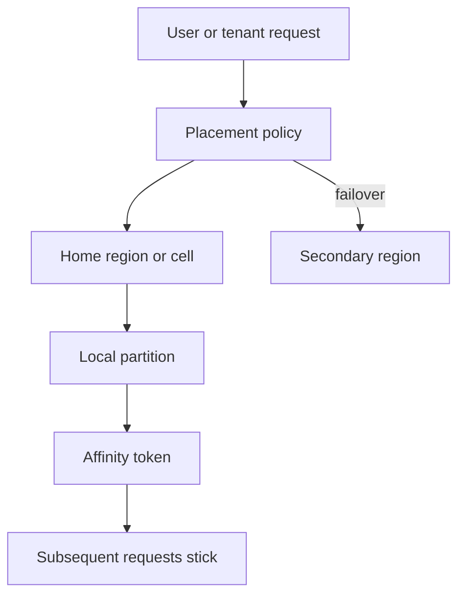
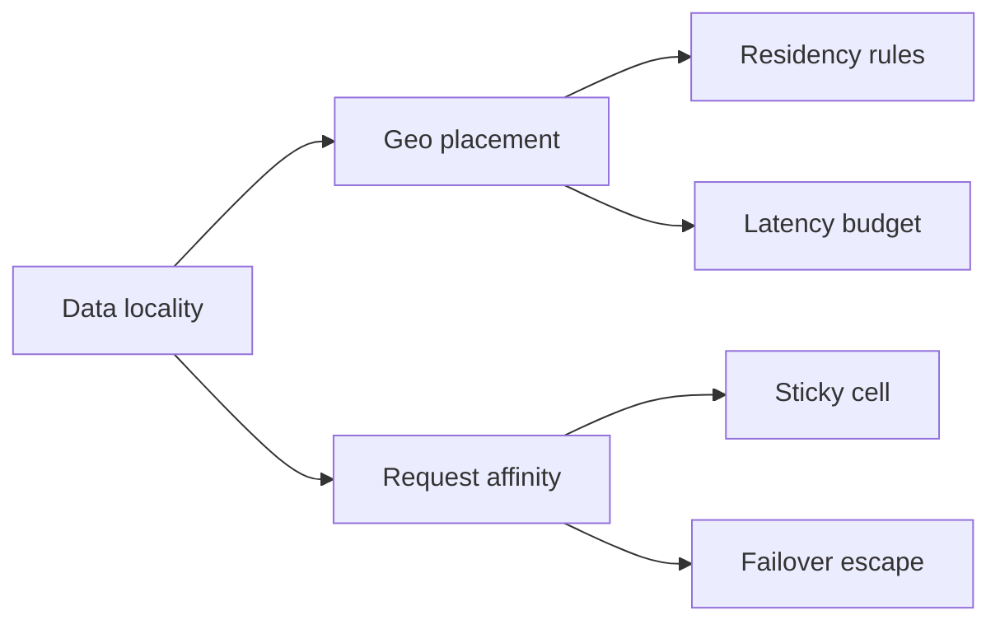

# Data Locality Geo Placement and Affinity

## Overview

**Data locality** places data near the compute and users that touch it most, minimizing cross-AZ/region RTT and egress. **Geo placement** assigns partitions to regions under latency, residency, and blast-radius constraints. **Affinity** sticks a session, tenant, or entity to a cell so subsequent requests avoid cold caches and cross-cell coordination. Locality is a product topology decision: it shapes partition keys, directory pins, and multi-region patterns—not merely a CDN checkbox.

## Learning Objectives

- Quantify locality gains against cross-region RTT and egress cost
- Choose placement policies: user-home, tenant-pin, compute-follows-data, data-follows-compute
- Design affinity tokens (cookies, headers, directory pins) with failure escape hatches
- Balance residency/compliance with failover mobility
- Relate locality to active-active and single-primary multi-region designs

## Prerequisites

- [[09-System-Design/04-Partitioning-Sharding-and-Placement/Partition Keys Hotspots and Skew|Partition Keys Hotspots and Skew]]
- [[09-System-Design/01-Capacity-Latency-and-Bottlenecks/Latency Budgets Percentiles and Tail Behavior|Latency Budgets Percentiles and Tail Behavior]]

## Difficulty

`advanced`

## Estimated Time

- Reading: 2 hours
- Exercises: 3 hours
- Mini project: 4 hours

## History

Mainframes co-located data and CPU because the bus was the network. Geographic distribution arrived with CDNs and multi-region databases; products then discovered that **hashing around the world** burns latency budgets even when capacity is fine. GDPR/residency and cloud egress pricing made placement a legal and cost control plane, not only a performance tweak.

## Problem It Solves

- **p99 latency** dominated by cross-region hops on “local” UX
- **Egress bills** from chatty cross-cell services
- **Compliance violations** when data leaves a residency zone
- **Affinity storms** when sticky routing overloads one cell

## Internal Implementation



**Placement policy matrix:**

| Policy | Idea | Risk |
| --- | --- | --- |
| User-home | Pin by signup/geo IP | Travelers, VPN noise |
| Tenant-pin | Directory maps tenant→cell | Mega-tenant imbalance |
| Compute-follows-data | Run jobs where data lives | Job queue complexity |
| Data-follows-compute | Move partitions toward load | Reshard cost |

## Mermaid Diagrams

### Structure



### Sequence / Lifecycle — affinity miss after cell failover

```mermaid
sequenceDiagram
    participant User
    participant Edge
    participant CellA
    participant CellB
    User->>Edge: request + affinity=CellA
    Edge->>CellA: route
    CellA-->>Edge: unhealthy
    Edge->>CellB: failover route
    CellB-->>User: 200 + affinity=CellB
    Note over User: cold cache possible; RYW policy needed
```

## Examples

### Minimal Example — home region from latency table

```typescript
export type Region = "us-east" | "eu-west" | "ap-northeast";

const RTT_MS: Record<Region, Record<Region, number>> = {
  "us-east": { "us-east": 2, "eu-west": 80, "ap-northeast": 160 },
  "eu-west": { "us-east": 80, "eu-west": 2, "ap-northeast": 220 },
  "ap-northeast": { "us-east": 160, "eu-west": 220, "ap-northeast": 2 },
};

export function pickHome(userRegion: Region, candidates: Region[]): Region {
  return candidates.reduce((best, r) =>
    RTT_MS[userRegion][r] < RTT_MS[userRegion][best] ? r : best,
  );
}
```

### Production-Shaped Example — affinity header with residency guard

```typescript
export interface Placement {
  cell: string;
  region: Region;
  residency: "EU" | "US" | "JP" | "ANY";
}

export function resolvePlacement(
  tenantId: string,
  directory: Map<string, Placement>,
  requestedCell: string | undefined,
  userResidency: Placement["residency"],
): Placement {
  const pinned = directory.get(tenantId);
  if (pinned) {
    if (userResidency !== "ANY" && pinned.residency !== "ANY" && pinned.residency !== userResidency) {
      throw Object.assign(new Error("residency violation"), { code: "RESIDENCY" });
    }
    return pinned;
  }
  // Fallback: honor affinity only if residency allows; else assign new home.
  const fallback: Placement = {
    cell: requestedCell && userResidency === "ANY" ? requestedCell : `cell-${userResidency}-1`,
    region: userResidency === "EU" ? "eu-west" : userResidency === "JP" ? "ap-northeast" : "us-east",
    residency: userResidency,
  };
  directory.set(tenantId, fallback);
  return fallback;
}
```

## Trade-offs

| Dimension | Upside | Downside | When it matters |
| --- | --- | --- | --- |
| Strong locality | Low latency, low egress | Harder global features | Consumer apps |
| Global hash | Simple ops | Cross-region p99 | Wrong for chatty UX |
| Sticky affinity | Warm caches | Imbalance, sticky outages | Session-heavy APIs |
| Strict residency | Compliance | Failover constrained | Regulated data |

### When to Use

- Pin tenants/users to a home cell when interactive RTT is in the latency budget
- Affinity for session/cache warmth within a region
- Explicit residency tags in the directory for regulated tenants

### When Not to Use

- Do not pin forever without a rehome/reshard path
- Do not confuse CDN edge caching with durable data placement
- Multi-region write topology → [[09-System-Design/07-Multi-Region-and-Geo/Multi-Region Active-Passive Active-Active Patterns|Multi-Region Active-Passive Active-Active Patterns]]

## Exercises

1. Given RTT table and 50 ms budget, decide which features must be local vs global.
2. Design rehome for a user who moves continents; include cache and identity impact.
3. Model affinity imbalance when 5% of users stick to one cell after a partial outage.
4. Write residency+failover policy for EU tenants with US DR.
5. Estimate egress cost of a chatty service incorrectly placed cross-region.

## Mini Project

**Placement simulator.** Assign users to cells by RTT and residency; measure p50/p99 and cell load under travel/failover scenarios.

## Portfolio Project

Geo placement ADR in [[09-System-Design/projects/Multi-Region Failover Playbook Lab/README|Multi-Region Failover Playbook Lab]].

## Interview Questions

1. What is data locality and why does hashing globally hurt UX?
2. How does affinity differ from load balancing?
3. How do residency rules constrain failover?
4. When should compute follow data vs data follow compute?
5. What escape hatch do you need when affinity targets are down?

### Stretch / Staff-Level

1. Design cell rehome with dual-write window and identity token migration.
2. Compare Spanner-style global vs regional-first product topologies for latency SLOs.

## Common Mistakes

- Geo-DNS to nearest edge while primary DB stays in one region (false locality)
- Affinity without drain/failover → sticky outages
- Ignoring egress in capacity cost models
- Residency as a checkbox without directory enforcement

## Best Practices

- Put **home region in the directory**, not only in the client cookie
- Budget cross-region calls as first-class dependencies with SLOs
- Pair affinity with health-aware escape → [[09-System-Design/02-Load-Balancing-and-Edge-Entry/Health Checks Drain and Connection Management|Health Checks Drain and Connection Management]]
- Consistency across regions → [[09-System-Design/07-Multi-Region-and-Geo/Replica Lag as User-Facing Consistency Budget|Replica Lag as User-Facing Consistency Budget]]
- Edge steering → [[09-System-Design/02-Load-Balancing-and-Edge-Entry/Edge Admission Control and Global Traffic Steering|Edge Admission Control and Global Traffic Steering]]

## Summary

Locality places durable data and sticky compute near users and legal homes; affinity preserves warmth within that choice; geo placement encodes latency, cost, and residency. Hash-everywhere topologies trade simplicity for cross-region latency. Product ADRs must state home assignment, escape hatches, and how failover respects residency.

## Further Reading

- [[00-References/System Design/README|System Design References]]
- Cloud architecture guides — multi-region data residency
- Kleppmann — data locality discussions

## Related Notes

- [[09-System-Design/04-Partitioning-Sharding-and-Placement/Range Hash and Directory-Based Sharding|Range Hash and Directory-Based Sharding]]
- [[09-System-Design/04-Partitioning-Sharding-and-Placement/Resharding Rebalancing and Dual-Write Windows|Resharding Rebalancing and Dual-Write Windows]]
- [[09-System-Design/07-Multi-Region-and-Geo/Single-Primary Multi-Primary and Leaderless Product Views|Single-Primary Multi-Primary and Leaderless Product Views]]
- [[09-System-Design/07-Multi-Region-and-Geo/Multi-Region Active-Passive Active-Active Patterns|Multi-Region Active-Passive Active-Active Patterns]]
- [[09-System-Design/README|System Design]]

## Progress Checklist

- [ ] Explained from first principles
- [ ] Drew at least one Mermaid diagram
- [ ] Implemented a minimal version
- [ ] Documented trade-offs and non-goals
- [ ] Completed exercises
- [ ] Practiced interview questions aloud
- [ ] Linked prerequisites and dependents
