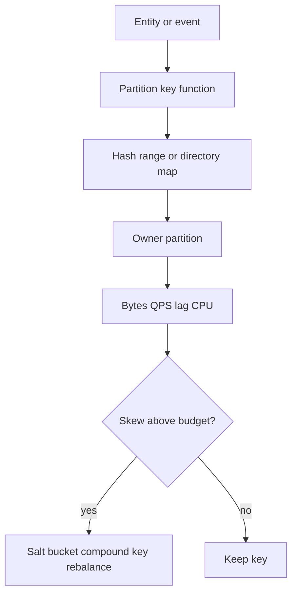
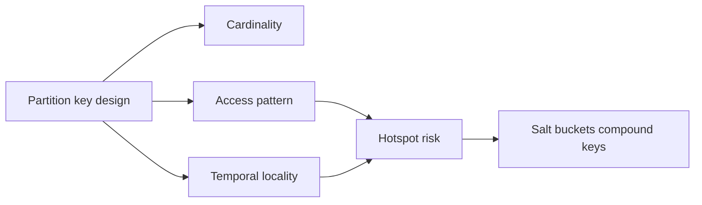
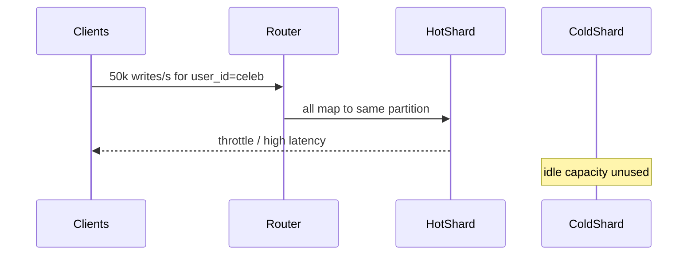

# Partition Keys Hotspots and Skew

## Overview

A **partition key** (shard key) maps each row or entity to exactly one partition for storage and routing. **Skew** is imbalance of bytes, QPS, or both across partitions. A **hotspot** is a single key or narrow key range that absorbs disproportionate traffic—celebrity accounts, flash-sale SKUs, `status=pending` queues, or monotonic timestamps used as keys. Partitioning fails product SLOs when the key looks “even” in cardinality but concentrates load in time or space. Engine page layout belongs to Databases; this note owns **product key choice, skew budgets, and hotspot mitigations at topology scale**.

## Learning Objectives

- Define partition key, skew dimensions (bytes vs QPS vs fan-in), and hotspot
- Derive skew budgets from capacity models and p99 latency SLOs
- Detect hotspots with per-partition metrics and traffic histograms
- Apply mitigations: compound keys, salting, time bucketing, write sharding, read replicas
- Write an ADR that states non-goals (cross-partition transactions, global secondary indexes)

## Prerequisites

- [[09-System-Design/01-Capacity-Latency-and-Bottlenecks/Back-of-Envelope Capacity Estimation|Back-of-Envelope Capacity Estimation]]
- [[09-System-Design/03-Consistency-Models-and-CAP/Choosing Consistency from User-Visible Invariants|Choosing Consistency from User-Visible Invariants]]

## Difficulty

`advanced`

## Estimated Time

- Reading: 2 hours
- Exercises: 3 hours
- Mini project: 4 hours

## History

Early shared-nothing systems (Teradata, Bigtable, Dynamo) forced explicit keys because network and disk could not hide imbalance. Social products discovered “super-node” keys: one user_id with millions of followers collapses a hash ring into one hot shard. Modern platforms expose partition stats (Cassandra token ownership, DynamoDB adaptive capacity, Kafka partition lag) because operators learned that **cardinality ≠ load**.

## Problem It Solves

- **Single shard CPU/IO saturation** while the fleet is mostly idle
- **Throttling and cascading retries** on hot partitions
- **False capacity planning** that multiplies “average QPS × shards”
- **Silent product bugs** when range scans hit one overloaded owner

## Internal Implementation



**Skew dimensions (measure all three):**

| Dimension | Symptom | Typical cause |
| --- | --- | --- |
| Bytes | One shard disk full | Large tenants, blob-heavy keys |
| Write QPS | Write p99 spike | Hot entity, monotonic key |
| Read QPS / fan-in | Cache miss storm | Viral key, fan-out reads |

**First-principles key design:** co-locate data that is co-accessed; spread data that is co-written at high rate; never use a pure timestamp or autoincrement as the sole partition key under write load.

## Mermaid Diagrams

### Structure



### Sequence / Lifecycle — celebrity write hotspot



## Examples

### Minimal Example — skew score

```typescript
/** Ratio of max partition load to ideal fair share. 1.0 = perfect. */
export function skewScore(loads: number[]): number {
  if (loads.length === 0) return 1;
  const total = loads.reduce((a, b) => a + b, 0);
  const fair = total / loads.length;
  if (fair === 0) return 1;
  return Math.max(...loads) / fair;
}

// Ideal: 1.0–1.5. Alarm: >3 for sustained windows.
```

### Production-Shaped Example — compound key + write sharding

```typescript
import { createHash } from "node:crypto";

export type ShardId = number;

/** Avoid single-key hotspot: salt write path; keep logical entity id for reads via index. */
export function writeShardKey(entityId: string, writeBucket: number, shardCount: number): ShardId {
  const material = `${entityId}#w${writeBucket}`;
  const h = createHash("sha256").update(material).digest();
  return h.readUInt32BE(0) % shardCount;
}

export function pickWriteBucket(nowMs: number, bucketCount: number): number {
  // Rotate buckets slowly so each entity spreads writes without exploding cardinality forever.
  return Math.floor(nowMs / 60_000) % bucketCount;
}

export async function ingestEvent(
  entityId: string,
  payload: unknown,
  shards: Array<{ id: ShardId; qps: number }>,
): Promise<{ shardId: ShardId; key: string }> {
  const hot = shards.some((s) => s.qps > 10_000);
  const buckets = hot ? 16 : 1;
  const bucket = pickWriteBucket(Date.now(), buckets);
  const shardId = writeShardKey(entityId, bucket, shards.length);
  const key = `${entityId}#w${bucket}`;
  // router.route(shardId).append(key, payload) — omit broker details
  return { shardId, key };
}
```

## Trade-offs

| Dimension | Upside | Downside | When it matters |
| --- | --- | --- | --- |
| Fine-grained key | Spreads load | Cross-partition joins/txn cost | High write QPS |
| Coarse tenant key | Local queries | Mega-tenant hotspot | Multi-tenant SaaS |
| Salting | Breaks hotspots | Harder point reads / more fan-out | Celebrity / viral keys |
| Time-bucket keys | Spreads time series | Range queries span buckets | Metrics, activity feeds |

### When to Use

- Hash or salted keys when writes dominate and entities are independently addressable
- Compound `(tenant_id, entity_id)` when most queries are tenant-scoped
- Explicit hotspot playbooks for known viral entities

### When Not to Use

- Do not pick keys only for “even hash” without measuring access patterns
- Do not use autoincrement / pure timestamp as sole partition key under write load
- Engine-level page free space → [[08-Databases/01-Storage-and-Buffer-Pool/Free Space Maps Fillfactor and Fragmentation|Free Space Maps Fillfactor and Fragmentation]]

## Exercises

1. Given 100 shards and power-law traffic (α=1.2), compute expected max/mean QPS ratio.
2. Redesign a key `created_at` for a write-heavy audit log; document query trade-offs.
3. Instrument a router to emit per-partition QPS histograms; set alert thresholds.
4. Model a mega-tenant: when does `(tenant_id)` fail and require sub-sharding?
5. Write an ADR for a celebrity write-shard strategy including read fan-in.

## Mini Project

**Hotspot clinic.** Simulate power-law keys on a consistent-hash ring; implement salting when skewScore > 3; graph before/after.

## Portfolio Project

Partition/skew module in [[09-System-Design/projects/Shard Router and Hotspot Clinic/README|Shard Router and Hotspot Clinic]].

## Interview Questions

1. What is a partition hotspot and how is it different from data skew?
2. Why can a high-cardinality key still hotspot?
3. How do you measure skew in production?
4. Trade-offs of salting a hot user_id?
5. Why is `ORDER BY created_at` a dangerous partition key for writes?

### Stretch / Staff-Level

1. Design adaptive capacity: detect hot partitions and temporarily split without full reshard.
2. Compare DynamoDB adaptive capacity vs manual salting for product UX.

## Common Mistakes

- Capacity = average_load × shard_count (ignores max partition)
- Changing keys without a dual-write / backfill plan → [[09-System-Design/04-Partitioning-Sharding-and-Placement/Resharding Rebalancing and Dual-Write Windows|Resharding Rebalancing and Dual-Write Windows]]
- Assuming secondary indexes fix hotspots (they move read fan-in) → [[09-System-Design/04-Partitioning-Sharding-and-Placement/Secondary Indexes Across Partitions|Secondary Indexes Across Partitions]]
- Confusing hash evenness with temporal evenness

## Best Practices

- Budget **max partition QPS / fair share ≤ 2–3** in steady state; page for sustained >5
- Co-design key with query patterns and consistency invariants
- Keep a known-hot-key denylist with manual overrides
- Cross-link locality → [[09-System-Design/04-Partitioning-Sharding-and-Placement/Data Locality Geo Placement and Affinity|Data Locality Geo Placement and Affinity]]
- Client cache-aside does not fix shard hotspots → [[07-Backend/07-Caching-Jobs-and-Messaging/Cache-Aside and TTL Strategies|Cache-Aside and TTL Strategies]]

## Summary

Partition keys encode co-location and load distribution; skew is imbalance of bytes or QPS; hotspots are extreme concentration on few keys. Design from access patterns and capacity budgets, not from hash aesthetics. Measure per-partition load, mitigate with compound keys and salting when justified, and treat key changes as resharding projects—not schema renames.

## Further Reading

- [[00-References/System Design/README|System Design References]]
- Kleppmann — Partitioning and data locality
- Dynamo / Bigtable papers — key design lessons

## Related Notes

- [[09-System-Design/04-Partitioning-Sharding-and-Placement/Range Hash and Directory-Based Sharding|Range Hash and Directory-Based Sharding]]
- [[09-System-Design/04-Partitioning-Sharding-and-Placement/Resharding Rebalancing and Dual-Write Windows|Resharding Rebalancing and Dual-Write Windows]]
- [[09-System-Design/04-Partitioning-Sharding-and-Placement/Data Locality Geo Placement and Affinity|Data Locality Geo Placement and Affinity]]
- [[09-System-Design/04-Partitioning-Sharding-and-Placement/Secondary Indexes Across Partitions|Secondary Indexes Across Partitions]]
- [[09-System-Design/README|System Design]]

## Progress Checklist

- [ ] Explained from first principles
- [ ] Drew at least one Mermaid diagram
- [ ] Implemented a minimal version
- [ ] Documented trade-offs and non-goals
- [ ] Completed exercises
- [ ] Practiced interview questions aloud
- [ ] Linked prerequisites and dependents
