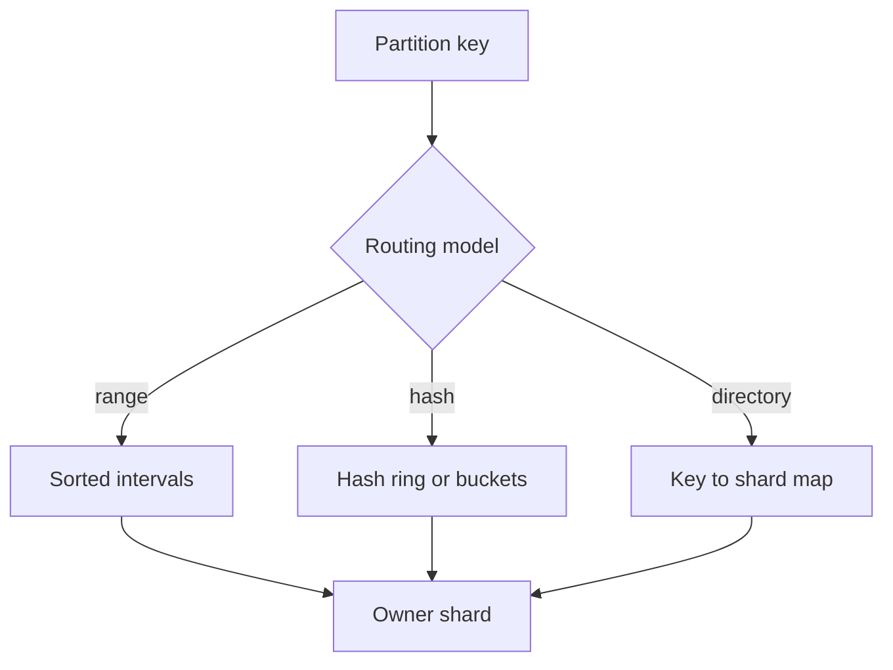
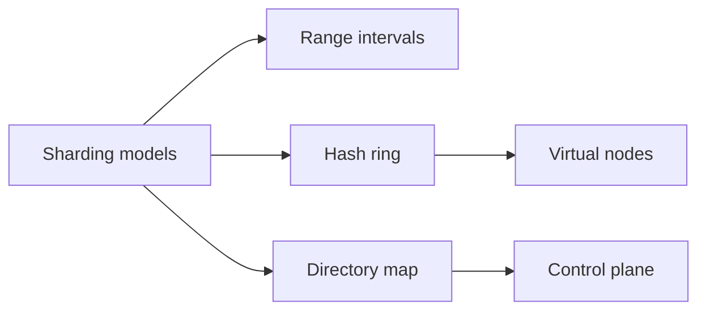
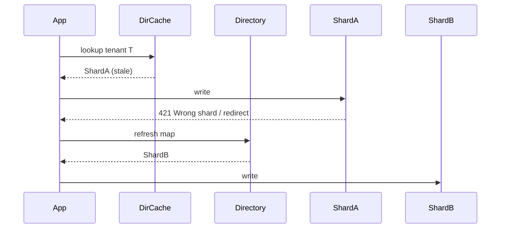

# Range Hash and Directory-Based Sharding

## Overview

Three product-scale routing models dominate sharding: **range** (ordered key intervals owned by a shard), **hash** (hash(key) → ring or modulo bucket), and **directory** (explicit lookup map key→shard). Each trades range-scan efficiency, rebalance cost, hotspot risk, and control-plane complexity. Consistent hashing reduces remaps on membership change but does not eliminate skew. Choose the model from **query shape + rebalance frequency + operational maturity**, not fashion.

## Learning Objectives

- Contrast range, hash (modulo vs consistent hash), and directory routing
- Explain why range enables efficient scans and risks hot ends
- Model remapped fraction when adding nodes under modulo vs consistent hash
- Design a directory service with cache TTLs and fencing against stale maps
- Select a model with an ADR covering scans, joins, and reshard windows

## Prerequisites

- [[09-System-Design/04-Partitioning-Sharding-and-Placement/Partition Keys Hotspots and Skew|Partition Keys Hotspots and Skew]]
- [[09-System-Design/02-Load-Balancing-and-Edge-Entry/Algorithms Round Robin Least Conn Consistent Hash|Algorithms Round Robin Least Conn Consistent Hash]]

## Difficulty

`advanced`

## Estimated Time

- Reading: 2.5 hours
- Exercises: 3 hours
- Mini project: 5 hours

## History

Range partitions came from parallel databases and HBase/Bigtable tablets. Modulo hash was common in early MySQL shard proxies but remapped nearly everything on N→N+1. Dynamo popularized **consistent hashing** with virtual nodes. MongoDB, Vitess, and Citus expose both range and hash; many SaaS products keep a **directory** (tenant→shard) for explicit placement and tenancy isolation.

## Problem It Solves

- **Wrong model** forcing full-table scatter-gather on every list query
- **Massive remaps** on shard add/remove with naive modulo
- **Uncontrolled hotspots** on range max keys
- **Stale routing** when directory updates race with traffic

## Internal Implementation



| Model | Strength | Weakness | Typical use |
| --- | --- | --- | --- |
| Range | Ordered scans, split/merge tablets | Hot ranges, uneven growth | Time series, sorted IDs |
| Hash (modulo) | Simple | Remap storm on N change | Small static fleets |
| Hash (consistent) | Bounded remap | Harder range queries | KV, sessions |
| Directory | Explicit placement, tenancy | Lookup SPOF / stale cache | Multi-tenant SaaS |

## Mermaid Diagrams

### Structure



### Sequence / Lifecycle — directory route with stale cache



## Examples

### Minimal Example — range vs hash assignment

```typescript
export type Range = { start: string; end: string; shardId: number };

export function routeRange(key: string, ranges: Range[]): number {
  const hit = ranges.find((r) => key >= r.start && key < r.end);
  if (!hit) throw new Error(`no range for ${key}`);
  return hit.shardId;
}

export function routeHash(key: string, shardCount: number): number {
  let h = 0;
  for (let i = 0; i < key.length; i++) h = (h * 31 + key.charCodeAt(i)) >>> 0;
  return h % shardCount;
}
```

### Production-Shaped Example — consistent hash ring + directory overlay

```typescript
import { createHash } from "node:crypto";

export class HashRing {
  private readonly points: Array<{ hash: number; node: string }> = [];

  constructor(nodes: string[], vnodesPerNode = 64) {
    for (const node of nodes) {
      for (let v = 0; v < vnodesPerNode; v++) {
        const hash = this.hash(`${node}#${v}`);
        this.points.push({ hash, node });
      }
    }
    this.points.sort((a, b) => a.hash - b.hash);
  }

  private hash(s: string): number {
    return createHash("sha1").update(s).digest().readUInt32BE(0);
  }

  locate(key: string): string {
    const h = this.hash(key);
    const idx = this.points.findIndex((p) => p.hash >= h);
    return this.points[idx === -1 ? 0 : idx].node;
  }
}

/** Directory overlay: pin mega-tenants off the ring onto dedicated shards. */
export class HybridRouter {
  constructor(
    private readonly ring: HashRing,
    private readonly directory: Map<string, string>,
  ) {}

  route(tenantId: string): string {
    return this.directory.get(tenantId) ?? this.ring.locate(tenantId);
  }
}
```

## Trade-offs

| Dimension | Upside | Downside | When it matters |
| --- | --- | --- | --- |
| Range | Efficient range scans | Hot ends, split ops | Analytics-ish OLTP |
| Consistent hash | Small remap on scale-out | Scatter queries | KV / session stores |
| Directory | Explicit isolation | Control plane + stale maps | Tenancy, compliance |
| Hybrid | Escape hatches | Two mental models | Large SaaS |

### When to Use

- Range when primary access is ordered prefixes or time windows
- Consistent hash for opaque IDs with point gets
- Directory when legal/ops needs pin a tenant to a cell
- Hybrid: ring default + directory pins for mega-tenants

### When Not to Use

- Do not use modulo hash if shard count changes often
- Do not expect hash sharding to support efficient global ORDER BY without scatter
- Page/B+ layouts inside a shard → [[08-Databases/03-Indexing-on-Disk/B-Plus Trees as Page Structures|B-Plus Trees as Page Structures]]

## Exercises

1. Compute remap fraction for N=8→9 under modulo vs consistent hash with 100 vnodes.
2. Design range splits for a tablet that grew past 50 GB; define split key policy.
3. Implement HashRing locate; fuzz test membership add/remove remap ratio.
4. Sketch directory cache invalidation with epoch fencing.
5. ADR: choose model for multi-tenant CRM with tenant-scoped list queries.

## Mini Project

**Router bake-off.** Implement range, modulo, and consistent-hash routers; measure remap and scan fan-out on synthetic workloads.

## Portfolio Project

Routing core in [[09-System-Design/projects/Shard Router and Hotspot Clinic/README|Shard Router and Hotspot Clinic]].

## Interview Questions

1. Compare range vs hash sharding for a social feed keyed by user_id.
2. Why does consistent hashing reduce remaps?
3. What is a directory-based shard map and its failure modes?
4. When would you pin a tenant off the hash ring?
5. How do virtual nodes help skew?

### Stretch / Staff-Level

1. Design a tablet split/merge control plane with load-aware triggers.
2. Compare Vitess VIndex types to Cassandra token rings for product designers.

## Common Mistakes

- Using range on monotonically increasing keys without bucketing → hotspots
- Caching directory forever without epoch / wrong-shard redirects
- Treating consistent hash as “no rebalance work” (data still moves)
- Ignoring scatter-gather cost of global secondary filters

## Best Practices

- Prefer **wrong-shard redirects** over silent dual-writes during map changes
- Size virtual nodes for both remap bound and memory of the ring
- Document scan fan-out SLOs in the ADR
- Reshard windows → [[09-System-Design/04-Partitioning-Sharding-and-Placement/Resharding Rebalancing and Dual-Write Windows|Resharding Rebalancing and Dual-Write Windows]]
- Geo affinity may override pure hash → [[09-System-Design/04-Partitioning-Sharding-and-Placement/Data Locality Geo Placement and Affinity|Data Locality Geo Placement and Affinity]]

## Summary

Range, hash, and directory sharding are routing contracts: range optimizes ordered access, hash optimizes even placement and bounded remaps (with consistent hashing), directory optimizes explicit placement. Product design picks the model from query shape and operational remapping cost, then hardens stale-map and hotspot behaviors.

## Further Reading

- [[00-References/System Design/README|System Design References]]
- Dynamo paper — consistent hashing
- Vitess / Citus docs — sharding models

## Related Notes

- [[09-System-Design/04-Partitioning-Sharding-and-Placement/Partition Keys Hotspots and Skew|Partition Keys Hotspots and Skew]]
- [[09-System-Design/04-Partitioning-Sharding-and-Placement/Resharding Rebalancing and Dual-Write Windows|Resharding Rebalancing and Dual-Write Windows]]
- [[09-System-Design/04-Partitioning-Sharding-and-Placement/Secondary Indexes Across Partitions|Secondary Indexes Across Partitions]]
- [[09-System-Design/02-Load-Balancing-and-Edge-Entry/Algorithms Round Robin Least Conn Consistent Hash|Algorithms Round Robin Least Conn Consistent Hash]]
- [[09-System-Design/README|System Design]]

## Progress Checklist

- [ ] Explained from first principles
- [ ] Drew at least one Mermaid diagram
- [ ] Implemented a minimal version
- [ ] Documented trade-offs and non-goals
- [ ] Completed exercises
- [ ] Practiced interview questions aloud
- [ ] Linked prerequisites and dependents
