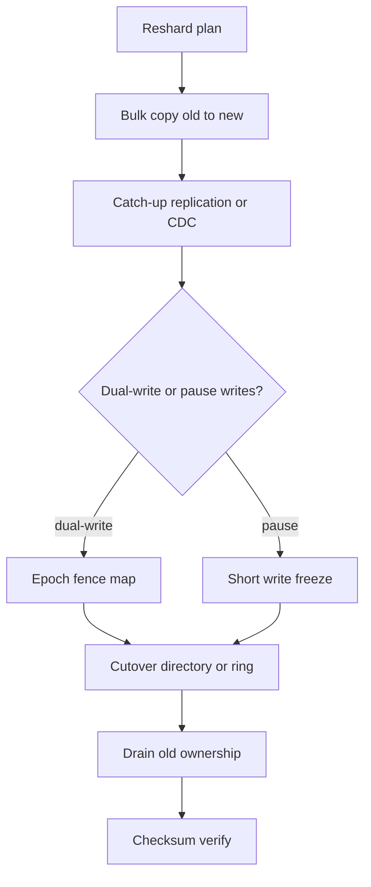
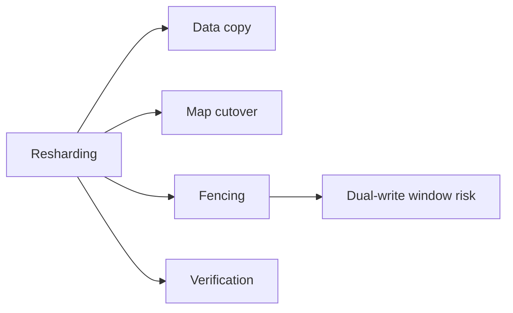
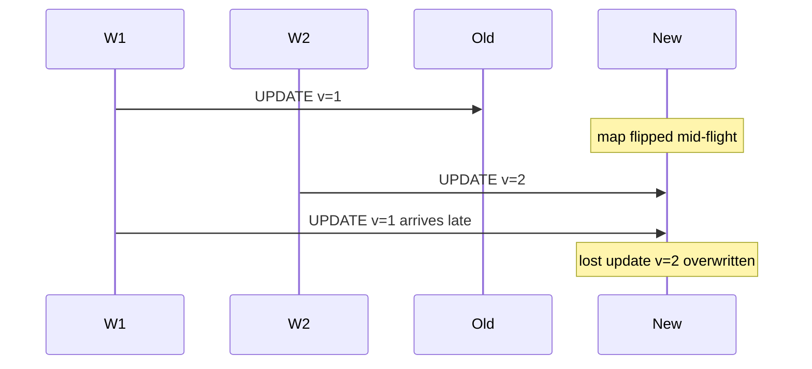

# Resharding Rebalancing and Dual-Write Windows

## Overview

**Resharding** changes the key→shard mapping (split, merge, add nodes, change key). **Rebalancing** moves data to restore capacity or skew budgets under a fixed or evolving map. A **dual-write window** is the dangerous interval where writers may need to touch old and new locations, or where readers may see either—unless the protocol fences ownership tightly. Product topology owns cutover policy, consistency during move, and rollback; engine replication/WAL shipping is a tool, not the plan.

## Learning Objectives

- Distinguish split/merge, horizontal add-node, and key-scheme changes
- Design migration phases: shadow copy → dual-write/catch-up → cutover → drain
- Reason about dual-write races, idempotency, and fencing tokens
- Set lag and error budgets for live migration
- Write a reshard ADR with abort criteria and product-visible impact

## Prerequisites

- [[09-System-Design/04-Partitioning-Sharding-and-Placement/Range Hash and Directory-Based Sharding|Range Hash and Directory-Based Sharding]]
- [[09-System-Design/04-Partitioning-Sharding-and-Placement/Partition Keys Hotspots and Skew|Partition Keys Hotspots and Skew]]

## Difficulty

`expert`

## Estimated Time

- Reading: 3 hours
- Exercises: 4 hours
- Mini project: 6 hours

## History

MySQL horizontal sharding forced painful dual-write migrations. Distributed stores added live tablet moves (HBase region moves, Cassandra streaming, DynamoDB partition splits). Cloud “elastic” tables hide windows but still expose throttling and brief inconsistency. Outages taught: **cutover without fencing** equals split ownership.

## Problem It Solves

- **Capacity cliffs** when one shard fills
- **Prolonged dual-write bugs** (lost updates, phantom deletes)
- **Unbounded migrations** that never drain
- **Silent rollback failure** after partial cutover

## Internal Implementation



**Phase contract (typical):**

1. **Shadow copy** — new location receives data; old remains authoritative.
2. **Catch-up** — CDC/replication lag under budget.
3. **Ownership flip** — directory epoch++ or ring membership change; writers use fencing.
4. **Drain** — old location rejects writes; reads follow redirects.
5. **Verify + abort path** — checksum samples; ability to flip epoch back if criteria fail.

## Mermaid Diagrams

### Structure



### Sequence / Lifecycle — dual-write race without fencing



## Examples

### Minimal Example — migration epoch fence

```typescript
export type ShardMap = { epoch: number; route: (key: string) => string };

export function assertEpoch(clientEpoch: number, map: ShardMap): void {
  if (clientEpoch !== map.epoch) {
    throw Object.assign(new Error("stale shard map"), { code: "STALE_MAP", epoch: map.epoch });
  }
}
```

### Production-Shaped Example — phased cutover controller

```typescript
export type Phase = "copy" | "catchup" | "dual" | "cutover" | "drain" | "done" | "abort";

export interface MigrationState {
  phase: Phase;
  epoch: number;
  lagMs: number;
  errorRate: number;
  checksumMismatchRate: number;
}

export function nextPhase(s: MigrationState): Phase {
  const lagOk = s.lagMs < 2_000;
  const errOk = s.errorRate < 0.001;
  const checkOk = s.checksumMismatchRate < 1e-6;

  if (!errOk || !checkOk) return "abort";

  switch (s.phase) {
    case "copy":
      return lagOk ? "catchup" : "copy";
    case "catchup":
      return lagOk ? "dual" : "catchup";
    case "dual":
      return lagOk && errOk ? "cutover" : "dual";
    case "cutover":
      return "drain";
    case "drain":
      return checkOk ? "done" : "abort";
    default:
      return s.phase;
  }
}

/** Dual-write: write new primary; optionally mirror to old until drain. Prefer single-owner after epoch bump. */
export async function writeWithFence(
  key: string,
  value: unknown,
  map: ShardMap,
  clientEpoch: number,
  write: (shard: string, key: string, value: unknown) => Promise<void>,
): Promise<void> {
  assertEpoch(clientEpoch, map);
  await write(map.route(key), key, value);
}
```

## Trade-offs

| Dimension | Upside | Downside | When it matters |
| --- | --- | --- | --- |
| Live dual-write | Near-zero downtime | Race complexity | Always-on products |
| Brief write freeze | Simple correctness | User-visible pause | Low-traffic windows |
| CDC catch-up | Incremental | Lag and schema drift | Large datasets |
| Offline copy | Simple | Long outage | Internal tools |

### When to Use

- Live reshard with epoch fencing for customer-facing OLTP
- Write freeze only when freeze << RTO and product allows
- Incremental tablet splits for range systems with load triggers

### When Not to Use

- Do not dual-write indefinitely “just to be safe”
- Do not cut over with lag above your consistency budget
- Engine physical replication mechanics → [[08-Databases/07-Replication-Mechanics/WAL Shipping and Streaming Replication|WAL Shipping and Streaming Replication]]
- Service outbox for cross-service events → [[07-Backend/07-Caching-Jobs-and-Messaging/Transactional Outbox and Inbox Patterns|Transactional Outbox and Inbox Patterns]]

## Exercises

1. Timeline a 10 TB reshard at 200 MB/s copy + catch-up; estimate freeze vs dual-write duration.
2. Enumerate lost-update scenarios without epoch fencing; design fixes.
3. Define abort criteria (lag, error rate, checksum) for a cutover go/no-go.
4. Simulate N→N+1 consistent-hash remap and schedule background moves.
5. Write a customer-comms plan for a 30s write freeze vs dual-write approach.

## Mini Project

**Cutover simulator.** Model copy/catch-up/dual/cutover with injected lag and races; require epoch fencing to pass tests.

## Portfolio Project

Migration playbook in [[09-System-Design/projects/Shard Router and Hotspot Clinic/README|Shard Router and Hotspot Clinic]] and ADR in [[09-System-Design/projects/Distributed Systems Workbench/README|Distributed Systems Workbench]].

## Interview Questions

1. What is a dual-write window and why is it dangerous?
2. How does an epoch / fencing token help during reshard?
3. Compare write-freeze cutover vs live dual-write.
4. What metrics gate cutover?
5. How do you verify migration completeness?

### Stretch / Staff-Level

1. Design exactly-once-ish key moves with idempotent apply and fencing across two stores.
2. Compare Vitess MoveTables / Reshard workflows to a hand-rolled CDC plan.

## Common Mistakes

- Flipping DNS/directory before catch-up completes
- Dual-writing without idempotent keys → divergent values
- No rollback epoch after partial failure
- Treating “bytes copied” as “consistent”

## Best Practices

- Prefer **single-owner after epoch bump** over prolonged dual-write
- Budget remapped QPS so migration traffic does not starve product traffic
- Sample checksums continuously during drain
- Cross-link multi-region moves → [[09-System-Design/07-Multi-Region-and-Geo/Multi-Region Active-Passive Active-Active Patterns|Multi-Region Active-Passive Active-Active Patterns]]
- Outbox at fleet scale → [[09-System-Design/06-Messaging-Streams-and-Async-Topologies/Outbox at System Scale Cross-Service Contracts|Outbox at System Scale Cross-Service Contracts]]

## Summary

Resharding and rebalancing are controlled ownership transfers. Dual-write windows exist whenever old and new locations can accept mutations without a clear fence. Safe plans copy, catch up, fence with epochs, cut over under budgets, drain, and verify—with explicit abort criteria. Downtime can be traded for simplicity; unbounded dual-write cannot be traded for safety.

## Further Reading

- [[00-References/System Design/README|System Design References]]
- Vitess resharding docs
- Database live migration case studies (Shopify, Stripe engineering blogs)

## Related Notes

- [[09-System-Design/04-Partitioning-Sharding-and-Placement/Range Hash and Directory-Based Sharding|Range Hash and Directory-Based Sharding]]
- [[09-System-Design/04-Partitioning-Sharding-and-Placement/Partition Keys Hotspots and Skew|Partition Keys Hotspots and Skew]]
- [[09-System-Design/08-Coordination-Consensus-and-Locks/Distributed Locks Leases and Fencing Tokens|Distributed Locks Leases and Fencing Tokens]]
- [[09-System-Design/07-Multi-Region-and-Geo/Failover RPO RTO and Split-Brain Product Policy|Failover RPO RTO and Split-Brain Product Policy]]
- [[09-System-Design/README|System Design]]

## Progress Checklist

- [ ] Explained from first principles
- [ ] Drew at least one Mermaid diagram
- [ ] Implemented a minimal version
- [ ] Documented trade-offs and non-goals
- [ ] Completed exercises
- [ ] Practiced interview questions aloud
- [ ] Linked prerequisites and dependents
