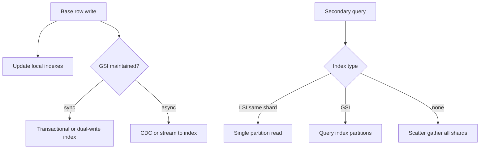
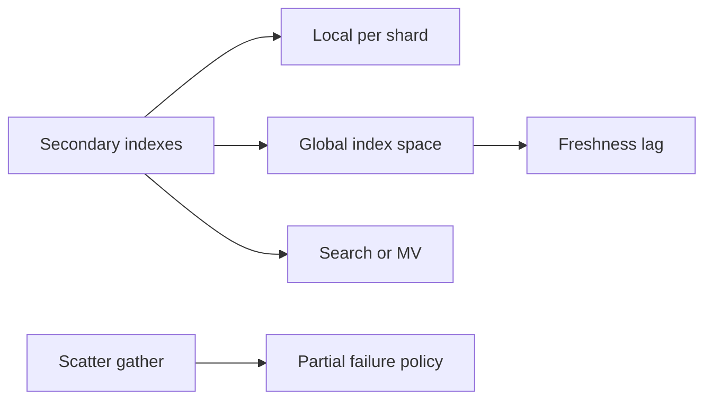
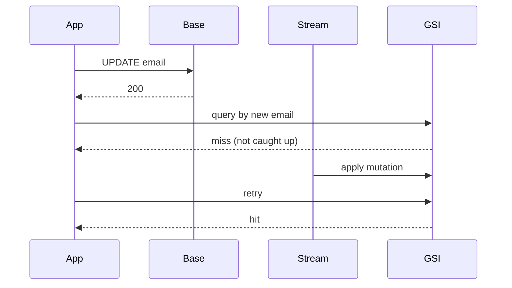

# Secondary Indexes Across Partitions

## Overview

A **secondary index** answers queries on non-partition-key attributes. In a partitioned store, indexes are either **local** (per partition, co-located with primary data) or **global** (their own partitioned space, often eventually consistent with the base table). Cross-partition secondary access forces **scatter-gather** or a separately maintained GSI with dual-write/CDC lag. This note owns product topology for indexes at shard scale; B+ tree page mechanics belong to Databases.

## Learning Objectives

- Contrast local secondary indexes (LSI) vs global secondary indexes (GSI)
- Cost scatter-gather fan-out against latency and partial-failure behavior
- Design GSI freshness budgets (eventual vs transactional index updates)
- Choose denormalization / materialized views when indexes are insufficient
- Document query patterns that must not rely on cross-partition indexes

## Prerequisites

- [[09-System-Design/04-Partitioning-Sharding-and-Placement/Range Hash and Directory-Based Sharding|Range Hash and Directory-Based Sharding]]
- [[09-System-Design/03-Consistency-Models-and-CAP/Strong Eventual Causal and Read-Your-Writes|Strong Eventual Causal and Read-Your-Writes]]

## Difficulty

`expert`

## Estimated Time

- Reading: 2.5 hours
- Exercises: 3 hours
- Mini project: 5 hours

## History

Shared-disk RDBMS offered global indexes “for free.” Shared-nothing systems (DynamoDB GSI, Cassandra SASI/secondary indexes, Elasticsearch as external index) made the cost explicit: every base write may fan out to index partitions. Teams that treated secondary indexes like monolith Postgres discovered **thundering writes** and **stale GSI reads** after cutovers.

## Problem It Solves

- **Full-cluster scatter** for `WHERE email = ?` without a GSI
- **Stale search results** after write when GSI is async
- **Write amplification** melting capacity budgets
- **Partial query results** when some shards fail mid-scatter

## Internal Implementation



| Approach | Consistency | Write cost | Read shape |
| --- | --- | --- | --- |
| LSI | Usually with base | Low | Partition-key required |
| Sync GSI | Stronger | High amplification | Point/range on index key |
| Async GSI | Eventual | Deferred | Stale window |
| Scatter-gather | As-of each shard | None extra | p99 ≈ slowest shard |
| External search | Eventual | Pipeline | Rich queries |

## Mermaid Diagrams

### Structure



### Sequence / Lifecycle — async GSI stale read



## Examples

### Minimal Example — scatter-gather with deadline

```typescript
export async function scatterGetByEmail(
  shards: Array<(email: string) => Promise<{ id: string } | null>>,
  email: string,
  deadlineMs: number,
): Promise<{ id: string } | null> {
  const ac = new AbortController();
  const timer = setTimeout(() => ac.abort(), deadlineMs);
  try {
    const results = await Promise.all(
      shards.map((q) =>
        q(email).catch(() => null), // partial failure → null from that shard
      ),
    );
    return results.find((r) => r !== null) ?? null;
  } finally {
    clearTimeout(timer);
  }
}
```

### Production-Shaped Example — GSI write with freshness token

```typescript
export interface IndexWrite {
  pk: string;
  sk: string;
  baseVersion: number;
}

export async function writeUserEmail(
  userId: string,
  email: string,
  version: number,
  baseWrite: (row: unknown) => Promise<void>,
  gsiWrite: (idx: IndexWrite) => Promise<void>,
  mode: "sync" | "async",
): Promise<{ freshnessToken: string }> {
  await baseWrite({ userId, email, version });
  const idx: IndexWrite = { pk: email, sk: userId, baseVersion: version };
  if (mode === "sync") {
    await gsiWrite(idx);
  } else {
    // enqueue CDC; client gets token to wait or read-your-writes via base
    void gsiWrite(idx);
  }
  return { freshnessToken: `${userId}@${version}` };
}

export function gsiIsFresh(gotVersion: number, required: number): boolean {
  return gotVersion >= required;
}
```

## Trade-offs

| Dimension | Upside | Downside | When it matters |
| --- | --- | --- | --- |
| Scatter-gather | No index maintenance | Fan-out latency/cost | Rare admin queries |
| Sync GSI | Fresh secondary reads | Write amp, distributed txn pain | Unique email login |
| Async GSI | Protects write path | Stale UX | Search, discovery |
| Denormalized tables | Tailored access | Multi-write coordination | Hot read models |

### When to Use

- LSI when queries always include the partition key
- GSI when secondary lookups are common and selective
- External search/MV for rich predicates and ranking
- Scatter only for low-QPS operational tools with explicit partial-failure UX

### When Not to Use

- Do not add a GSI for every column “just in case”
- Do not promise unique constraints on async GSI without a reconciliation story
- Engine index internals → [[08-Databases/03-Indexing-on-Disk/B-Plus Trees as Page Structures|B-Plus Trees as Page Structures]]
- Document multikey indexes → [[08-Databases/09-Document-Engines-MongoDB/Indexes on Documents and Multikey Behavior|Indexes on Documents and Multikey Behavior]]

## Exercises

1. Cost a 64-shard scatter at 5 ms p50 / 40 ms p99 per shard—what is query p99?
2. Design unique email under hash partitioning with sync vs async GSI.
3. Define partial-failure policy: fail open (partial list) vs fail closed.
4. Compare denormalized `email→userId` table vs Dynamo-style GSI.
5. ADR for search: async index lag SLO and read-your-writes after profile update.

## Mini Project

**Index topology demo.** Implement base table + async GSI with injectable lag; expose freshness tokens to the API.

## Portfolio Project

Access-path matrix in [[09-System-Design/projects/Distributed Systems Workbench/README|Distributed Systems Workbench]].

## Interview Questions

1. Local vs global secondary index in a partitioned store?
2. Why are GSIs often eventually consistent?
3. How does scatter-gather fail partially?
4. How do you enforce uniqueness across shards?
5. When is an external search cluster better than a GSI?

### Stretch / Staff-Level

1. Design transactional GSI updates without a cross-shard 2PC tax (outbox/CDC patterns).
2. Compare Spanner interleaved indexes vs DynamoDB GSI for product invariants.

## Common Mistakes

- Assuming secondary index queries are single-partition
- Ignoring write amplification in capacity plans
- Treating async GSI as read-your-writes after POST
- Scatter without deadlines → retry storms

## Best Practices

- Catalog **allowed query shapes** per table in the ADR
- Publish GSI lag SLOs next to API consistency tiers
- Prefer denormalized lookup tables for critical unique keys
- Caching of secondary lookups → [[09-System-Design/05-Caching-at-Product-Scale/Cache Hierarchies CDN Edge Regional App|Cache Hierarchies CDN Edge Regional App]]
- Messaging for async index build → [[09-System-Design/06-Messaging-Streams-and-Async-Topologies/Queue vs Log vs Pub-Sub Topology Choice|Queue vs Log vs Pub-Sub Topology Choice]]

## Summary

Secondary indexes across partitions are a topology choice: local indexes need the partition key; global indexes add write amplification and often lag; scatter-gather avoids maintenance but multiplies latency and failure modes. Design from query shapes and freshness budgets, and treat uniqueness and read-your-writes as explicit contracts—not index defaults.

## Further Reading

- [[00-References/System Design/README|System Design References]]
- DynamoDB GSI / LSI documentation
- Kleppmann — secondary indexes in distributed systems

## Related Notes

- [[09-System-Design/04-Partitioning-Sharding-and-Placement/Partition Keys Hotspots and Skew|Partition Keys Hotspots and Skew]]
- [[09-System-Design/04-Partitioning-Sharding-and-Placement/Resharding Rebalancing and Dual-Write Windows|Resharding Rebalancing and Dual-Write Windows]]
- [[09-System-Design/03-Consistency-Models-and-CAP/Strong Eventual Causal and Read-Your-Writes|Strong Eventual Causal and Read-Your-Writes]]
- [[09-System-Design/05-Caching-at-Product-Scale/When Caching Lies Read-Your-Writes Cross-Region|When Caching Lies Read-Your-Writes Cross-Region]]
- [[09-System-Design/README|System Design]]

## Progress Checklist

- [ ] Explained from first principles
- [ ] Drew at least one Mermaid diagram
- [ ] Implemented a minimal version
- [ ] Documented trade-offs and non-goals
- [ ] Completed exercises
- [ ] Practiced interview questions aloud
- [ ] Linked prerequisites and dependents
