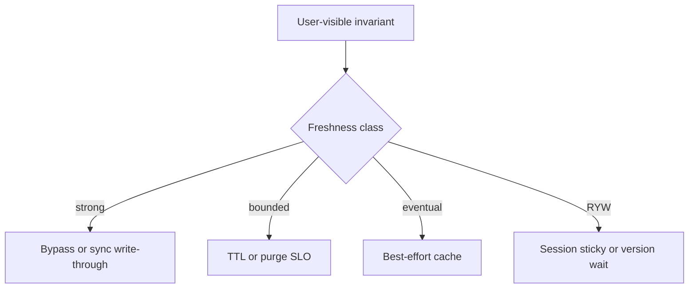
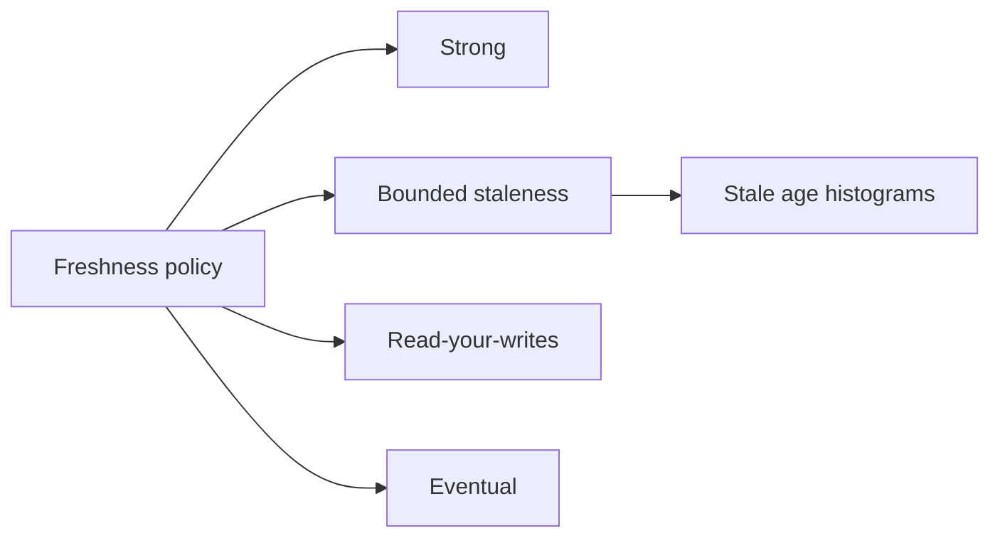

# Cache Coherence vs Acceptable Staleness

## Overview

**Cache coherence** means observers see a defined relationship between cached copies and the source of truth (e.g., no reader sees a value older than a published version after invalidation completes). **Acceptable staleness** is a product SLO: how old a value may be before UX or business invariants break. Most product caches are **not** CPU-MESI coherent; they are **freshness-bounded**. Design by classifying invariants into “must be coherent now” vs “may lag by T,” then pick invalidation and read routing accordingly.

## Learning Objectives

- Separate hardware coherence myths from distributed freshness contracts
- Express staleness budgets as SLOs (time, version, or probability)
- Map invariants (inventory, profile name, feed) to freshness classes
- Choose when to bypass cache for strong reads
- Document coherence non-goals in ADRs

## Prerequisites

- [[09-System-Design/05-Caching-at-Product-Scale/Invalidation Strategies TTL Write-Through Write-Back|Invalidation Strategies TTL Write-Through Write-Back]]
- [[09-System-Design/03-Consistency-Models-and-CAP/Choosing Consistency from User-Visible Invariants|Choosing Consistency from User-Visible Invariants]]

## Difficulty

`advanced`

## Estimated Time

- Reading: 2 hours
- Exercises: 3 hours
- Mini project: 4 hours

## History

SMP cache coherence protocols solved multi-core shared memory. Distributed web caches borrowed the word loosely. CAP/PACELC thinking forced products to admit that global instant coherence fights latency. Modern APIs expose version tokens and `Cache-Control` because **staleness became a first-class product knob**.

## Problem It Solves

- **Over-engineering** invalidate-everywhere for data that may lag minutes
- **Under-engineering** TTL-only for checkout inventory
- **Inconsistent UX** when two widgets disagree without a policy
- **Impossible SLOs** (“always consistent cached reads, globally”)

## Internal Implementation



| Class | Example | Typical mechanism |
| --- | --- | --- |
| Strong | Payment capture idempotency key state | No shared cache / primary read |
| Bounded T | Public price display ≤ 30s | TTL + purge on change |
| RYW | Own profile after edit | Primary/version token |
| Eventual | Recommendation shelf | Async rebuild |

## Mermaid Diagrams

### Structure



### Sequence / Lifecycle — two widgets, one policy

```mermaid
sequenceDiagram
    participant User
    participant PriceWidget
    participant CartWidget
    participant Cache
    participant Origin
    User->>PriceWidget: view
    PriceWidget->>Cache: GET price
    Cache-->>PriceWidget: $10 stale ok
    User->>CartWidget: add
    CartWidget->>Origin: reserve inventory
    Origin-->>CartWidget: ok at $10
    Note over User: policy allows price lag; inventory is strong
```

## Examples

### Minimal Example — freshness class enum

```typescript
export type Freshness = "strong" | "bounded" | "ryw" | "eventual";

export const FIELD_POLICY: Record<string, { freshness: Freshness; maxStaleSec: number }> = {
  inventory: { freshness: "strong", maxStaleSec: 0 },
  listPrice: { freshness: "bounded", maxStaleSec: 30 },
  displayName: { freshness: "ryw", maxStaleSec: 5 },
  relatedItems: { freshness: "eventual", maxStaleSec: 600 },
};
```

### Production-Shaped Example — enforce policy at read path

```typescript
export async function readField(
  field: keyof typeof FIELD_POLICY,
  key: string,
  opts: { lastWriteVersion?: number },
  cache: { get: (k: string) => Promise<{ v: string; ver: number; at: number } | null> },
  origin: { get: (k: string) => Promise<{ v: string; ver: number }> },
): Promise<string> {
  const policy = FIELD_POLICY[field];
  if (policy.freshness === "strong") {
    return (await origin.get(key)).v;
  }

  const hit = await cache.get(key);
  const now = Date.now();
  if (
    hit &&
    (now - hit.at) / 1000 <= policy.maxStaleSec &&
    (opts.lastWriteVersion === undefined || hit.ver >= opts.lastWriteVersion)
  ) {
    return hit.v;
  }
  return (await origin.get(key)).v;
}
```

## Trade-offs

| Dimension | Upside | Downside | When it matters |
| --- | --- | --- | --- |
| Strong everywhere | Simple mental model | Latency/cost | Rarely sustainable |
| Bounded staleness | Scale | Explicit UX risk | Most public reads |
| Per-field policy | Correctness where needed | Complexity | Mixed pages |
| Global purge on any write | Feels coherent | Herds + cost | Overkill |

### When to Use

- Publish a freshness matrix per API field / widget
- Bypass cache for money, authz, and uniqueness checks
- Bounded TTL for public content with business-approved lag
- RYW tokens for “I just edited” flows

### When Not to Use

- Do not promise MESI-like coherence across regions with async caches
- Do not hide staleness from support/runbooks
- Cross-region RYW deep dive → [[09-System-Design/05-Caching-at-Product-Scale/When Caching Lies Read-Your-Writes Cross-Region|When Caching Lies Read-Your-Writes Cross-Region]]

## Exercises

1. Classify 10 fields of a social profile into freshness classes.
2. Compute max business loss if price can lag 60s during a flash sale.
3. Design metrics: p95 stale age, RYW violation rate.
4. Rewrite a “cache all reads” service to policy-based reads.
5. ADR: coherence non-goals for a multi-region catalog.

## Mini Project

**Freshness router.** Implement `readField` with injectable clock and verify policy tests.

## Portfolio Project

Consistency/freshness matrix in [[09-System-Design/projects/Consistency and Quorum Demo/README|Consistency and Quorum Demo]].

## Interview Questions

1. What does cache coherence mean in product systems vs CPUs?
2. How do you express acceptable staleness?
3. When must you bypass the cache?
4. How do version tokens help RYW?
5. Why do two widgets disagree and when is that OK?

### Stretch / Staff-Level

1. Design probabilistic freshness SLOs (e.g., 99% of reads ≤ 5s stale).
2. Compare CDC-driven invalidate vs TTL for bounded coherence.

## Common Mistakes

- One global TTL for all entities
- Calling TTL caches “strongly consistent”
- Measuring hit ratio but not stale age
- Invalidating everything to avoid thinking about classes

## Best Practices

- Put freshness class in OpenAPI / API docs
- Alert on RYW violation proxies (support tickets, client version skew)
- Prefer versioned reads after writes over shorter global TTLs
- Tie to CAP product constraints → [[09-System-Design/03-Consistency-Models-and-CAP/CAP and PACELC as Product Constraints|CAP and PACELC as Product Constraints]]
- Replica lag budgets → [[09-System-Design/07-Multi-Region-and-Geo/Replica Lag as User-Facing Consistency Budget|Replica Lag as User-Facing Consistency Budget]]

## Summary

Product caches trade coherence for scale. Acceptable staleness is an explicit SLO derived from user-visible invariants; coherence mechanisms (bypass, purge, versions) are applied only where the SLO demands them. Design matrices beat slogans like “keep the cache consistent.”

## Further Reading

- [[00-References/System Design/README|System Design References]]
- PACELC and client-centric consistency models
- HTTP caching freshness heuristics

## Related Notes

- [[09-System-Design/05-Caching-at-Product-Scale/Invalidation Strategies TTL Write-Through Write-Back|Invalidation Strategies TTL Write-Through Write-Back]]
- [[09-System-Design/05-Caching-at-Product-Scale/When Caching Lies Read-Your-Writes Cross-Region|When Caching Lies Read-Your-Writes Cross-Region]]
- [[09-System-Design/03-Consistency-Models-and-CAP/Strong Eventual Causal and Read-Your-Writes|Strong Eventual Causal and Read-Your-Writes]]
- [[09-System-Design/README|System Design]]

## Progress Checklist

- [ ] Explained from first principles
- [ ] Drew at least one Mermaid diagram
- [ ] Implemented a minimal version
- [ ] Documented trade-offs and non-goals
- [ ] Completed exercises
- [ ] Practiced interview questions aloud
- [ ] Linked prerequisites and dependents
