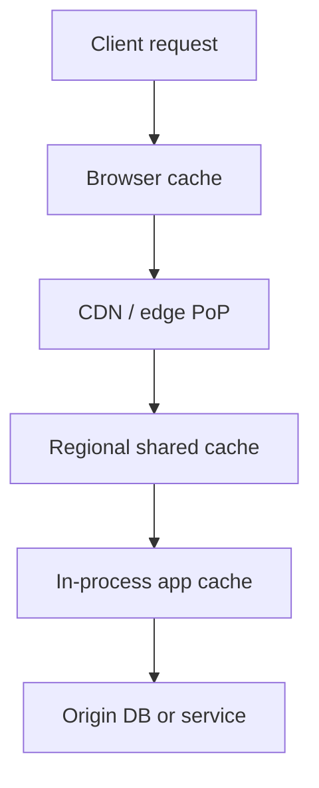
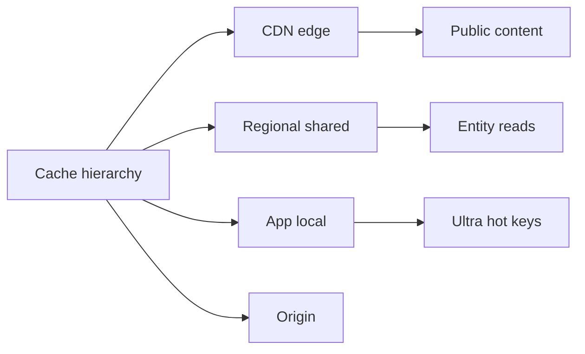
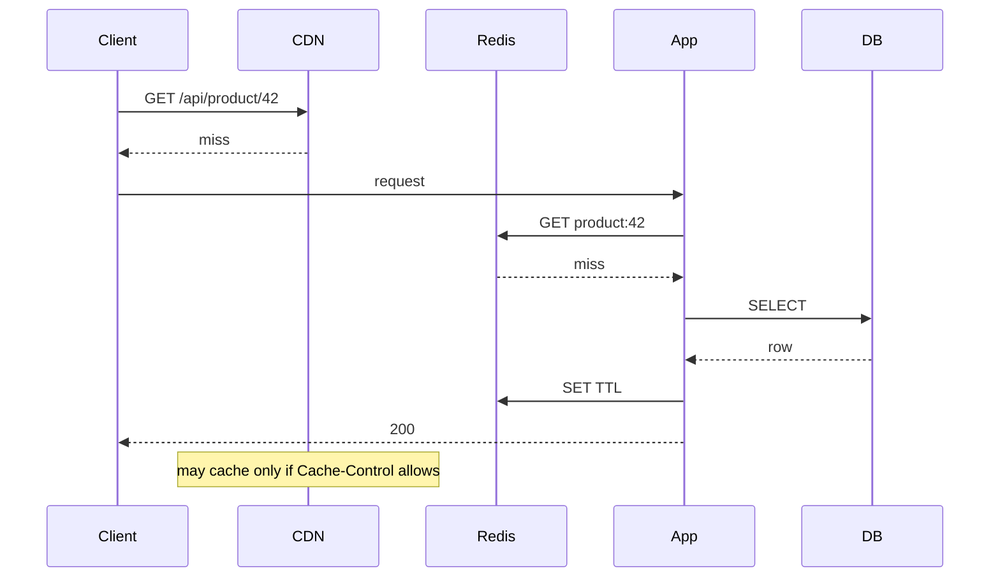

# Cache Hierarchies CDN Edge Regional App

## Overview

A **cache hierarchy** is a layered memory of answers: browser → CDN/edge → regional shared cache → in-process app cache → origin (DB/service). Each layer trades hit ratio, coherence cost, blast radius, and operational ownership. System Design owns **which layer stores which class of data** and the latency budget each layer must meet. Backend owns cache-aside client patterns inside one service; this note owns fleet-scale topology.

## Learning Objectives

- Map content classes (immutable assets, personalized HTML, session, derived aggregates) to layers
- Budget latency and hit ratio per layer from capacity models
- Reason about stampede and invalidation across layers
- Avoid “cache everything everywhere” cardinality explosions
- Write an ADR for a multi-layer read path with ownership boundaries

## Prerequisites

- [[09-System-Design/01-Capacity-Latency-and-Bottlenecks/Latency Budgets Percentiles and Tail Behavior|Latency Budgets Percentiles and Tail Behavior]]
- [[09-System-Design/02-Load-Balancing-and-Edge-Entry/Edge Admission Control and Global Traffic Steering|Edge Admission Control and Global Traffic Steering]]

## Difficulty

`advanced`

## Estimated Time

- Reading: 2 hours
- Exercises: 3 hours
- Mini project: 4 hours

## History

HTTP caches and reverse proxies preceded app Redis. CDNs pushed static assets to PoPs; then edge compute blurred static vs dynamic. Products that put personalized feeds in global CDNs learned coherence and cardinality pain. Modern stacks deliberately separate **immutable edge**, **regional shared**, and **local process** caches.

## Problem It Solves

- **Origin overload** when every miss collapses to one database
- **Wrong-layer caching** (PII in shared CDN, huge objects in process heap)
- **Opaque latency** when four layers each add jitter
- **Invalidation chaos** when layers disagree on freshness

## Internal Implementation



| Layer | Typical TTL | Good for | Bad for |
| --- | --- | --- | --- |
| Browser | short / immutable hashed | JS/CSS/images | Personalized private data |
| CDN/edge | minutes–hours | Public pages, media | Per-user secrets |
| Regional Redis/Memcached | seconds–minutes | Hot entity reads | Huge working sets without eviction plan |
| In-process | ms–seconds | Ultra-hot keys, config | Multi-instance coherence |

## Mermaid Diagrams

### Structure



### Sequence / Lifecycle — layered miss path



## Examples

### Minimal Example — layer policy table

```typescript
export type Layer = "cdn" | "regional" | "local" | "origin";

export const PRODUCT_READ: Record<Layer, { ttlSec: number; allowed: boolean }> = {
  cdn: { ttlSec: 60, allowed: true }, // public catalog
  regional: { ttlSec: 30, allowed: true },
  local: { ttlSec: 5, allowed: true },
  origin: { ttlSec: 0, allowed: true },
};

export const ACCOUNT_READ: Record<Layer, { ttlSec: number; allowed: boolean }> = {
  cdn: { ttlSec: 0, allowed: false },
  regional: { ttlSec: 10, allowed: true },
  local: { ttlSec: 2, allowed: true },
  origin: { ttlSec: 0, allowed: true },
};
```

### Production-Shaped Example — regional cache with local L1

```typescript
export interface Cache {
  get(key: string): Promise<string | null>;
  set(key: string, value: string, ttlSec: number): Promise<void>;
}

export class TwoLevelCache {
  constructor(
    private readonly l1: Map<string, { v: string; exp: number }>,
    private readonly l2: Cache,
    private readonly l1TtlMs: number,
  ) {}

  async getOrLoad(key: string, loader: () => Promise<string>, l2TtlSec: number): Promise<string> {
    const now = Date.now();
    const hit = this.l1.get(key);
    if (hit && hit.exp > now) return hit.v;

    const remote = await this.l2.get(key);
    if (remote !== null) {
      this.l1.set(key, { v: remote, exp: now + this.l1TtlMs });
      return remote;
    }

    const loaded = await loader();
    await this.l2.set(key, loaded, l2TtlSec);
    this.l1.set(key, { v: loaded, exp: now + this.l1TtlMs });
    return loaded;
  }
}
```

## Trade-offs

| Dimension | Upside | Downside | When it matters |
| --- | --- | --- | --- |
| More layers | Lower origin load | Coherence + debug cost | Read-heavy public traffic |
| CDN personalization | Edge latency | Cardinality / privacy | Rarely worth it |
| Fat regional cache | Shared hits | Network hop, stampede | Multi-instance fleets |
| Fat L1 only | Micro latency | Per-instance duplication | Tiny hot config |

### When to Use

- Immutable hashed assets at CDN with long TTL
- Public catalog fragments at edge/regional with short TTL
- Entity caches regional; ultra-hot keys optionally L1
- Origin as source of truth with explicit miss budgets

### When Not to Use

- Do not put private account HTML on shared CDN without isolation
- Do not stack four caches without an invalidation story → [[09-System-Design/05-Caching-at-Product-Scale/Invalidation Strategies TTL Write-Through Write-Back|Invalidation Strategies TTL Write-Through Write-Back]]
- Single-service cache-aside pedagogy → [[07-Backend/07-Caching-Jobs-and-Messaging/Cache-Aside and TTL Strategies|Cache-Aside and TTL Strategies]]

## Exercises

1. Split a news homepage into layers; assign TTLs and owners.
2. Compute origin QPS given 90% CDN, 80% regional conditional on CDN miss.
3. Identify PII leakage risks in a proposed edge cache design.
4. Design observability: hit ratio and latency histograms per layer.
5. ADR: where session tokens may live (and where they must not).

## Mini Project

**Hierarchy simulator.** Model hit ratios and origin load for 3 layers under diurnal traffic.

## Portfolio Project

Cache topology in [[09-System-Design/projects/Distributed Systems Workbench/README|Distributed Systems Workbench]] and clone CDN notes in [[09-System-Design/12-Clone-Case-Studies-and-Portfolio/Netflix Clone Catalog Playback and CDN|Netflix Clone Catalog Playback and CDN]].

## Interview Questions

1. What belongs in CDN vs Redis vs in-process cache?
2. How do you budget latency across a hierarchy?
3. Why can more caches make p99 worse?
4. How does personalization interact with edge caching?
5. Who owns invalidation at each layer?

### Stretch / Staff-Level

1. Design a request path where edge caches public shells and regional fills private fragments.
2. Compare Cloudflare Workers KV vs regional Redis for product data classes.

## Common Mistakes

- Caching personalized responses globally by URL without Vary
- No miss budget—origin becomes the real capacity plan
- Measuring only CDN hit ratio while Redis thrashes
- Treating Redis as durable primary → [[08-Databases/10-Redis-and-In-Memory-Engines/Redis as Cache vs Primary Store|Redis as Cache vs Primary Store]]

## Best Practices

- Classify data before choosing layers
- Emit **per-layer** hit/miss and origin QPS
- Prefer immutable URLs for assets; short TTL + purge for mutable public pages
- Hot key defenses → [[09-System-Design/05-Caching-at-Product-Scale/Hot Keys Stampede and Thundering Herd at Scale|Hot Keys Stampede and Thundering Herd at Scale]]
- Cross-region lies → [[09-System-Design/05-Caching-at-Product-Scale/When Caching Lies Read-Your-Writes Cross-Region|When Caching Lies Read-Your-Writes Cross-Region]]

## Summary

Cache hierarchies assign each data class to the cheapest correct layer: edge for public/immutable, regional for shared entity heat, local for ultra-hot, origin for truth. Latency and coherence budgets must be explicit. Backend cache-aside is necessary but insufficient for fleet topology.

## Further Reading

- [[00-References/System Design/README|System Design References]]
- HTTP caching RFC semantics
- CDN architecture guides

## Related Notes

- [[09-System-Design/05-Caching-at-Product-Scale/Invalidation Strategies TTL Write-Through Write-Back|Invalidation Strategies TTL Write-Through Write-Back]]
- [[09-System-Design/05-Caching-at-Product-Scale/Cache Coherence vs Acceptable Staleness|Cache Coherence vs Acceptable Staleness]]
- [[09-System-Design/02-Load-Balancing-and-Edge-Entry/Edge Admission Control and Global Traffic Steering|Edge Admission Control and Global Traffic Steering]]
- [[07-Backend/07-Caching-Jobs-and-Messaging/Cache-Aside and TTL Strategies|Cache-Aside and TTL Strategies]]
- [[09-System-Design/README|System Design]]

## Progress Checklist

- [ ] Explained from first principles
- [ ] Drew at least one Mermaid diagram
- [ ] Implemented a minimal version
- [ ] Documented trade-offs and non-goals
- [ ] Completed exercises
- [ ] Practiced interview questions aloud
- [ ] Linked prerequisites and dependents
