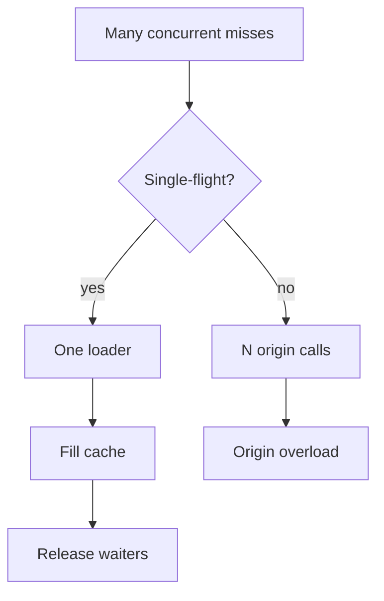
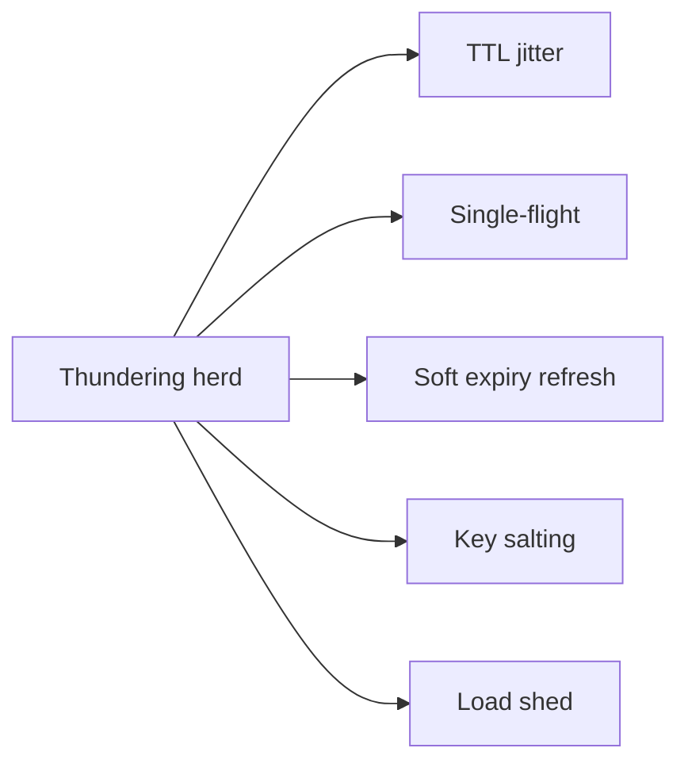
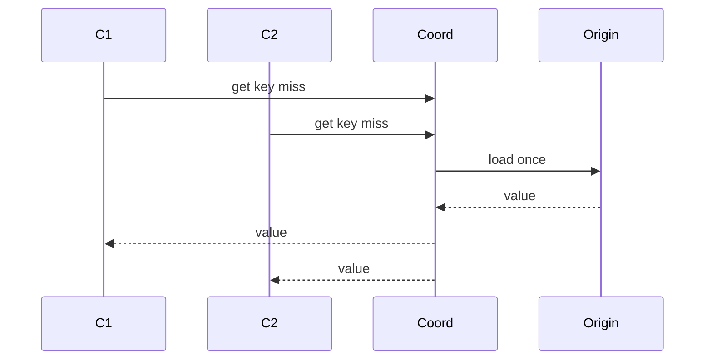

# Hot Keys Stampede and Thundering Herd at Scale

## Overview

A **hot key** receives disproportionate cache or origin traffic. A **stampede / thundering herd** occurs when many clients miss the same key simultaneously (TTL expiry alignment, deploy flush, partition failover) and stampede the origin. At product scale this is both a caching and partitioning problem: one Redis shard or one DB row becomes the bottleneck. Mitigations include probabilistic early expiry, single-flight/coalescing, request hedging controls, replicas, and key sharding. Backend soft-expiry patterns apply in-process; this note owns **fleet-scale** herd control.

## Learning Objectives

- Distinguish hot key, stampede, and partitioned hot shard
- Model origin amplification from synchronized misses
- Apply single-flight, soft TTL, jitter, and negative caching
- Combine cache defenses with partition salting for extreme keys
- Set SLOs and load-shed policies when herds are inevitable

## Prerequisites

- [[09-System-Design/05-Caching-at-Product-Scale/Cache Hierarchies CDN Edge Regional App|Cache Hierarchies CDN Edge Regional App]]
- [[09-System-Design/04-Partitioning-Sharding-and-Placement/Partition Keys Hotspots and Skew|Partition Keys Hotspots and Skew]]

## Difficulty

`advanced`

## Estimated Time

- Reading: 2 hours
- Exercises: 3 hours
- Mini project: 5 hours

## History

Thundering herds were classic in kernel wait queues and later in web caches. Memcached/Redis fleets made synchronized TTL expiry a recurring SEV. Social and commerce products hit “celebrity keys.” Patterns matured: XFetch probabilistic refresh, singleflight (Go), and edge request collapsing.

## Problem It Solves

- **Origin meltdown** after cache flush or TTL cliff
- **Redis CPU hot shard** on one key
- **Retry amplification** turning a miss into an outage
- **Uneven cell load** when affinity pins a viral entity

## Internal Implementation



**Defense stack (defense in depth):**

1. TTL jitter / probabilistic early refresh
2. Per-process single-flight
3. Regional lock or request coalescing
4. Negative caching for misses
5. Partition salting / replicas for extreme keys
6. Load shedding when still overrun

## Mermaid Diagrams

### Structure



### Sequence / Lifecycle — single-flight coalescing



## Examples

### Minimal Example — in-process single-flight

```typescript
export class SingleFlight<V> {
  private readonly inflight = new Map<string, Promise<V>>();

  do(key: string, loader: () => Promise<V>): Promise<V> {
    const existing = this.inflight.get(key);
    if (existing) return existing;
    const p = loader().finally(() => this.inflight.delete(key));
    this.inflight.set(key, p);
    return p;
  }
}
```

### Production-Shaped Example — soft TTL + probabilistic refresh

```typescript
export interface Entry {
  value: string;
  expireAt: number;
  softAt: number;
}

export function shouldRefresh(entry: Entry, now: number): boolean {
  if (now >= entry.expireAt) return true;
  if (now < entry.softAt) return false;
  // XFetch-style: higher chance as we approach hard expiry
  const window = entry.expireAt - entry.softAt;
  const progressive = (now - entry.softAt) / window;
  return Math.random() < progressive;
}

export async function getHot(
  key: string,
  store: Map<string, Entry>,
  flight: SingleFlight<string>,
  load: () => Promise<string>,
  hardTtlMs: number,
  softMs: number,
): Promise<string> {
  const now = Date.now();
  const hit = store.get(key);
  if (hit && now < hit.expireAt && !shouldRefresh(hit, now)) return hit.value;

  return flight.do(key, async () => {
    const value = await load();
    store.set(key, {
      value,
      expireAt: now + hardTtlMs,
      softAt: now + softMs,
    });
    return value;
  });
}
```

## Trade-offs

| Dimension | Upside | Downside | When it matters |
| --- | --- | --- | --- |
| Single-flight | Cuts origin fan-out | Latency coupling of waiters | Miss storms |
| Soft TTL | Prefetch before cliff | Extra refresh load | Predictable hot keys |
| Salting | Spreads hot key | Read fan-in / merge | Extreme celebrities |
| Negative cache | Stops miss loops | Delays visibility of creates | 404 storms |

### When to Use

- Always jitter TTLs for popular keys
- Single-flight in every cache-aside path at scale
- Soft refresh for known hot catalog keys
- Salt + merge for keys that exceed one shard’s QPS

### When Not to Use

- Do not salt keys that need strong single-row transactions without a merge plan
- Do not flush entire Redis as a “fix” in production
- In-process stampede only → [[07-Backend/07-Caching-Jobs-and-Messaging/Cache Stampede and Soft Expiry|Cache Stampede and Soft Expiry]]

## Exercises

1. Model 10k clients hitting a key at TTL expiry with and without single-flight.
2. Implement probabilistic early expiry; measure origin QPS vs staleness.
3. Design salted hot-key reads that merge N replicas.
4. Add load shedding when origin error rate exceeds budget.
5. ADR for Super Bowl / flash-sale hot SKU playbook.

## Mini Project

**Stampede clinic.** Simulate synchronized misses; prove single-flight + jitter keep origin under budget.

## Portfolio Project

Hotspot module shared with [[09-System-Design/projects/Shard Router and Hotspot Clinic/README|Shard Router and Hotspot Clinic]].

## Interview Questions

1. What causes a cache stampede?
2. How does single-flight help?
3. Why does TTL jitter matter at fleet scale?
4. Hot key vs hot partition—same fix?
5. When do you shard a single logical key?

### Stretch / Staff-Level

1. Design regional coalescing with leases so only one datacenter refreshes a global hot key.
2. Compare edge request collapsing vs app single-flight for HTML fragments.

## Common Mistakes

- Cache flush on deploy without warm-up
- Retries without coalescing → multiplicative herd
- Only L1 single-flight while 500 instances each hit origin
- Ignoring Redis hot shard CPU while app looks fine

## Best Practices

- Warm critical keys before traffic shifts
- Cap concurrent origin loads per key **across the fleet**, not only per process
- Alert on per-key QPS outliers
- Tie to partition skew budgets → [[09-System-Design/04-Partitioning-Sharding-and-Placement/Partition Keys Hotspots and Skew|Partition Keys Hotspots and Skew]]
- Shedding → [[09-System-Design/09-Failure-Modes-at-Product-Scale/Graceful Degradation and Feature Shedding|Graceful Degradation and Feature Shedding]]

## Summary

Hot keys and stampedes convert popularity into origin overload. Fleet-scale defenses combine jittered TTLs, single-flight coalescing, soft refresh, negative caching, and sometimes key salting—plus load shedding when physics wins. Treat herds as capacity incidents with playbooks, not as surprising bugs.

## Further Reading

- [[00-References/System Design/README|System Design References]]
- XFetch / probabilistic early expiry papers and posts
- Go `singleflight` pattern

## Related Notes

- [[09-System-Design/05-Caching-at-Product-Scale/Invalidation Strategies TTL Write-Through Write-Back|Invalidation Strategies TTL Write-Through Write-Back]]
- [[09-System-Design/05-Caching-at-Product-Scale/Cache Coherence vs Acceptable Staleness|Cache Coherence vs Acceptable Staleness]]
- [[07-Backend/07-Caching-Jobs-and-Messaging/Cache Stampede and Soft Expiry|Cache Stampede and Soft Expiry]]
- [[09-System-Design/04-Partitioning-Sharding-and-Placement/Partition Keys Hotspots and Skew|Partition Keys Hotspots and Skew]]
- [[09-System-Design/README|System Design]]

## Progress Checklist

- [ ] Explained from first principles
- [ ] Drew at least one Mermaid diagram
- [ ] Implemented a minimal version
- [ ] Documented trade-offs and non-goals
- [ ] Completed exercises
- [ ] Practiced interview questions aloud
- [ ] Linked prerequisites and dependents
