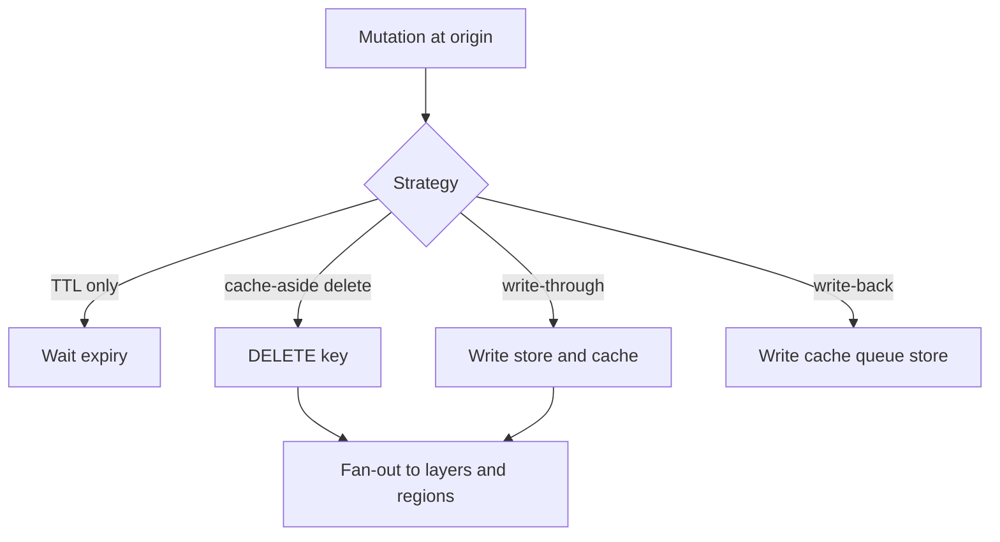
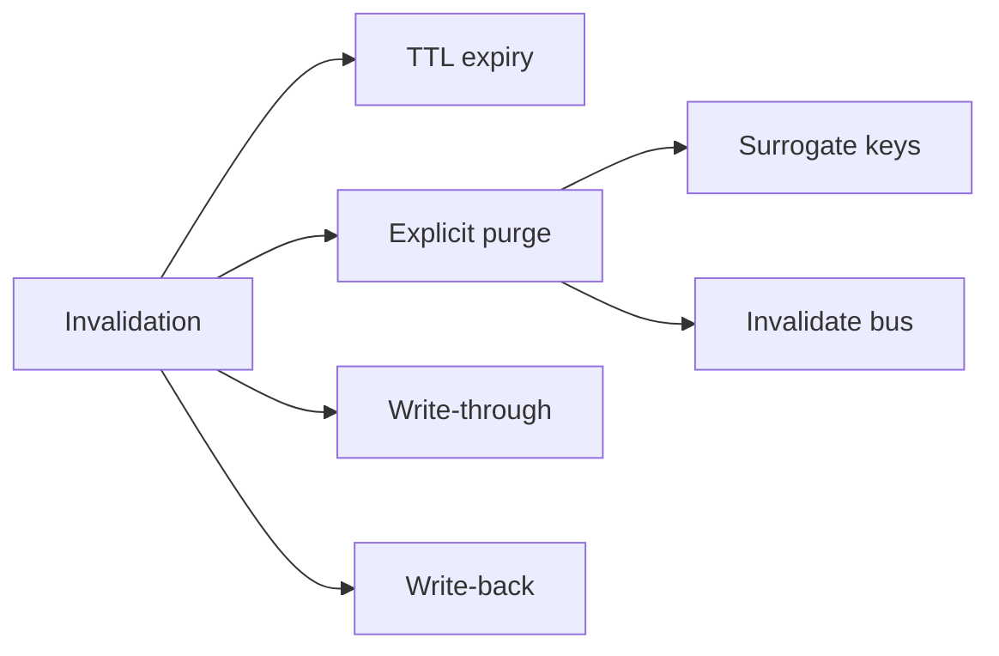
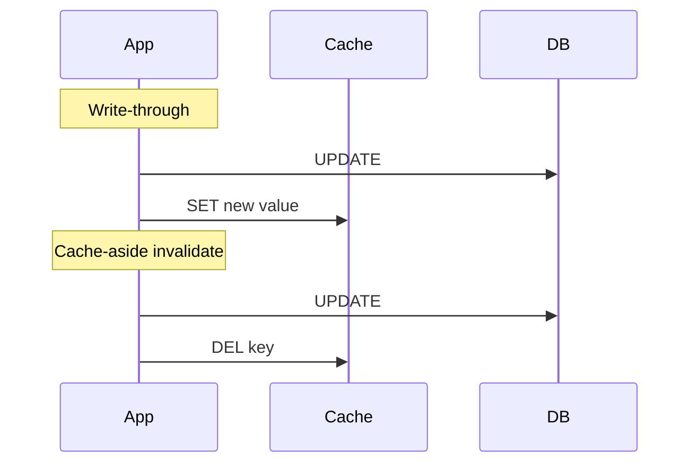

# Invalidation Strategies TTL Write-Through Write-Back

## Overview

**Invalidation** makes cached copies stop being served after the source of truth changes. Strategies include **TTL expiry**, **explicit purge/delete**, **write-through** (write cache and store together), **write-around**, and **write-back/write-behind** (cache acknowledges early; store catches up asynchronously). At product scale, invalidation is a distributed systems problem: fan-out to PoPs, races with concurrent writers, and partial purge failure. Prefer boring TTL+delete for most OLTP; reserve write-back for carefully fenced durable caches.

## Learning Objectives

- Compare TTL, purge, write-through, write-around, and write-back
- Design invalidation fan-out for multi-layer and multi-region caches
- Reason about lost invalidations and tombstones
- Choose strategies from staleness SLOs and write QPS
- Separate Backend cache-aside mechanics from fleet purge topology

## Prerequisites

- [[09-System-Design/05-Caching-at-Product-Scale/Cache Hierarchies CDN Edge Regional App|Cache Hierarchies CDN Edge Regional App]]
- [[07-Backend/07-Caching-Jobs-and-Messaging/Cache-Aside and TTL Strategies|Cache-Aside and TTL Strategies]]

## Difficulty

`advanced`

## Estimated Time

- Reading: 2.5 hours
- Exercises: 3 hours
- Mini project: 5 hours

## History

“There are only two hard things…” became folklore because distributed purge is races plus partial failure. CDNs added surrogate keys and soft purge. Databases offered changefeeds to invalidate. Write-back caches in storage engines inspired app-level write-behind—and many durability incidents when crash windows were ignored.

## Problem It Solves

- **Stale reads** after updates without purge
- **Origin storms** when TTL aligns across the fleet
- **Silent data loss** with naive write-back
- **Incomplete CDN purge** leaving some PoPs stale

## Internal Implementation



| Strategy | Freshness | Durability risk | Ops cost |
| --- | --- | --- | --- |
| TTL only | Bounded staleness | Low | Low |
| Explicit invalidate | Fast when delivered | Low | Fan-out reliability |
| Write-through | Fresh cache | Low | Write latency |
| Write-around | Avoids cache pollution | Stale until TTL | Medium |
| Write-back | Fast writes | Crash loss window | High |

## Mermaid Diagrams

### Structure



### Sequence / Lifecycle — write-through vs cache-aside



## Examples

### Minimal Example — TTL with jitter

```typescript
export function ttlWithJitter(baseSec: number, jitterSec: number): number {
  return baseSec + Math.floor(Math.random() * jitterSec);
}
// Prevents aligned expiry stampede across instances.
```

### Production-Shaped Example — mutate with invalidate fan-out

```typescript
export interface InvalidateBus {
  publish(keys: string[]): Promise<void>;
}

export async function updateProduct(
  id: string,
  patch: { title: string },
  db: { update: (id: string, patch: unknown) => Promise<void> },
  cache: { del: (key: string) => Promise<void> },
  bus: InvalidateBus,
  cdnPurge: (urls: string[]) => Promise<void>,
): Promise<void> {
  await db.update(id, patch);
  const key = `product:${id}`;
  await cache.del(key); // cache-aside invalidate
  await bus.publish([key]); // other regions / L1 listeners
  await cdnPurge([`/api/products/${id}`, `/p/${id}`]);
}

/** Write-through variant for ultra-hot reads after write in same region. */
export async function updateProductWriteThrough(
  id: string,
  row: { title: string },
  db: { update: (id: string, row: unknown) => Promise<void> },
  cache: { set: (key: string, value: string, ttl: number) => Promise<void> },
): Promise<void> {
  await db.update(id, row);
  await cache.set(`product:${id}`, JSON.stringify(row), ttlWithJitter(30, 5));
}
```

## Trade-offs

| Dimension | Upside | Downside | When it matters |
| --- | --- | --- | --- |
| TTL + jitter | Simple | Stale until expiry | Most reads |
| Explicit purge | Faster freshness | Delivery failures | Editorial / pricing |
| Write-through | Warm after write | Extra write latency | Read-your-writes UX |
| Write-back | Write throughput | Durability / replay | Rare; specialized |

### When to Use

- Default: cache-aside + TTL jitter + delete-on-write
- Write-through when same-region RYW matters and keys are few
- Surrogate-key CDN purge for pages composed of many objects
- Write-back only with WAL/replay and acknowledged loss window

### When Not to Use

- Do not write-back user funds, inventory, or auth without a durability design
- Do not purge by full URL crawl when surrogate keys exist
- Soft expiry / single-flight → [[07-Backend/07-Caching-Jobs-and-Messaging/Cache Stampede and Soft Expiry|Cache Stampede and Soft Expiry]] and [[09-System-Design/05-Caching-at-Product-Scale/Hot Keys Stampede and Thundering Herd at Scale|Hot Keys Stampede and Thundering Herd at Scale]]

## Exercises

1. Compare stale windows: TTL=60 vs delete-on-write with 200 ms purge p99.
2. Design surrogate keys for a product page including price and inventory fragments.
3. Model write-back crash: quantify lost writes and recovery.
4. Implement invalidate bus consumers for L1 clear across 100 instances.
5. ADR: choose strategy for cart vs public catalog.

## Mini Project

**Invalidation harness.** Mutate origin; verify regional + L1 + CDN mock converge within SLO under injected drop.

## Portfolio Project

Invalidation playbook in [[09-System-Design/projects/Distributed Systems Workbench/README|Distributed Systems Workbench]].

## Interview Questions

1. TTL vs explicit invalidation?
2. Write-through vs write-back vs cache-aside?
3. How do you invalidate a multi-PoP CDN?
4. Why add jitter to TTL?
5. What fails when invalidation messages are dropped?

### Stretch / Staff-Level

1. Design exactly-once-ish invalidation with epochs and tombstones.
2. Compare Redis keyspace notifications vs explicit invalidate bus at fleet scale.

## Common Mistakes

- SET after write without DELETE races (stale overwrite)
- Assuming CDN purge is synchronous worldwide
- Write-back without fsync/replay story
- Invalidating only one layer of a hierarchy

## Best Practices

- Prefer **delete-on-write** over update-in-cache when writers are many
- Version keys (`product:42:vN`) for immutable-ish entries
- Monitor purge success rate and residual stale hit ratio
- Coherence policy → [[09-System-Design/05-Caching-at-Product-Scale/Cache Coherence vs Acceptable Staleness|Cache Coherence vs Acceptable Staleness]]
- Cross-region RYW → [[09-System-Design/05-Caching-at-Product-Scale/When Caching Lies Read-Your-Writes Cross-Region|When Caching Lies Read-Your-Writes Cross-Region]]

## Summary

Invalidation is how caches respect truth under change. TTL bounds staleness; explicit purge shortens it; write-through keeps caches warm; write-back trades durability for write speed. At product scale, fan-out reliability and multi-layer consistency dominate—Backend cache-aside is the local verb; fleet purge topology is the System Design noun.

## Further Reading

- [[00-References/System Design/README|System Design References]]
- CDN purge / surrogate key docs
- Caching pattern literature (Fowler, Oracle Coherence patterns)

## Related Notes

- [[09-System-Design/05-Caching-at-Product-Scale/Cache Hierarchies CDN Edge Regional App|Cache Hierarchies CDN Edge Regional App]]
- [[09-System-Design/05-Caching-at-Product-Scale/Hot Keys Stampede and Thundering Herd at Scale|Hot Keys Stampede and Thundering Herd at Scale]]
- [[07-Backend/07-Caching-Jobs-and-Messaging/Cache-Aside and TTL Strategies|Cache-Aside and TTL Strategies]]
- [[09-System-Design/README|System Design]]

## Progress Checklist

- [ ] Explained from first principles
- [ ] Drew at least one Mermaid diagram
- [ ] Implemented a minimal version
- [ ] Documented trade-offs and non-goals
- [ ] Completed exercises
- [ ] Practiced interview questions aloud
- [ ] Linked prerequisites and dependents
