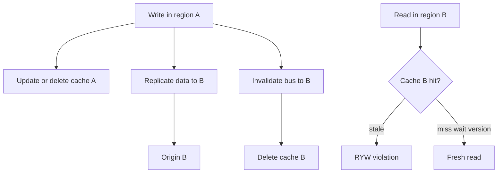
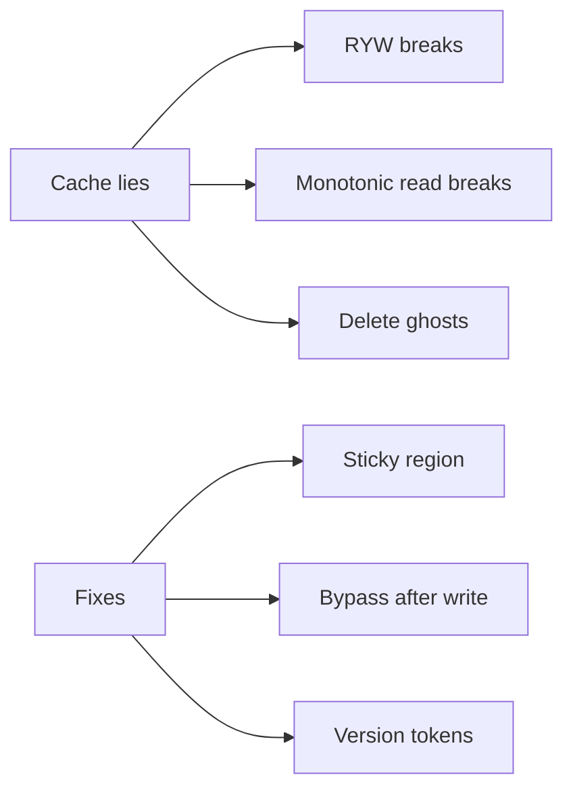
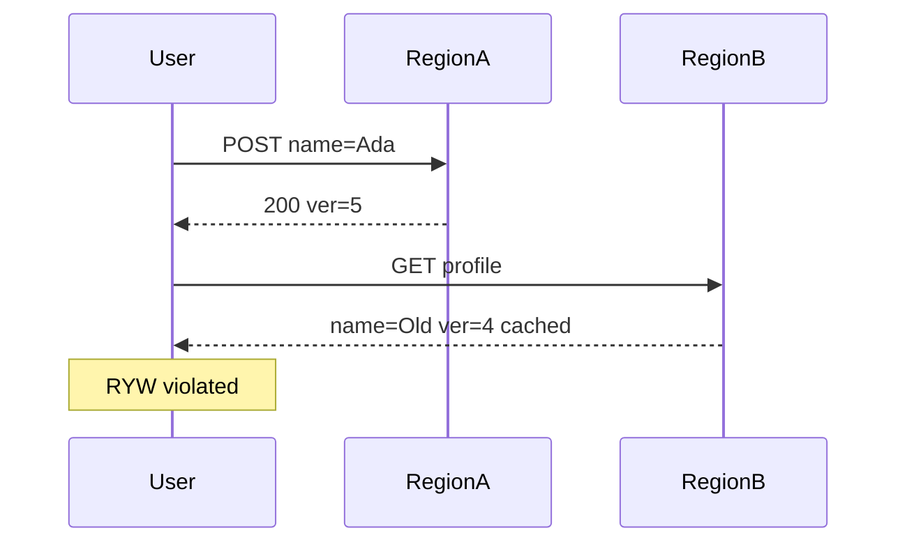

# When Caching Lies Read-Your-Writes Cross-Region

## Overview

Caches **lie** when they serve a value that violates the user’s consistency expectation—most commonly **read-your-writes (RYW)** after a mutation, especially when the next read hits another region, PoP, or replica-backed cache. Lies also include monotonic-read violations across tabs and “delete then still see” ghosts. Engine replica lag is one cause; **regional cache islands** and **CDN PoPs** are others. This note owns product patterns: sticky region, version tokens, bypass-after-write, and cross-region invalidate—without confusing them with Postgres LSN waits.

## Learning Objectives

- Enumerate how multi-layer/multi-region caches break RYW and monotonic reads
- Implement version-token and bypass-after-write patterns at the edge
- Design cross-region invalidation with lag budgets
- Separate DB replica RYW from cache RYW in runbooks
- Set product policy when global RYW is too expensive

## Prerequisites

- [[09-System-Design/05-Caching-at-Product-Scale/Cache Coherence vs Acceptable Staleness|Cache Coherence vs Acceptable Staleness]]
- [[08-Databases/07-Replication-Mechanics/Replica Lag and Read-Your-Writes at Connection Level|Replica Lag and Read-Your-Writes at Connection Level]]

## Difficulty

`expert`

## Estimated Time

- Reading: 2.5 hours
- Exercises: 4 hours
- Mini project: 5 hours

## History

“I saved but the old profile shows” migrated from read-replica bugs to global cache bugs as apps went multi-region. Sticky sessions helped within a DC; then mobile clients bounced PoPs. Version tokens (ETags, `X-Resource-Version`) and “read primary for N seconds” became standard UX patches while true global RYW remained rare and costly.

## Problem It Solves

- **Post-submit stale UI** across regions
- **Support tickets** that look like “DB bugs” but are cache islands
- **Flaky E2E tests** racing invalidate buses
- **False confidence** in “we purged Redis” while CDN still serves

## Internal Implementation



**Mitigation toolbox:**

| Pattern | Guarantees | Cost |
| --- | --- | --- |
| Sticky home region after write | RYW in home | Travelers / failover |
| Bypass cache N seconds | Simple RYW | Origin load |
| Version token / wait | Targeted freshness | Client + API complexity |
| Sync cross-region invalidate | Faster convergence | Still not zero RTT |
| Write-through local + async remote | Local RYW | Remote lag remains |

## Mermaid Diagrams

### Structure



### Sequence / Lifecycle — cross-region stale hit



## Examples

### Minimal Example — bypass window

```typescript
export function shouldBypassCache(lastWriteAtMs: number | undefined, now: number, windowMs: number): boolean {
  return lastWriteAtMs !== undefined && now - lastWriteAtMs < windowMs;
}
```

### Production-Shaped Example — version-gated read

```typescript
export interface CacheRecord {
  body: string;
  version: number;
}

export async function getProfile(
  userId: string,
  minVersion: number | undefined,
  cache: { get: (k: string) => Promise<CacheRecord | null>; del: (k: string) => Promise<void> },
  origin: { get: (id: string) => Promise<CacheRecord> },
  lastWriteAt: number | undefined,
): Promise<CacheRecord> {
  if (shouldBypassCache(lastWriteAt, Date.now(), 5_000)) {
    const fresh = await origin.get(userId);
    await cache.del(`profile:${userId}`); // prevent immediate stale refill races optionally
    return fresh;
  }

  const key = `profile:${userId}`;
  const hit = await cache.get(key);
  if (hit && (minVersion === undefined || hit.version >= minVersion)) return hit;

  const loaded = await origin.get(userId);
  // caller may SET asynchronously
  return loaded;
}

/** Client stores version from write response and sends If-Version-GE header on next GET. */
```

## Trade-offs

| Dimension | Upside | Downside | When it matters |
| --- | --- | --- | --- |
| Sticky region | Easy RYW | Weak under geo mobility | Most consumer apps |
| Bypass window | Predictable | Origin spikes after writes | Edit-heavy flows |
| Version tokens | Precise | Client protocol | Mobile + web |
| Global sync invalidate | Faster | Never free / still races | Editorial |

### When to Use

- Return `version` on writes; accept `minVersion` on reads for editable resources
- Sticky home cell for sessions; bypass on failover
- Document “global RYW not guaranteed” for public CDN content

### When Not to Use

- Do not claim RYW for CDN-cached personalized pages without Vary + purge proof
- Do not fix cache RYW only at DB router and ignore regional Redis
- Engine LSN waits → [[08-Databases/07-Replication-Mechanics/Replica Lag and Read-Your-Writes at Connection Level|Replica Lag and Read-Your-Writes at Connection Level]]
- Multi-region topology → [[09-System-Design/07-Multi-Region-and-Geo/Multi-Region Active-Passive Active-Active Patterns|Multi-Region Active-Passive Active-Active Patterns]]

## Exercises

1. Reproduce RYW break with two regional caches; fix with version tokens.
2. Measure bypass-window origin QPS for 1% writers.
3. Design monotonic reads for a user with two devices in two regions.
4. Write a support runbook distinguishing DB lag vs cache island.
5. ADR: which endpoints guarantee RYW cross-region.

## Mini Project

**Lie detector.** Integration test suite that fails if GET after POST across regions returns older version.

## Portfolio Project

RYW policy in [[09-System-Design/projects/Multi-Region Failover Playbook Lab/README|Multi-Region Failover Playbook Lab]].

## Interview Questions

1. How can caches violate read-your-writes?
2. Sticky session vs version token—trade-offs?
3. Why is CDN purge insufficient for RYW?
4. How do you test cross-region freshness?
5. When is “eventual is fine” the right product answer?

### Stretch / Staff-Level

1. Design causal consistency for profile reads using version vectors across regions.
2. Compare session stickiness at edge vs application-level home directory.

## Common Mistakes

- Purging one layer only
- Storing write success in UI state but reading a global CDN URL next
- E2E tests pinned to one region hiding production bugs
- Equating Redis SET in region A with visibility in region B

## Best Practices

- Emit `resource_version` on mutating APIs
- Prefer home-region reads for the writer’s session
- Track RYW violation metrics via client-reported versions
- Invalidate bus + bypass together for editable entities
- Consistency models → [[09-System-Design/03-Consistency-Models-and-CAP/Strong Eventual Causal and Read-Your-Writes|Strong Eventual Causal and Read-Your-Writes]]

## Summary

Caching lies when layer or region boundaries violate user consistency expectations—especially RYW. Fixes are product contracts: sticky homes, bypass windows, version-gated reads, and honest SLOs when global coherence is unaffordable. Treat DB replica lag and cache islands as separate failure modes with separate telemetry.

## Further Reading

- [[00-References/System Design/README|System Design References]]
- Client-centric consistency (RYW, monotonic reads)
- Multi-region caching case studies

## Related Notes

- [[09-System-Design/05-Caching-at-Product-Scale/Cache Hierarchies CDN Edge Regional App|Cache Hierarchies CDN Edge Regional App]]
- [[09-System-Design/05-Caching-at-Product-Scale/Cache Coherence vs Acceptable Staleness|Cache Coherence vs Acceptable Staleness]]
- [[09-System-Design/07-Multi-Region-and-Geo/Replica Lag as User-Facing Consistency Budget|Replica Lag as User-Facing Consistency Budget]]
- [[08-Databases/07-Replication-Mechanics/Replica Lag and Read-Your-Writes at Connection Level|Replica Lag and Read-Your-Writes at Connection Level]]
- [[09-System-Design/README|System Design]]

## Progress Checklist

- [ ] Explained from first principles
- [ ] Drew at least one Mermaid diagram
- [ ] Implemented a minimal version
- [ ] Documented trade-offs and non-goals
- [ ] Completed exercises
- [ ] Practiced interview questions aloud
- [ ] Linked prerequisites and dependents
