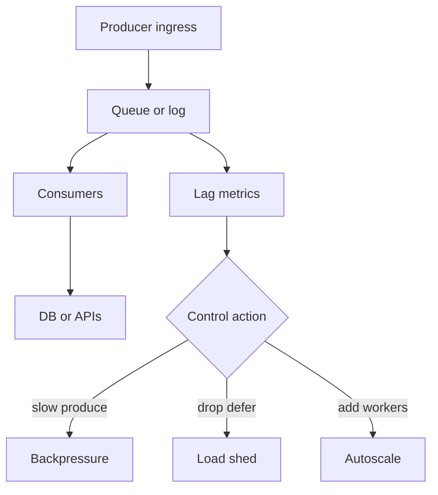
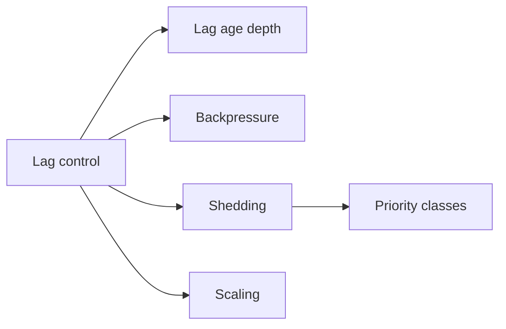
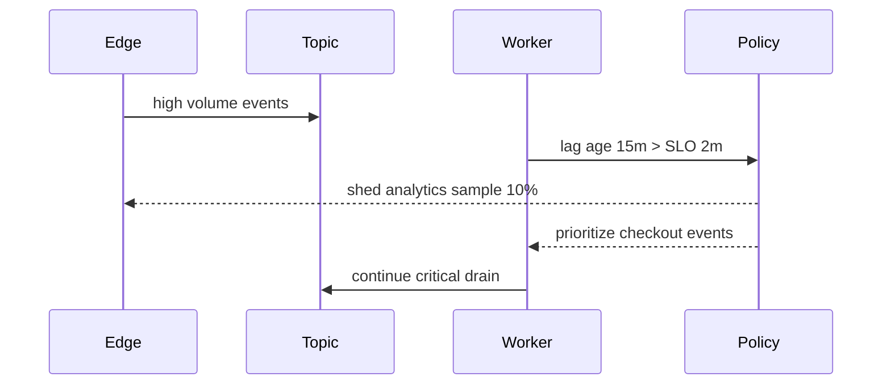

# Backpressure Consumer Lag and Load Shedding

## Overview

**Backpressure** signals producers or ingress to slow down when consumers cannot keep up. **Consumer lag** measures how far consumers trail the log/queue head (messages, time, or offsets). **Load shedding** deliberately drops or defers low-priority work to protect critical paths when lag or latency exceeds budgets. At product scale, unbounded queues convert outages into multi-hour catch-up incidents. Little’s Law links lag, throughput, and latency—use it as a control-plane tool.

## Learning Objectives

- Define lag metrics (offset, age, depth) and SLOs
- Apply backpressure mechanisms (credit, blocking, adaptive concurrency)
- Design shed policies (drop, sample, defer, degrade feature)
- Size retention and DLQs against catch-up capacity
- Tie autoscaling to lag without amplifying stampedes

## Prerequisites

- [[09-System-Design/06-Messaging-Streams-and-Async-Topologies/Queue vs Log vs Pub-Sub Topology Choice|Queue vs Log vs Pub-Sub Topology Choice]]
- [[09-System-Design/01-Capacity-Latency-and-Bottlenecks/Throughput Queuing and Littles Law Intuition|Throughput Queuing and Littles Law Intuition]]

## Difficulty

`advanced`

## Estimated Time

- Reading: 2 hours
- Exercises: 3 hours
- Mini project: 4 hours

## History

Telephony and streaming protocols formalized backpressure (TCP windows, reactive streams). Kafka made lag a first-class metric; teams learned that “just add consumers” fails when partition count or downstream DB is the bottleneck. SRE culture added load shedding as a first-class reliability tool during brownouts.

## Problem It Solves

- **Multi-hour lag** after traffic spikes
- **Retry storms** when consumers crash under load
- **Retention exhaustion** deleting unconsumed data
- **Priority inversion** when bulk jobs block user-critical events

## Internal Implementation



| Control | Effect | Risk |
| --- | --- | --- |
| Block/slow producers | Protects buffer | User-facing latency |
| Adaptive concurrency | Matches downstream | Needs good signals |
| Shed low priority | Saves core UX | Data loss / delay |
| Autoscale consumers | More drain | Hot partitions, cost |

## Mermaid Diagrams

### Structure



### Sequence / Lifecycle — shed under lag SLO breach



## Examples

### Minimal Example — lag age SLO

```typescript
export function lagAgeSec(newestTs: number, consumerTs: number): number {
  return Math.max(0, (newestTs - consumerTs) / 1000);
}

export function breached(lagSec: number, sloSec: number): boolean {
  return lagSec > sloSec;
}
```

### Production-Shaped Example — priority shed + adaptive concurrency

```typescript
export type Priority = "critical" | "bulk";

export class LagController {
  constructor(
    private readonly sloSec: number,
    private maxInflight: number,
  ) {}

  decide(lagSec: number, priority: Priority): "accept" | "defer" | "drop" {
    if (!breached(lagSec, this.sloSec)) return "accept";
    if (priority === "critical") return "accept";
    if (lagSec > this.sloSec * 3) return "drop"; // extreme: sample/drop bulk
    return "defer";
  }

  onSuccess(latencyMs: number): void {
    if (latencyMs < 50) this.maxInflight = Math.min(256, this.maxInflight + 1);
  }

  onError(): void {
    this.maxInflight = Math.max(1, Math.floor(this.maxInflight / 2));
  }

  get inflightLimit(): number {
    return this.maxInflight;
  }
}
```

## Trade-offs

| Dimension | Upside | Downside | When it matters |
| --- | --- | --- | --- |
| Backpressure to users | Protects core | Visible slowdown | Interactive producers |
| Buffer growth | Smooth spikes | Long catch-up | Needs retention $ |
| Shedding | Fast recovery | Loss/delay | Brownouts |
| Autoscale | Elastic drain | Thundering scale | Partition-limited |

### When to Use

- Publish lag age SLOs per consumer group
- Shed bulk/analytics before touching checkout/auth paths
- Adaptive concurrency against downstream latency/errors
- Cap queue depth / retention with alarms before silent drop

### When Not to Use

- Do not autoscale blindly when the bottleneck is a single hot partition
- Do not infinite-buffer “to be safe”
- Feature shedding UX → [[09-System-Design/09-Failure-Modes-at-Product-Scale/Graceful Degradation and Feature Shedding|Graceful Degradation and Feature Shedding]]
- Circuit breakers in-process → [[07-Backend/06-Reliability-and-Abuse-Resistance/Circuit Breakers and Bulkheads|Circuit Breakers and Bulkheads]]

## Exercises

1. Given λ=5k msg/s, μ=4k, compute growth of lag over 10 minutes.
2. Design priority classes for a social app’s event bus.
3. Simulate adaptive concurrency vs fixed; compare p99 and error rate.
4. Set retention so catch-up at 2× rate finishes before data expiry.
5. ADR: lag SLO + shed policy for billing vs clickstream.

## Mini Project

**Lag governor.** Inject overload; demonstrate shed of bulk restores critical lag SLO.

## Portfolio Project

Backpressure controls in [[09-System-Design/projects/Distributed Systems Workbench/README|Distributed Systems Workbench]].

## Interview Questions

1. What is consumer lag and how do you measure it?
2. Backpressure vs load shedding?
3. How does Little’s Law inform lag?
4. When does adding consumers not help?
5. How do you prioritize events under overload?

### Stretch / Staff-Level

1. Design multi-tenant fair queuing so one tenant cannot starve others.
2. Compare reactive streams backpressure to Kafka consumer pause.

## Common Mistakes

- Alerting only on consumer CPU, not lag age
- Same SLO for critical and bulk topics
- Redrive from DLQ without rate limits → second outage
- Scaling producers during consumer brownout

## Best Practices

- Chart **lag age p99** next to produce/consume rates
- Separate topics or priorities for critical paths
- Rehearse catch-up runbooks (pause producers, scale, shed)
- Tie to capacity estimation → [[09-System-Design/01-Capacity-Latency-and-Bottlenecks/Back-of-Envelope Capacity Estimation|Back-of-Envelope Capacity Estimation]]
- Fan-out overload → [[09-System-Design/06-Messaging-Streams-and-Async-Topologies/Fan-out Broadcast and Notification Architectures|Fan-out Broadcast and Notification Architectures]]

## Summary

Lag is the inventory of unfinished async work; backpressure slows intake; shedding drops or defers the expendable. Control systems need SLOs, priorities, and honest limits—unbounded buffers only postpone failure. Design for brownout recovery, not only sunny-day throughput.

## Further Reading

- [[00-References/System Design/README|System Design References]]
- SRE books — load shedding chapters
- Kafka consumer lag monitoring guides

## Related Notes

- [[09-System-Design/06-Messaging-Streams-and-Async-Topologies/Queue vs Log vs Pub-Sub Topology Choice|Queue vs Log vs Pub-Sub Topology Choice]]
- [[09-System-Design/06-Messaging-Streams-and-Async-Topologies/Ordering Partitions Idempotency and Exactly-Once Claims|Ordering Partitions Idempotency and Exactly-Once Claims]]
- [[09-System-Design/01-Capacity-Latency-and-Bottlenecks/Throughput Queuing and Littles Law Intuition|Throughput Queuing and Littles Law Intuition]]
- [[09-System-Design/README|System Design]]

## Progress Checklist

- [ ] Explained from first principles
- [ ] Drew at least one Mermaid diagram
- [ ] Implemented a minimal version
- [ ] Documented trade-offs and non-goals
- [ ] Completed exercises
- [ ] Practiced interview questions aloud
- [ ] Linked prerequisites and dependents
