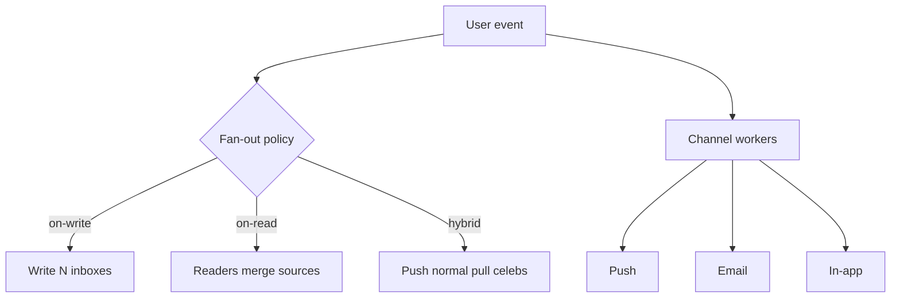
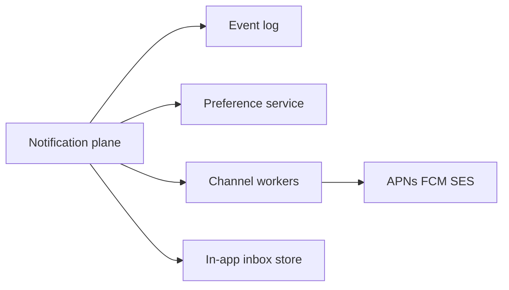
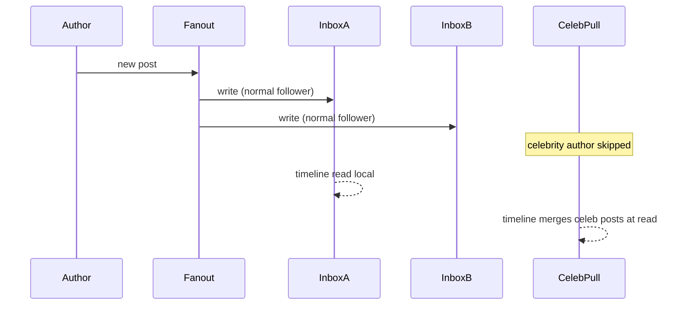

# Fan-out Broadcast and Notification Architectures

## Overview

**Fan-out** multiplies one event into many deliveries (feeds, pushes, emails, device sync). **Broadcast** delivers the same payload to a large audience with shared infrastructure. Notification architectures choose **fan-out-on-write** (precompute inboxes), **fan-out-on-read** (pull/merge at read), or **hybrid** (celebrity exceptions). Product topology must budget write amplification, read latency, and lag under viral spikes—classic feed/notify system design.

## Learning Objectives

- Compare fan-out-on-write, fan-out-on-read, and hybrid strategies
- Size write amplification for social graphs and device fleets
- Design priority lanes for push vs email vs in-app
- Protect against celebrity/hot-key fan-out storms
- Select brokers and stores for notification planes

## Prerequisites

- [[09-System-Design/06-Messaging-Streams-and-Async-Topologies/Queue vs Log vs Pub-Sub Topology Choice|Queue vs Log vs Pub-Sub Topology Choice]]
- [[09-System-Design/04-Partitioning-Sharding-and-Placement/Partition Keys Hotspots and Skew|Partition Keys Hotspots and Skew]]

## Difficulty

`advanced`

## Estimated Time

- Reading: 2.5 hours
- Exercises: 3 hours
- Mini project: 5 hours

## History

Early social networks fan-out-on-write into per-user feeds until celebrities melted writers. Twitter-era hybrids pushed ordinary users and pulled celebrities. Mobile push added APNs/FCM fan-out with hard provider rate limits. Modern designs treat notifications as a multi-channel plane with shared event log and channel workers.

## Problem It Solves

- **Write storms** when one post fans to millions of inboxes
- **Slow timelines** when fan-out-on-read scans huge graphs
- **Duplicate/noisy notifies** without dedupe and preference centers
- **Channel outages** cascading into core product

## Internal Implementation



| Strategy | Write cost | Read cost | Best for |
| --- | --- | --- | --- |
| Fan-out-on-write | O(followers) | O(1) inbox read | Small/medium graphs |
| Fan-out-on-read | O(1) | O(following) merge | Huge celebrities |
| Hybrid | Mixed | Mixed | Real social products |

## Mermaid Diagrams

### Structure



### Sequence / Lifecycle — hybrid feed fan-out



## Examples

### Minimal Example — decide fan-out mode

```typescript
export function fanoutMode(followerCount: number, celebThreshold = 10_000): "write" | "read" {
  return followerCount >= celebThreshold ? "read" : "write";
}
```

### Production-Shaped Example — bounded fan-out worker

```typescript
export async function fanoutOnWrite(
  postId: string,
  followerIds: string[],
  inboxWrite: (userId: string, postId: string) => Promise<void>,
  opts: { concurrency: number; maxFollowers: number },
): Promise<{ written: number; truncated: boolean }> {
  const targets = followerIds.slice(0, opts.maxFollowers);
  let written = 0;
  for (let i = 0; i < targets.length; i += opts.concurrency) {
    const batch = targets.slice(i, i + opts.concurrency);
    await Promise.all(batch.map((u) => inboxWrite(u, postId)));
    written += batch.length;
  }
  return { written, truncated: followerIds.length > opts.maxFollowers };
}

export async function enqueueChannels(
  event: { userId: string; type: string },
  prefs: { push: boolean; email: boolean },
  queues: { push: { send: (e: unknown) => Promise<void> }; email: { send: (e: unknown) => Promise<void> } },
): Promise<void> {
  const jobs: Promise<void>[] = [];
  if (prefs.push) jobs.push(queues.push.send(event));
  if (prefs.email) jobs.push(queues.email.send(event));
  await Promise.all(jobs);
}
```

## Trade-offs

| Dimension | Upside | Downside | When it matters |
| --- | --- | --- | --- |
| On-write | Fast reads | Write amp / hot writers | Feeds |
| On-read | Stable writes | Slow/complex reads | Celebrities |
| Multi-channel async | Isolation | Lag / prefs complexity | Mobile products |
| Sync notify in request | Simple | Tail latency | Anti-pattern at scale |

### When to Use

- Hybrid feeds with explicit celebrity threshold
- Shared event log + per-channel queues for notifications
- Preference and quiet-hours before enqueue
- Backpressure and rate limits at provider edges

### When Not to Use

- Do not synchronously fan-out millions inside the publish API
- Do not share one worker pool for email and push without isolation
- Feed case study → [[09-System-Design/11-Reference-Architectures/Feed Timeline Fan-out Push Pull Hybrid|Feed Timeline Fan-out Push Pull Hybrid]]
- Hot keys → [[09-System-Design/05-Caching-at-Product-Scale/Hot Keys Stampede and Thundering Herd at Scale|Hot Keys Stampede and Thundering Herd at Scale]]

## Exercises

1. Compute write amp for 1M posts/day × avg 200 followers on-write.
2. Pick celebrity threshold given writer capacity 50k inbox writes/s.
3. Design dedupe across push and in-app for the same event id.
4. Model APNs rate limits into channel worker concurrency.
5. ADR: hybrid feed for a Twitter-like clone.

## Mini Project

**Hybrid fan-out simulator.** Inject celebrity posts; show write path skip + read merge.

## Portfolio Project

Notification plane in [[09-System-Design/12-Clone-Case-Studies-and-Portfolio/Discord Clone Realtime Fan-out and Presence|Discord Clone Realtime Fan-out and Presence]] and feed reference architecture.

## Interview Questions

1. Fan-out-on-write vs fan-out-on-read?
2. How do you handle celebrity accounts?
3. How do notifications differ from timeline fan-out?
4. Where do preferences and quiet hours live?
5. How do you prevent notification storms?

### Stretch / Staff-Level

1. Design topic-based push with device graph partitioning and provider failover.
2. Compare pull-based sync protocols vs push notify for mobile inbox.

## Common Mistakes

- No celebrity exception → write meltdown
- Fan-out before preference checks → wasted cost and user hate
- One queue for all channels → email outage blocks push
- Ignoring idempotency across retries → duplicate pushes

## Best Practices

- Bound fan-out concurrency and max targets per event
- Use event ids for dedupe across channels
- Monitor fan-out lag separately from channel provider lag
- Lag control → [[09-System-Design/06-Messaging-Streams-and-Async-Topologies/Backpressure Consumer Lag and Load Shedding|Backpressure Consumer Lag and Load Shedding]]
- Outbox for publish atomicity → [[09-System-Design/06-Messaging-Streams-and-Async-Topologies/Outbox at System Scale Cross-Service Contracts|Outbox at System Scale Cross-Service Contracts]]

## Summary

Fan-out multiplies events into inboxes and channels; broadcast scales shared delivery. Write-time fan-out optimizes reads until amplification breaks; read-time and hybrid patterns rescue celebrities. Notification architectures need preference gating, channel isolation, and lag budgets—not a single “send to everyone” loop.

## Further Reading

- [[00-References/System Design/README|System Design References]]
- Classic Twitter fan-out engineering posts
- Mobile push architecture guides

## Related Notes

- [[09-System-Design/06-Messaging-Streams-and-Async-Topologies/Queue vs Log vs Pub-Sub Topology Choice|Queue vs Log vs Pub-Sub Topology Choice]]
- [[09-System-Design/11-Reference-Architectures/Feed Timeline Fan-out Push Pull Hybrid|Feed Timeline Fan-out Push Pull Hybrid]]
- [[09-System-Design/04-Partitioning-Sharding-and-Placement/Partition Keys Hotspots and Skew|Partition Keys Hotspots and Skew]]
- [[09-System-Design/README|System Design]]

## Progress Checklist

- [ ] Explained from first principles
- [ ] Drew at least one Mermaid diagram
- [ ] Implemented a minimal version
- [ ] Documented trade-offs and non-goals
- [ ] Completed exercises
- [ ] Practiced interview questions aloud
- [ ] Linked prerequisites and dependents
